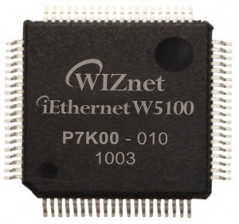
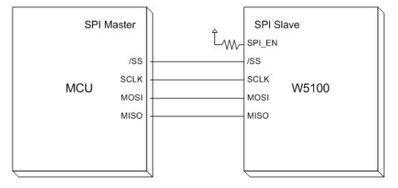
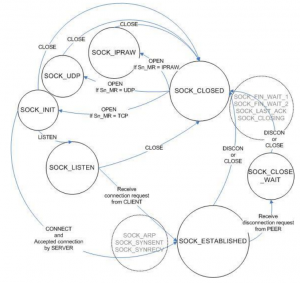
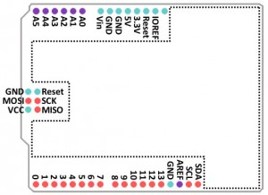
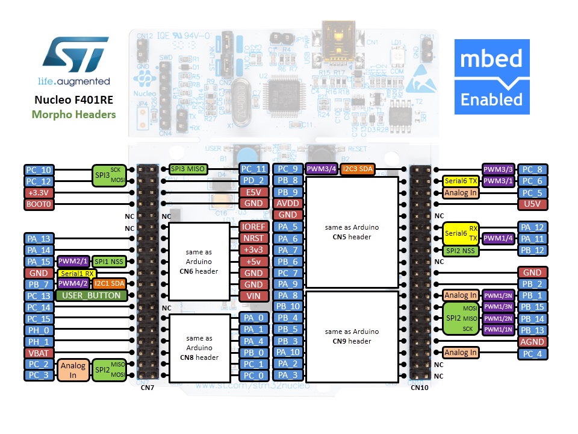
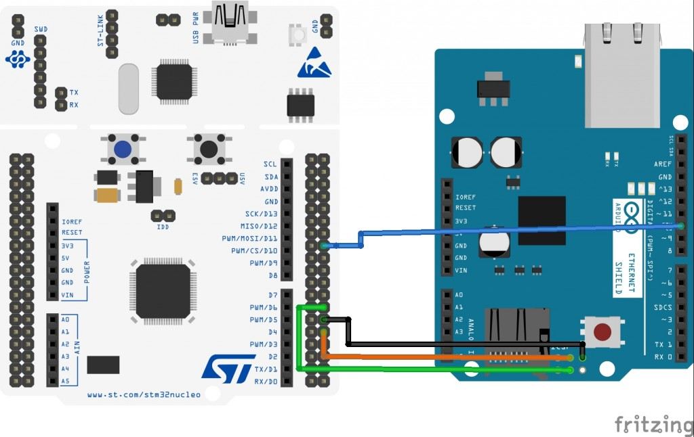
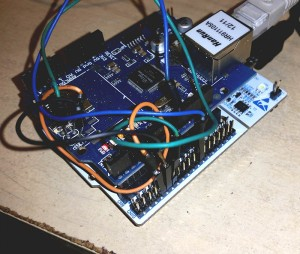
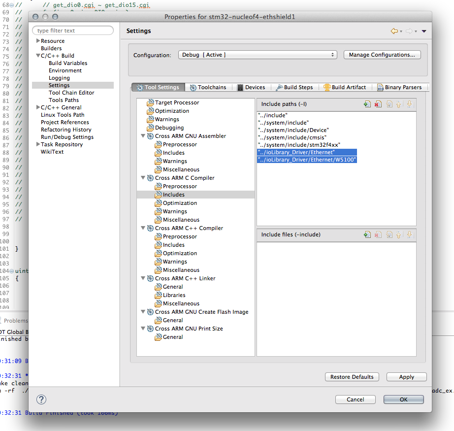

+++
title = "Adding ethernet connectivity to a STM32-Nucleo"
slug = "adding-ethernet-connectivity-stm32-nucleo"
url = "/2015/08/28/adding-ethernet-connectivity-stm32-nucleo/"
date = "2015-08-28T05:23:37Z"
lastmod = "2015-09-04T13:09:20Z"
draft = false
description = "One drawback of the Nucleo ecosystem is the lack of a version with ethernet connectivity or a dedicated shield officially supported by ST. There are 90 different STM32 MCUs available that…"
categories = ["Electronics","Programming","STM32"]
tags = ["ethernet shield","internet","IoT","stm32","stm32nucleo","w5100","wiznet"]
showHero = true
showTableOfContents = true

[cover]
image = "images/legacy/adding-ethernet-connectivity-stm32-nucleo/cover-stm32-nucleo-ethernet-shield.jpg"
alt = "stm32-nucleo-ethernet-shield"
hiddenInSingle = false
+++

One drawback of the Nucleo ecosystem is the lack of a version with ethernet connectivity or a dedicated shield officially supported by ST. There are 90 different STM32 MCUs available that provide an Ethernet MAC interface (this means that only an external ethernet transceiver - also called *phyter* - and few other things are required to bring your MCU to the IoT world). STM32Cube (the HAL officially supported by ST) also provides support for [lwIP](http://savannah.nongnu.org/projects/lwip/) stack. But, all the current Nucleo boards are designed with a MCU without an Ethernet interface (I think that the main reason is that only two STM32 MCUs with Ethernet MAC are available in LQFP-64 package and the Nucleo boards are designed to be pin-to-pin compatible between its releases - L0, F1, etc). This means that without a dedicated expansion shield it is impossible to add network connectivity to our Nucleo. And this is a sin considering what that MCU can do.

In the Arduino world the official Ethernet Shield is the most popular solution to add Internet connectivity to Arduino. The ethernet shield is based on a network processor become really popular thanks to its diffusion in the Arduino community: [W5100](http://www.wiznet.co.kr/product-item/w5100/) from [WIZnet](http://www.wiznet.co.kr/).

[](01-w5100-71.jpg)

WIZNet is a Korean company specialized in producing monolithic network processors. A network processors is a sort of black box that provides hardware capabilities (a ethernet pyther, for example) and all the network stack required to connect a MCU to the Internet. The MCU interacts with the network processor through a bus interface. SPI is the most used solution since almost every MCU provides at least one SPI master interface.

From a theoretical point of view, the way the MCU interacts with the network processor is really simple. Sending specific sets of commands and changing some internal registers, the network processor is able to configure the IP parameters (IP address, netmask, etc), to open sockets and to establish connections to remote peers, either using TCP or UDP. All the implementation details about the TCP/IP stack are "hardcoded" inside the MCU. Programmers should "only" take care about application logic and how to exchange data with the remote peer using TCP or UDP sockets. This approach has several key benefits:

- **Simplified hardware design**: these chips are developed so that only some external passives and an ethernet port with magnetics are required on the board.
- **Reduced firmware size**: since the entire TCP/IP stack is included inside the network processor, the firmware occupies a smaller amount of bytes; this allows selecting a MCU with less flash and less demanding hardware capabilities, reducing the BOM cost.
- **Fast time to market**: programmers work is simplified by the fact that there is no need to fight against TCP/IP implementation details; all the dirty job is done by the network processors, and they can focus on the specific application (this is the main reason of the success of the PIC18 and PIC32 family, according to me, and the related free TCP/IP stack provided by Microchip).

However, in the first days of W5100 chips (and later derivative IC like the W5200 and so on) it was really complex to deal with these IC. The official documentation was only reduced by a small sized [datasheet](http://www.wiznet.co.kr/wp-content/uploads/wiznethome/Chip/W5100/Document/W5100_Datasheet_v1.2.5.pdf) (also containing several errors...). The best "C" library around was only the Arduino Ethernet library, designed to work with the ATMega8 family from AVR. However, WIZNet worked hard in the last few years to improve the quality of their official code (but there is still a strong lack of good documentation...). They've recently released a complete library, called *ioLibrary*, on their [github account](https://github.com/Wiznet/ioLibrary_Driver). The library was designed to be sufficiently generic to work with several HALs, and it's possible to use it with the STM32Cube HAL with a very little effort. The library provides support to the "low-level" functionalities of the W5x00 chips (IP configuration, sockets, etc) as well as the implementation of some popular network protocols like the HTTP.

In this first part of the series I'll show how to use the Arduino Ethernet shield on a STM32 Nucleo board. I'll show all the required hardware configuration steps. I'll also show how to import the WIZNet *ioLibrary* inside a fresh new STM32 project and how to configure the library to start working with this shield. In a next article we'll see how to enable a DHCP client and we'll made a simple web server that allows to interact with our Nucleo using a web interface.

### Hardware and software requirements

In this post I'll assume you have:

- One of the STM32Nucleo boards available on the market - I've successfully tested the code both on a Nucleo-F401RE and a Nucleo-F103RB board.
- An [Arduino Ethernet Shield](https://www.arduino.cc/en/Main/ArduinoEthernetShield), or one of its clones available [on eBay](http://www.ebay.com/sch/i.html?_from=R40&amp;_trksid=p2050601.m570.l1311.R4.TR9.TRC2.A0.H0.Xarduino+et.TRS0&amp;_nkw=arduino+ethernet+shield&amp;_sacat=0) for less than \$10.
- Some patch cables to reroute Arduino ICSP pins to Nucleo morpho headers - more about this later.
- A complete Eclipse/GCC ARM tool-chain with required plugins as described in [this post](/?p=998). I’ll assume that the whole tool-chain in installed in C:\STM32Toolchain or ~/STM32Toolchain if you have a UNIX-like system.
- A basic test project for your Nucleo version as described in [this post](/?p=1590).

I won't show the needed steps to create a bare bone project using Eclipse and the latest version of the HAL from ST, because I've already covered this aspect several times on my blog. You can find these posts looking for the most popular ones on the left side of this page.

### More about the W5100 chip

As I've said before, the W5100 chip is a networked TCP/IP embedded Ethernet controller that simplifies the process of adding ethernet connectivity to a MCU. W5100 provides in a single chip a 10/100 Ethernet MAC, a phyter, and a complete TCP/IP stack with support to TCP, UDP, IPv4, ICMP, ARP, IGMP, and PPPoE. W5100 uses a 16 bytes internal buffer to exchange data between internal chip memory and MCU. It is possible to use 4 independent hardware sockets simultaneously. For each socket user can define the amount of buffer memory for TX and RX. BUS (Direct & Indirect) & SPI (Serial Peripheral Interface) are provided for easy integration with the external MCU.

The programming process of a W5100 chip involves these steps:

- Configure the SPI bus according the MCU and the W5100 specifications. The W5100 operates as SPI Slave device and supports the most common modes - SPI Mode 0\
  and 3. [\
  ](01-w5100-71.jpg) [](03-schermata-2015-08-13-alle-08-20-01.png)
- Setup the MAC Address, IP Address, netmask and gateway. As we'll se in a next article, W5100 doesn't support by itself the DHCP protocol, but WIZnet provides a library that uses RAW sockets to implement the DHCP discovering protocol.
- Configure the internal socket buffers for TX and RX. User can decide to expand this memory independently from 0K to 8K. Please, be aware that the memory for TX and RX is shared among all 4 socket, and 8K is the total amount for each buffer (8K for TX and 8K for RX). Default configuration uses 2K bytes for each socket both for TX and RX buffers.
- Configure the sockets we need in our application. This means to decide the type of socket (TCP, UDP, IP RAW, etc) and so on.
- Use the socket issuing commands that put the socket in a given state according this state diagram\
  [](04-schermata-2015-08-13-alle-08-25-23.png)

Fortunately, we don't need to deal with these low-level aspects of W5100 chip. Thanks to the *ioLibrary* by WIZNet, and a little bit of "glue" to adapt it to the STM32Cube HAL, we can develop IoT applications with our favorite STM32 MCU in a really simple way.

### Hardware setup

Unfortunately, we can use the Arduino Ethernet Shield on our STM32 Nucleo easily. The reason is that the shield uses the Arduino ICSP connector as a source for the SPI pins (MISO, MOSI and SCK - SS is mapped to D10 pin), as shown in the following picture.

[](06-arduino-eth-shield-schema.jpg)

The Nucleo doesn't provide that connector. This means that we need to "reroute" those pins to other pins. Looking to the Nucleo-F401RE pinout, we can use the pins on the morpho connector associated to the SPI2 peripheral, as shown below.

[](08-xnucleo64-revc-f401re-mbed-pinout-v2-morpho-png-pagespeed-ic-vtjy5pi6l.png)

Se, we need to do this association:

1.  Arduino ICSP PIN** 1** (MISO) to Nucleo PIN **PB_14**.
2.  Arduino ICSP PIN **4** (MOSI) to Nucleo PIN **PB_15**.
3.  Arduino ICSP PIN **3** (SCK) to Nucleo PIN **PB_13**.
4.  Arduino **D10** PIN (SS) to Nucleo PIN **PB_12**.

The following *fritzing* schema can help understanding the connection.

[](09-eth-shield-bb.jpg)

I've used 4 patches (those used for breadboard connections) as shown in the following image.

[](11-2015-08-13-15-12-44.jpg)

 

### Importing the *ioLibrary* in Eclipse

Ok. Let's the fun part begins. First, we need a bare bone project to start with. If you don't know how-to generate one, you can follow [this tutorial](/?p=1590). Next, we need to download the latest *ioLibrary* from [WIZNet github repository](https://github.com/Wiznet/ioLibrary_Driver/archive/master.zip). Unpack it in a convenient place, rename the main folder from ioLibrary_Driver-master to ioLibrary_Driver and drag it inside the Eclipse project. Now we need to enable compilation of the added folder. Click with the right mouse button on ioLibrary_Driver folder and choose Resource Configurations-\>Exclude from builds.. and uncheck both Debug and Release items.

Next we need to add proper include folders inside the project settings. We need to add these Eclipse folders:

- "../ioLibrary_Driver/Ethernet"
- "../ioLibrary_Driver/Ethernet/W5100"

inside Project Settings-\>C/C++ Build-\>Settings-\>Cross ARM C Compiler-\>Includes as shown below.

[](13-schermata-2015-08-13-alle-19-40-10.png)

Repeat the same step for the Cross ARM C++ Compiler-\>Includes section. Finally, we need to set the proper WIZNet chip (the *ioLibrary* is designed to be used with all W5X00 chips). Open the file ioLibrary_Driver/Ethernet/wizchip_conf.c and change the \_WIZCHIP\_ macro to 5100 (the macro is defined around the line 64).

``` c
...
#define _WIZCHIP_            5100   // 5100, 5200, 5300, 5500
...
```

### Configuring SPI interface

Ok. Now we can start coding serious things 🙂 The first step is to configure the SPI interface associated to PB_12..15 pins: SPI2. I've to say that the simpler way to do this is to use the STM32CubeMX tool. It automatically generates all the needed stuff to proper configure SPI port. However, the code generated by CubeMX is a little bit articulated in several routines and source files. So it's not practical to use it here, as it would make this tutorial too much complicated to follow. I've defined this function in the main.c file:

``` c
void MX_SPI2_Init(void)
{
    GPIO_InitTypeDef GPIO_InitStruct;

    hspi2.Instance = SPI2;
    hspi2.Init.Mode = SPI_MODE_MASTER;
    hspi2.Init.Direction = SPI_DIRECTION_2LINES;
    hspi2.Init.DataSize = SPI_DATASIZE_8BIT;
    hspi2.Init.CLKPolarity = SPI_POLARITY_LOW;
    hspi2.Init.CLKPhase = SPI_PHASE_1EDGE;
    hspi2.Init.NSS = SPI_NSS_SOFT;
    hspi2.Init.BaudRatePrescaler = SPI_BAUDRATEPRESCALER_4;
    hspi2.Init.FirstBit = SPI_FIRSTBIT_MSB;
    hspi2.Init.TIMode = SPI_TIMODE_DISABLED;
    hspi2.Init.CRCCalculation = SPI_CRCCALCULATION_DISABLED;

    __SPI2_CLK_ENABLE();
    /**SPI2 GPIO Configuration
    PB12     ------> SPI2_NSS
    PB13     ------> SPI2_SCK
    PB14     ------> SPI2_MISO
    PB15     ------> SPI2_MOSI
    */
    GPIO_InitStruct.Pin = GPIO_PIN_13|GPIO_PIN_14|GPIO_PIN_15;
    GPIO_InitStruct.Mode = GPIO_MODE_AF_PP;
    GPIO_InitStruct.Pull = GPIO_NOPULL;
    GPIO_InitStruct.Speed = GPIO_SPEED_HIGH;
    GPIO_InitStruct.Alternate = GPIO_AF5_SPI2;
    HAL_GPIO_Init(GPIOB, &GPIO_InitStruct);

    /*Configure GPIO pin : PA5 */
    GPIO_InitStruct.Pin = GPIO_PIN_12;
    GPIO_InitStruct.Mode = GPIO_MODE_OUTPUT_PP;
    GPIO_InitStruct.Pull = GPIO_PULLUP;
    GPIO_InitStruct.Speed = GPIO_SPEED_LOW;
    HAL_GPIO_Init(GPIOB, &GPIO_InitStruct);

    HAL_SPI_Init(&hspi2);
}
```

This routine does two things. First, it properly configures the SPI interface to work with the W5100 chip. This is done setting the hspi2 variable, which type is  SPI_HandleTypeDef. The variable is defined as global variable inside the main.c file, since we'll use it in other routines. Second, the routine configures the pins associated to the SPI2 interface: PB12 to PB15. Pins PB13 to PB15 are configured as **Alternate Function** (AF) pins, since they will be used as SPI interface; Pin PB12 is the **Chip Select** (CS) pin, and it's configured as **Output Pin** in **pull-up mode** (this prevents pins to be "low" when floating).

### Configuring USART

In this project we'll use the USART associated to the ST-Link interface to output some messages on the Virtual COM Port. You can find more about this [here](/?p=1308). Before we can print messages on the serial, we need to configure USART2 interface accordingly. This work is accomplished by the following function, defined in main.c file.

``` c
/* USART2 init function */
void MX_USART2_UART_Init(void)
{
    GPIO_InitTypeDef GPIO_InitStruct;

    huart2.Instance = USART2;
    huart2.Init.BaudRate = 115200;
    huart2.Init.WordLength = UART_WORDLENGTH_8B;
    huart2.Init.StopBits = UART_STOPBITS_1;
    huart2.Init.Parity = UART_PARITY_NONE;
    huart2.Init.Mode = UART_MODE_TX_RX;
    huart2.Init.HwFlowCtl = UART_HWCONTROL_NONE;
    huart2.Init.OverSampling = UART_OVERSAMPLING_16;

    __USART2_CLK_ENABLE();
      /**USART2 GPIO Configuration
    PA2     ------> USART2_TX
    PA3     ------> USART2_RX
    */
    GPIO_InitStruct.Pin = GPIO_PIN_2|GPIO_PIN_3;
    GPIO_InitStruct.Mode = GPIO_MODE_AF_PP;
    GPIO_InitStruct.Pull = GPIO_NOPULL;
    GPIO_InitStruct.Speed = GPIO_SPEED_LOW;
    GPIO_InitStruct.Alternate = GPIO_AF7_USART2;
    HAL_GPIO_Init(GPIOA, &GPIO_InitStruct);

    HAL_UART_Init(&huart2);
}
```

As we have done for the SPI interface, we first need to configure the USART2 peripheral (chosen parameters are: *baudrate* *115200*, *8bit*, *1 stop bit*, *no parity*, *no hardware flow control*). Next, we need to configure the associated pin (PA2 and PA3) as Alternate Function pins.

### Configure *ioLibrary*

The WIZnet *ioLibrary* is designed so that it can be used with the majority of MCU (and HAL) on the market. This means that it was designed in an abstract way so that it's user responsibility to supply the specific code that works with the hardware. In our case we need to supply 4 custom functions:

- A function to select the slave chip during SPI transfer (that is, a function that pull low the GPIO pin associated to CS - PB_12 in our case).
- A function to deselect the slave chip.
- A function to write 1 byte on the SPI interface.
- A function to read 1 byte on the SPI interface.


*ioLibrary* requires other two functions to write/read on the SPI interface using *burst mode*. Bust mode is a mode used by modern and fast SPI devices to transfer chunks of bytes one shot, that is without doing X complete transfers. Burst mode allows to speed up the transfer between the MCU and the SPI chip, especially if the MCU support SPI DMA mode (like the STM32 does). However, the W5100 doesn't support this transfer mode (other W5x00 chips do). This means that we don't need to provide these other custom functions.


So, we have to define these four functions in our main.c file.

``` c
void cs_sel() {
    HAL_GPIO_WritePin(GPIOB, GPIO_PIN_12, GPIO_PIN_RESET); //CS LOW
}

void cs_desel() {
    HAL_GPIO_WritePin(GPIOB, GPIO_PIN_12, GPIO_PIN_SET); //CS HIGH
}

uint8_t spi_rb(void) {
    uint8_t rbuf;
    HAL_SPI_Receive(&hspi2, &rbuf, 1, 0xFFFFFFFF);
    return rbuf;
}

void spi_wb(uint8_t b) {
    HAL_SPI_Transmit(&hspi2, &b, 1, 0xFFFFFFFF);
}
```

The functions are really self-explaining. cs_sel() and cs_desel() simply pull PB12 pin low and high using the HAL_GPIO_WritePin() function. spi_rb() function is used to read 1 byte on the SPI interface using the HAL_SPI_Receive() function. In the same way, spi_wb() write 1 byte on the SPI.

Once we have defined the custom hardware related functions, we have to "pass" them to the *ioLibrary*. This work is done inside the main() function.

``` c
int main(void)
{
  uint8_t retVal, sockStatus;
  int16_t rcvLen;
  uint8_t rcvBuf[20], bufSize[] = {2, 2, 2, 2};

  HAL_Init();
  
  /* Configure the System clock to 84 MHz */
  SystemClock_Config();
  
  MX_GPIO_Init();
  MX_SPI2_Init();
  MX_USART2_UART_Init();

  PRINT_HEADER();

  reg_wizchip_cs_cbfunc(cs_sel, cs_desel);
  reg_wizchip_spi_cbfunc(spi_rb, spi_wb);
...
```

This is the very first part of our main() function. First, we need to initialize the HAL, the system clock, GPIO pins (I've omitted to describe the MX_GPIO_Init() functions, since it simply configures the pins associated to LED LD2 and user button - the blue one - on the Nucleo), SPI and USART. Next, we configure the *ioLibrary* to use our custom functions using reg_wizchip_cs_cbfunc() and reg_wizchip_spi_cbfunc() functions.

### Building a bare bone IoT app

Ok. We can finally start coding the core of our example application. I will show you a really simple application: a TCP server that accepts connections on port 5000. Every time a connection is established with a remote peer, it sends a welcome message on the socket and automatically closes the connection. It's simply a test program that allows us to check if all works well with the Arduino Ethernet shield.

Let's analyze the code.

``` c
...
  wizchip_init(bufSize, bufSize);
  wiz_NetInfo netInfo = { .mac  = {0x00, 0x08, 0xdc, 0xab, 0xcd, 0xef}, // Mac address
                          .ip   = {192, 168, 2, 192},                   // IP address
                          .sn   = {255, 255, 255, 0},                   // Subnet mask
                          .gw   = {192, 168, 2, 1}};                    // Gateway address
  wizchip_setnetinfo(&netInfo);
  wizchip_getnetinfo(&netInfo);
  PRINT_NETINFO(netInfo);
...
```

First, we need to initialize the W5100 chip passing the dimension of TX and RX memory buffers for each socket. In this case, we choose a standard configuration where each socket has a buffer with 2kbytes (remember that the W5100 chip has 8kbytes for TX buffers and 8k for RX ones; this space is subdivided between 4 different sockets). Next, thanks to the wiz_NetInfo structure we pass the setup of the ethernet interface, composed by the MAC address, the IP, the Subnet Mask configuration and the router address (please, arrange network addresses according your network configuration).


Please, take note that we are using a "random" MAC address in this example. This procedure is OK for a "private" environment, but it's completely forbidden if you are planning to sell your W5100 based product. In this case, you have to buy a valid pool of MAC address from IEEE (pools starts from [batches of 4096 addresses](https://standards.ieee.org/develop/regauth/oui36/) for a price of about 650\$). 


Using the wizchip_setnetinfo() function we send commands to W5100 to setup these parameters. If you want, you can skip the remaining lines of code (maybe adding a while(1); just after line 142) and start checking if all goes well doing a "ping 192.168.2.192".

``` c
reconnect:
  /* Open socket 0 as TCP_SOCKET with port 5000 */
  if((retVal = socket(0, Sn_MR_TCP, 5000, 0)) == 0) {
      /* Put socket in LISTEN mode. This means we are creating a TCP server */
      if((retVal = listen(0)) == SOCK_OK) {
          /* While socket is in LISTEN mode we wait for a remote connection */
          while(sockStatus = getSn_SR(0) == SOCK_LISTEN)
              HAL_Delay(100);
          /* OK. Got a remote peer. Let's send a message to it */
          while(1) {
              /* If connection is ESTABLISHED with remote peer */
              if(sockStatus = getSn_SR(0) == SOCK_ESTABLISHED) {
                  uint8_t remoteIP[4];
                  uint16_t remotePort;
                  /* Retrieving remote peer IP and port number */
                  getsockopt(0, SO_DESTIP, remoteIP);
                  getsockopt(0, SO_DESTPORT, (uint8_t*)&remotePort);
                  sprintf(msg, CONN_ESTABLISHED_MSG, remoteIP[0], remoteIP[1], remoteIP[2], remoteIP[3], remotePort);
                  PRINT_STR(msg);
                  /* Let's send a welcome message and closing socket */
                  if(retVal = send(0, GREETING_MSG, strlen(GREETING_MSG)) == (int16_t)strlen(GREETING_MSG))
                      PRINT_STR(SENT_MESSAGE_MSG);
                  else { /* Ops: something went wrong during data transfer */
                      sprintf(msg, WRONG_RETVAL_MSG, retVal);
                      PRINT_STR(msg);
                  }
                  break;
              }
              else { /* Something went wrong with remote peer, maybe the connection was closed unexpectedly */
                  sprintf(msg, WRONG_STATUS_MSG, sockStatus);
                  PRINT_STR(msg);
                  break;
              }
          }

      } else /* Ops: socket not in LISTEN mode. Something went wrong */
          PRINT_STR(LISTEN_ERR_MSG);
  } else { /* Can't open the socket. This means something is wrong with W5100 configuration: maybe SPI issue? */
      sprintf(msg, WRONG_RETVAL_MSG, retVal);
      PRINT_STR(msg);
  }

  /* We close the socket and start a connection again */
  disconnect(0);
  close(0);
  goto reconnect;
```

The remaining part of the main() function is dedicated to the "core" application. We first configure the socket 0 (one of the 4 available sockets) and open it on port 5000; then we put the socket listening for remote connections (lines 146-151). When a remote peer establishes the connection (line 155), we retrieve its IP and port and print them on the VCP (lines 156-152); then we send to remote peer a welcome message (defined by macro GREETING_MSG) and we close the socket immediately (lines 164 and lines 187-189). The rest of the code is dedicated to handle failure situations (remote socked closed by peer before we send data, and so on).

To test if application works well we can use a web browser or the telnet command, as shown below:

```
$ telnet 192.168.2.192 5000
Trying 192.168.2.192...
Connected to 192.168.2.192.
Escape character is '^]'.
Well done guys! Welcome to the IoT world. Bye!
Connection closed by foreign host.
$
```

If you want to access to the full main, you can see it directly on my [github account](https://github.com/cnoviello/stm32-nucleof4/blob/master/stm32-nucleof4-ethshield1/src/main.c).

In a next post I'll show how to build a complete web server that interacts with the Nucleo peripherals. Stay tuned 😉
