+++
title = "BlueNRG shield for STM32 Nucleo"
slug = "bluenrg-shield-stm32-nucleo"
url = "/2015/03/08/bluenrg-shield-stm32-nucleo/"
date = "2015-03-08T15:32:51Z"
lastmod = "2015-06-16T06:50:03Z"
draft = false
description = "I recently received during a ST training day a sample of the X-NUCLEO-IDB04A1 shield. This shield is based on the BlueNRG network processor from ST and it allows to create Bluetooth…"
categories = ["Electronics","STM32"]
tags = ["bluenrg","gcc","stm32","stm32nucleo","tutorial","X-NUCLEO-IDB04A1"]
showHero = true
showTableOfContents = true

[cover]
image = "images/legacy/bluenrg-shield-stm32-nucleo/cover-nucelo-f4-bluenrg2.jpg"
alt = "nucelo-f4-bluenrg"
hiddenInSingle = false
+++

I recently received during a ST training day a sample of the X-NUCLEO-IDB04A1 shield. This shield is based on the BlueNRG network processor from ST and it allows to create Bluetooth Low Energy (BLE) applications using an Arduino compatible developing board. Obviously, ST designed the software for this shield to be used mainly with its Nucleo range of developing boards. In fact, all necessary libraries and examples needed to use this shield are designed to run on Nucleo-L0 and Nucleo-F4 boards using their respective HAL. However, ST still doesn't provide official support to free GCC/Eclipse toolchains (an this is a pity...), and it's a little bit tricky to use ST demo files and BlueNRG HAL without using a commercial IDE supported by ST (IAR, TrueSTUDIO, etc).

In this post I'll show you how to use the free GCC/Eclipse toolchain we've [setup in the past](/?p=998 "Setting up a GCC/Eclipse toolchain for STM32Nucleo – Part I") to compile BlueNRG stack and demos. I'll show you all the required steps to successfully compile and run one of the three demos made by ST. ST provides also an App for Android and iOS platforms that interacts with this shield. At the end of this tutorial we'll be able to use this App to interact with your Nucleo and X-NUCLEO-IDB04A1 shield. However, I've to clarify that it's out of the scope of this post to explain how the code works in depth. I'll cover these aspects in the future. In this post we'll see how to correctly import the BlueNRG stack in the Eclipse CDT IDE and successfully compile it. Which is, believe me, a not trivial task if you are totally new to the STM32 developing process.

### What is BlueNRG?

Before we start playing with this shield, let me spend two words about BlueNRG chip. BlueNRG is a monolithic network processors made by a Cortex-M0 core plus a radio transceiver able to work ad 2.4GHZ frequency. It just requires few other external components to properly match the antenna section, and it's pre-flashed by ST with a Bluetooth 4.0 Low Energy (BLE) compatible stack. This means that all the necessary code to build BLE application is already implemented in the chip and you don't need to take care about how this is made, configured and optimized (you can trust me when I say that this is a really fundamental thing 🙂 ). The user application has to be implemented inside another external µC. Since the whole networks stack is implemented in another chip, we can use one of the STM32 µC from the value line F0 catalog. This means that you can use a chip that costs less than €0.50 to crate a complete BLE application, with a total cost less than €3.00/1000pcs. This a really interesting target price, according to me.

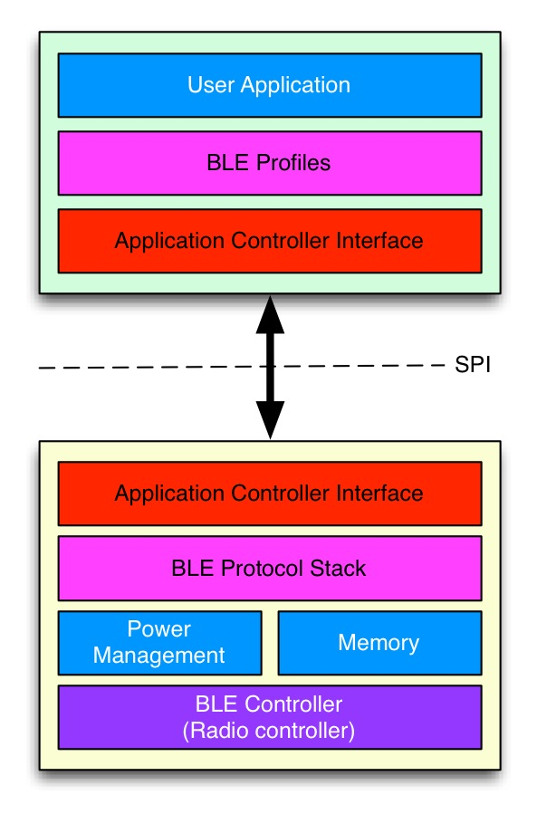BlueNRG interacts with user application in the external µC through the SPI interface. ST has developed an Application Controller Interface (ACI) - a sort of API build upon the SPI interface - that allows developers to interact with the chip without knowing implementation details of the BLE protocol stack. To simplify the development process, ST gives a free and complete set of libraries, which in turn are based on the STM32Cube-Fx framework. This set is called [X-CUBE-BLE1](http://www.st.com/web/en/catalog/tools/PF261442).

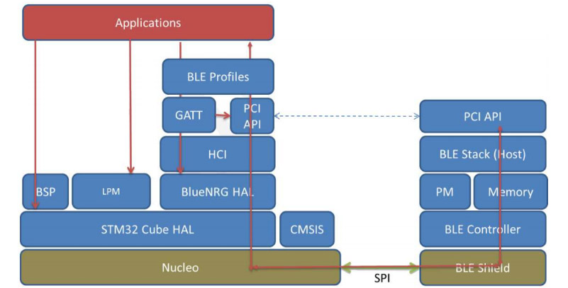X-CUBE-BLE1 contains these main relevant software components:

- a complete **BlueNRG HAL**, which abstracts from implementation details of ACI interface;
- a **Low Power Manager (LPM)** library, designed to correctly configure low power capabilities of BlueNRG network processor;
- two **Board Support Package (BSP)**, a set of specific hardware configurations for Nucleo-L0 and Nucleo-F4 boards;
- drivers for the **X-NUCLEO-IDB04A1** shield;
- 4 different demo projects to test different capabilities of BlueNRG chip; demos are built on STM32 Nucleo boards and X-NUCLEO-IDB04A1 shield.

### Software and hardware requirements

The instructions in this post are based on the following software and hardware requirements:

- A complete and working GCC/Eclipse toolchain for STM32 based on the GNU ARM Eclipse plug-in, as described in [this series](/?p=998).
- A STM32-Nucleo-F401RE developing board (it should be not too much complicated to rearrange instructions for your specific Nucleo).
- A X-NUCLEO-IDB04A1 Arduino compatible shield.

### How to compile a sample demo for BlueNRG chip

The first step we need to do is to create a project using the GCC ARM Eclipse plug-in. You can use the project name you want, but pay attention to use the following settings during project generation.

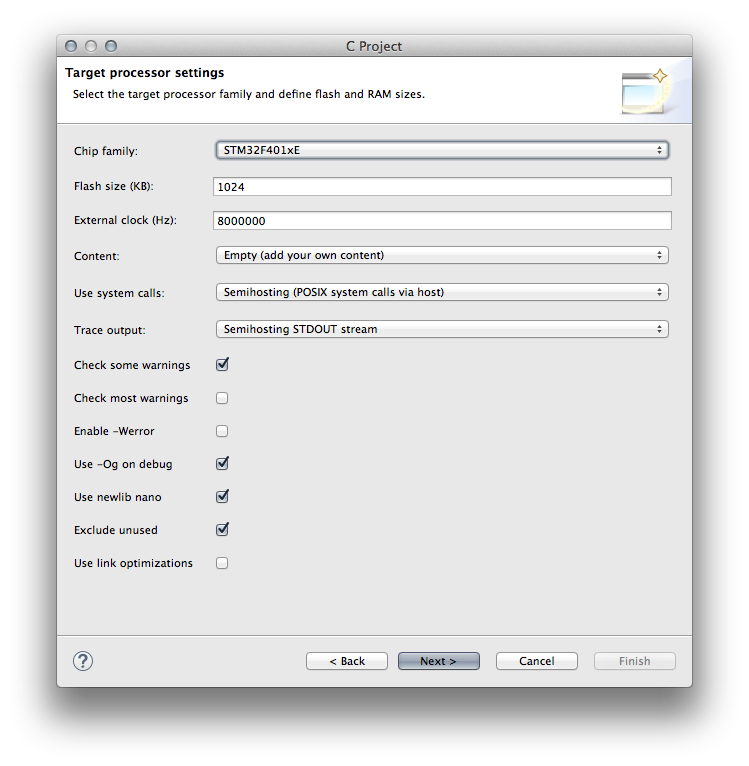Don't forget to enable *ARM Semihosting*, since the sample app from ST uses extensively semihosting to print debug messages. I'll show you next how to disable it to use the example application even without a debug session (when semihosting is enabled, the firmware hangs if it doesn't run during a debugging session, since the *print()* function expects a valid connection to OpenOCD to print messages on its console). Ok. Let Eclipse to generate the test project, and download the X-CUBE-BLE1 software package from [this page](http://www.st.com/web/en/catalog/tools/PF261442) (see the bottom of the page for download link). By default, I'll assume that the software package is extracted in the **C:\STM32Toolchain** directory, but feel free to place it where you've configured your toolchain.

Now we need to import in the Eclipse project all the necessary files and configure the project accordingly. First, create a folder in the Eclipse project, as shown in the following image, and name it ***bluenrg-stack***.

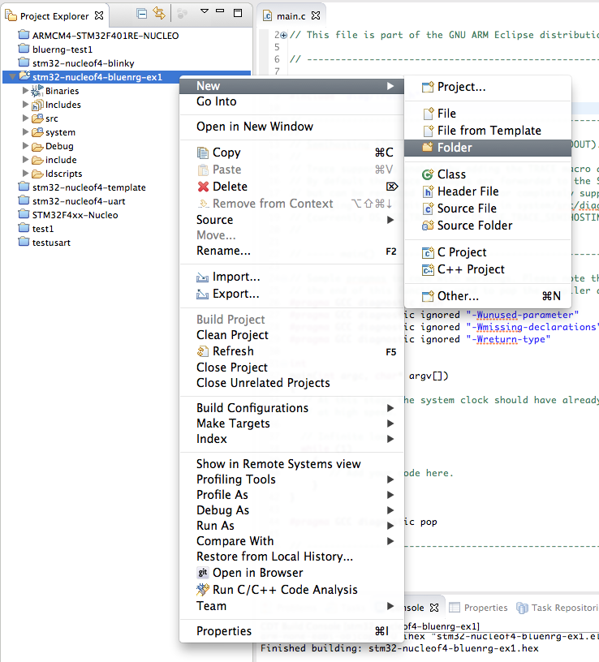Next, create a subfolder inside the *bluenrg-stack* folder and name it ***BSP***. Now go inside the C:\STM32Toolchain\X-CUBE-BLE1\Drivers\BSP folder and drag the folders *STM32F4xx-Nucleo* and *X-NUCLEO-IDB04A1* inside the *BSP* folder we made in Eclipse (you can find a video in the bottom of this page which shows the whole import process). Eclipse will show a dialog that ask you how to import files and folders in Eclipse: choose "Copy files and folder".

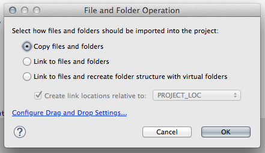


For the sake of completeness, I've to say that the best option is to choose "Link to files and folders", because if ST releases a new version of the software package, you should only replace the whole software folder in C:\STM32Toolchain without changing the project content and structure. However, this other option complicates a bit the project building process. I suggest you to try this other import option when you successfully compile the test project. It should be straightforward for you to rearrange the project settings. 


Next, you have to drag the whole C:\STM32Toolchain\X-CUBE-BLE1\Middlewares directory inside the *bluenrg-stack* eclipse folder. Always choose "Copy files and folder" when prompted. Now we need to delete the *main.c* file generated by GCC ARM plugin, since we'll use the one in the demo project. So, in Eclipse go to ***src*** folder and delete the ***main.c*** file, and drag in the same folder **ONLY** these files contained in the C:\STM32Toolchain\X-CUBE-BLE1\Projects\Multi\Applications\SensorDemo\Src folder:

- bluenrg_interface.c
- clock.c
- cube_hal_f4.c
- main.c
- sensor_service.c
- stm32xx_it.c

In the same way, drag in the Eclipse ***include*** folder these files from the C:\STM32Toolchain\X-CUBE-BLE1\Projects\Multi\Applications\SensorDemo\Inc folder:

- bluenrg_interface.h
- connection_config.h
- cube_hal.h
- sensor_service.h
- stm32xx_it.h

Ok. Now we need to instruct Eclipse to compile the files we've added to the project. By default, Eclipse doesn't compile the files we import in the project. To enable compilation, click with the right mouse button on the *bluenrg-stack* folder in *Project Explorer* panel and choose *Properties*.

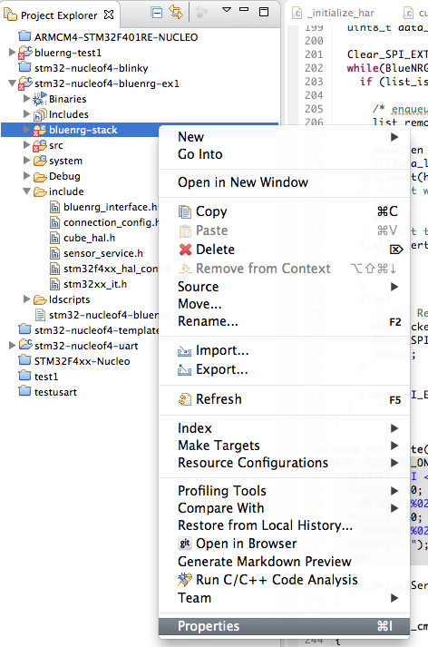Now go to *C/C++ Build-\>Settings* and UNCHECK "*Exclude resource from build*", as shown below.

[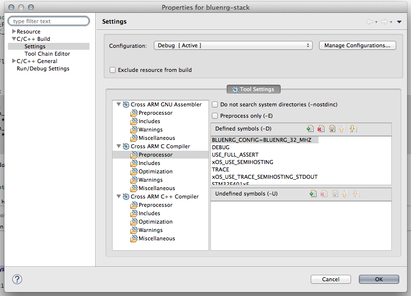](07-schermata-2015-03-08-alle-10-58-01.png)

In the same way, we have to enable compilation of **stm32f4xx_hal_spi.c** file (by default, GCC ARM plugin disables unused file to speed up project compilation). Go in the Eclipse folder **system/src/stm32f4-hal**; click on **stm32f4xx_hal_spi.c** file; choose "Properties" and in *C/C++ Build-\>Settings *UNCHECK "*Exclude resource from build*".

Ok. The most of the work is done. We only need to configure the test project adding few macro definitions and adding some paths to include directive.

We need to add two macro definitions to preprocessor symbols:  **USE_STM32F4XX_NUCLEO** and **BLUENRG_CONFIG=BLUENRG_32_MHZ**. This macro says respectively to **compile the project assuming a Nucleo-F4** board and to **configure BlueNRG with a clock of 32Mhz** (refer to BlueNRG documentation for more about this). Add these macros in the following way. Go to project properties (click on the main project folder with the right mouse button and choose "*Properties*"), *C/C++ Build-\>Settings*. In Tool Settings choose "Cross ARM C Compiler-\>Preprocessor" entry and click on the "Add..." icon. Add the two macros as shown below:

[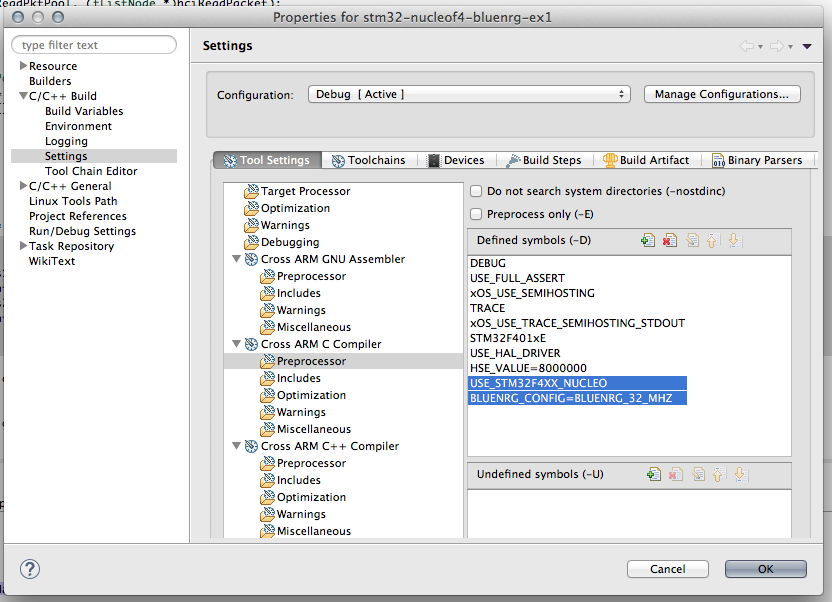](08-schermata-2015-03-08-alle-11-00-55.png)

In the same way we have to add folders where GCC will find necessary includes files to compile the libraries. In the same window, choose "Cross ARM C Compiler-\>Includes" entry and add the following paths:

- ../bluenrg-stack/Middlewares/ST/LowPowerManager/Inc
- ../bluenrg-stack/Middlewares/ST/STM32_BlueNRG/SimpleBlueNRG_HCI/includes
- ../bluenrg-stack/BSP/STM32F4xx-Nucleo
- ../bluenrg-stack/BSP/X-NUCLEO-IDB04A1

\[lightbox full="09-schermata-2015-03-08-alle-11-08-44.png" title=""\][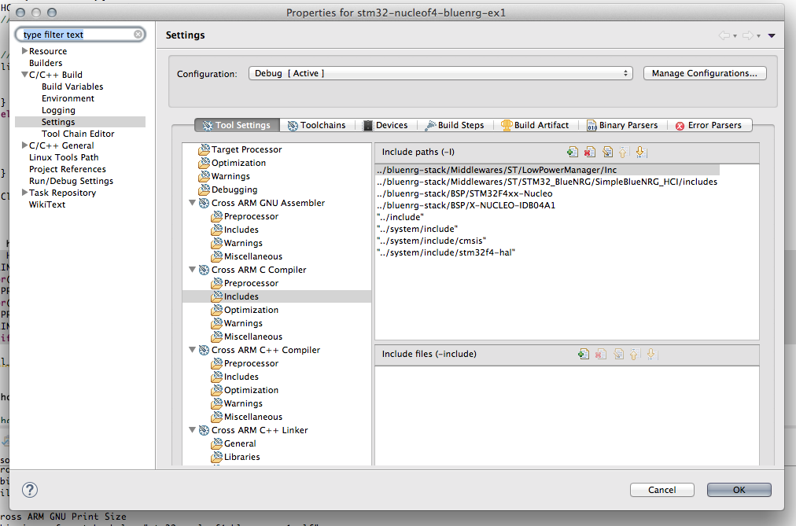](09-schermata-2015-03-08-alle-11-08-44.png)\[/lightbox\]

Finished 🙂\
You can now build the test project and upload it using OpenOCD (do not forget to create the *Debug Configuration* as shown in my series about Eclipse/GCC toolchain). To test the application you need a dedicated app provided by ST both for iOS and Android devices. The app name is "BlueNRG" and you can find it in the [Apple App Store](https://itunes.apple.com/it/app/bluenrg/id705873549?mt=8) and [Google Play Store](https://play.google.com/store/apps/details?id=com.st.bluenrg&amp;hl=it). The demo app is nothing more than a simulation of a giroscopic sensor, a temperature and humidity sensor. *Please, take note that it's just a demo and data are not real.*

|  |  |
|----|----|
| 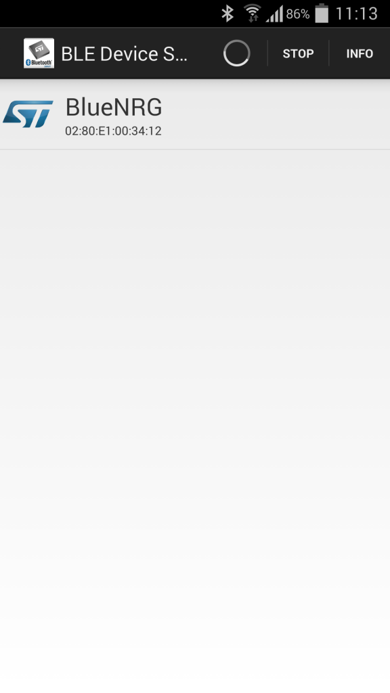| 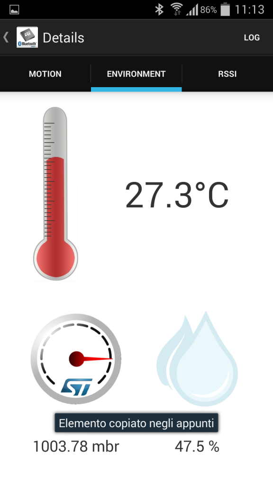|

### Some remarks

As said before in this post, the example demo uses *ARM Semihosting* to print messages on the OpenOCD console. You can see these messages going in the OpenOCD console in Eclipse.

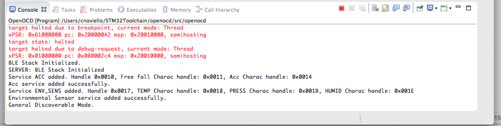This prevents application to run correctly without a debug session. If you want to use the compiled application even when not in debugging, you can disable the semihosting macros in preprocessor settings by simply adding a "*corrupting char*", as shown below:

[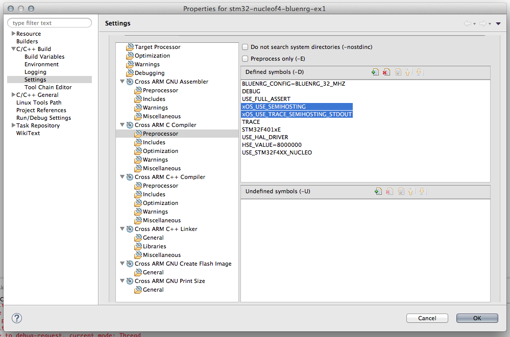](13-schermata-2015-03-08-alle-11-38-31.png)

Another important aspect to clarify is that different from other tutorials we have seen in the past, this time we didn't changed the clock configuration in **\_\_initialize_hardware.c** file, because the example demo already provide a correct clock configuration for Nucleo-F4 inside the **cube_hal_f4.c** file. This means that you have to modify the content of SystemClock_Config(void) function in that file to properly match your Nucleo oscillator settings (maybe using STCubeMX tool).

Finally, you'll see a lot of warning during the compilation process. This happens due some macro defined in the BlueNRG package that are already defined in the code generated by the GNU ARM Eclipse plug-in. You can safely ignore them.

As usual, you can download the whole test project from [my Github repository](https://github.com/cnoviello/stm32-nucleof4). I also made a video that shows the whole import and configuration process.

[Watch the embedded video](https://www.youtube.com/embed/xEDuP1G9kpI?feature=oembed)

In a next post I'll give a more detailed description of the demo code. Stay tuned 😉
