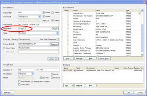
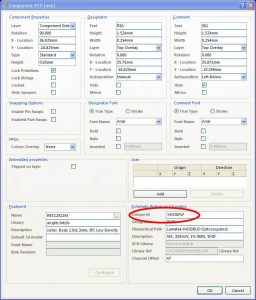
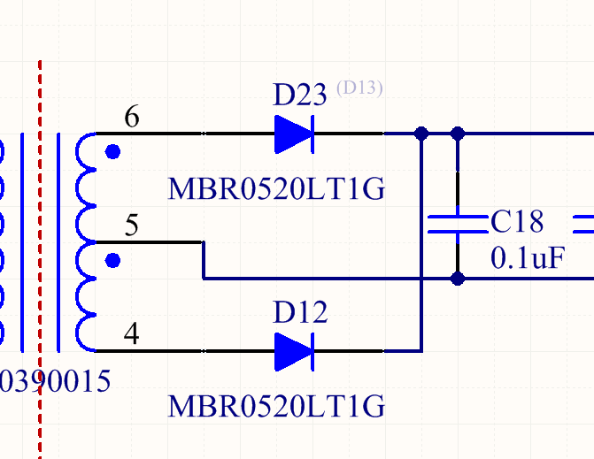

+++
title = "Correct way to perform re-annotation of designators in Altium"
slug = "correct-perform-re-annotation-designators-altium"
url = "/2016/08/28/correct-perform-re-annotation-designators-altium/"
date = "2016-08-28T17:02:53Z"
lastmod = "2022-11-22T17:00:36Z"
draft = false
description = "It's really common that at the end of the board layout we have that all component designators are randomly scattered over the board. R1 is somewhere, R2 is hidden in another…"
categories = ["Electronics"]
tags = ["altium","annotation","back","pcb","reannotation"]
showHero = true
showTableOfContents = true

[cover]
image = "images/legacy/correct-perform-re-annotation-designators-altium/cover-altium-back-annotate-pcb.jpg"
alt = "altium-back-annotate-pcb"
hiddenInSingle = false
+++

It's really common that at the end of the board layout we have that all component designators are randomly scattered over the board. R1 is somewhere, R2 is hidden in another place, and so on. This happens because often the development of schematics isn't  linear, especially if we are designing some sub-modules before others or if we are reusing some schematics sheets from other and well-tested designs. This is not a critical aspect if the board will be assembled using a pick-and-place (modern pick-and-places are able to process *pick-and-place files* that contain the exact coordinates of a given component on a board) or if it contains few tens of components. But if you are going to assemble a prototype manually (I'm used to assemble manually even boards with 3-400 components, believe it or not), then having all component designators scattered on the board is a hell. You can spend even minutes looking for the right place of a given component, and often you need to rotate too many times the board, running the risk to throw away already placed components.

Good CADs for PCB design allow to re-annotate designators at PCB-level. Usually, they allow you to select a re-annotate strategy (Altium Designer offers 5 strategies, and the most useful one is the second - *By Ascending X and Then Descending Y* - if you are used to assemble your boards manually), which numbers the component designators according their physical position. Once designators are renumbered, you need to transfer the new numbering to schematics: this procedure is called *back annotation*.

In Altium this procedure should be easy, at least on paper. Instead, every time I perform a re-annotation in the PCB editor I always forgot at least a critical step, causing that schematics and PCB layout go out-of-sync (that is a given component in schematics doesn't correspond to the same physical component on the PCB). So, I've decided to explain the right way to re-annotate designators in the PCB editor in Altium.

Before I show the exact procedure, it's important to underline that in Altium the designator of a component doesn't uniquely identify it. It's just the reference of a component in the design, which will have a label on the final PCB, but from the Altium's point of view it's just an annotation. The next figure shows the *Unique ID* of a part in the schematics editor, while the following one shows in the PCB editor.

Unique ID of a part in schematics editor

Unique ID of a part in PCB editor

This means that, in case your design goes out-of-sync, you can still recover the right annotation, unless you mess with *Unique IDs* of components. However, if you follow to the letter the next procedure, you should correctly perform a back annotation without encountering any issue.

First of all, **I strongly suggest to make a copy of the whole project before you start the procedure**. If something goes wrong you can easily restore the project without the risk of messing up with your design (you can read on the web of people that had to perform the board layout again after a wrong board re-annotation in PCB editor). Next, this is the right recipe to follow:

1.  Compile your project (**Project-\>Compile PCB Project**) and ensure that there are no relevant errors connected with component designators (e.g., duplicated designators and so on).
2.  Verify that board and schematics are up to date (from the PCB Editor no changes reported for **Design-\>Import changes from \*.PrjPcb** and for **Design-\>Update Schematics in \*.PrjPcb**).
3.  From the PCB Editor verify that there are no un-matched components in Component Links (**Project-\>Component Links...**).
4.  Then you can proceed to re-annotate designators from PCB Editor going to **Tools \> Re-Annotate** using the annotation strategy you want.
5.  From the PCB Editor go to **Design-\>Update schematics ** and accept the ECO.
6.  Now if you go in the Schematics Editor you can see that all components have two designators: the main one comes from the new PCB re-annotation; the greyed one corresponds to the old designators, as shown in the following picture.\
    \
    To force Altium to accept all new designators we need to recompile the project (**Project-\>Compile PCB Project**). **IMPORTANT: do not skip this step!**
7.  The previous step causes that all net names change (because the component designators change), except for the user-defined nets. We so need to sync net names between Schematics and the PCB Editor going inside the PCB Editor and choosing **Design \> Import changes... **(don't execute the procedure from the Schematics editor; don't ask me why, but a lot of troubles arise when this procedure is executed from the Schematics editor). **IMPORTANT: do not skip this step!**

Finished. If you have followed the above procedure I'm certainly sure that now you have re-annotated your design correctly, according the physical placement of parts on the final PCB.
