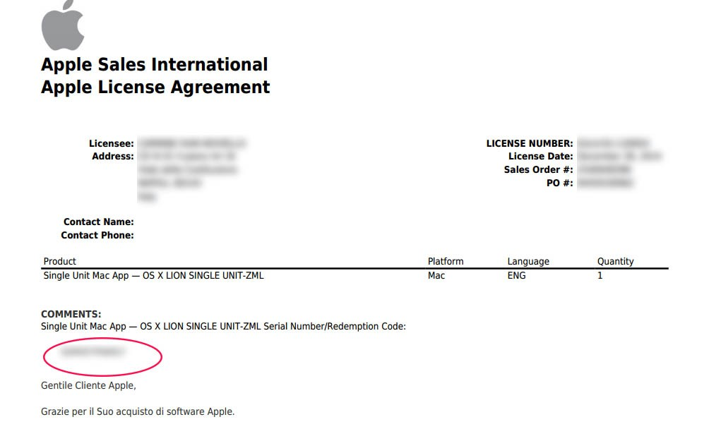
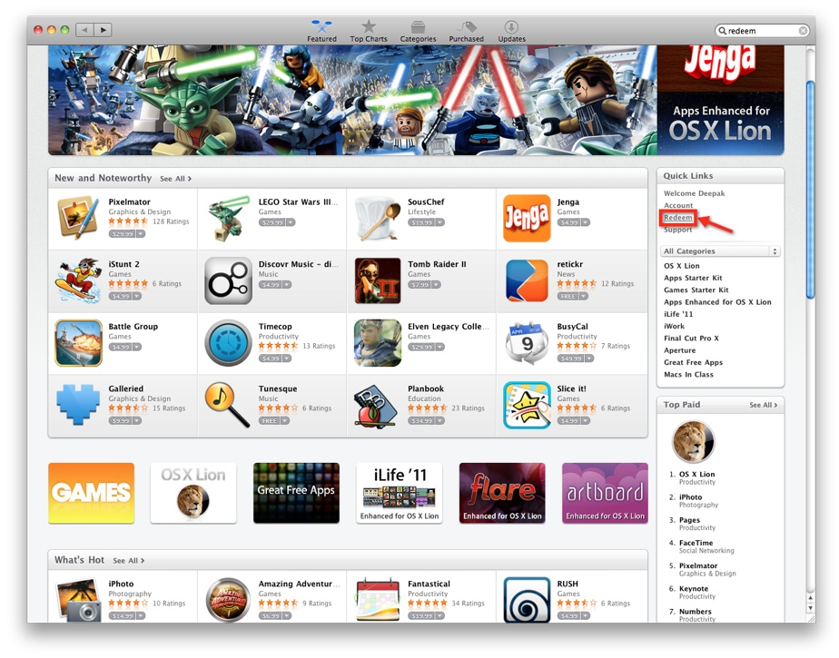

+++
title = "How to download Mac OSX Lion from the App Store"
slug = "download-mac-osx-lion-app-store"
url = "/2014/12/29/download-mac-osx-lion-app-store/"
date = "2014-12-29T19:12:31Z"
lastmod = "2014-12-29T19:12:31Z"
draft = false
description = "I'm the happy owner of an old 2007 MacBook Pro. All said it still runs goods. It has Snow Leopard (10.6.8). But, since there are a lot of apps that…"
categories = ["Others"]
tags = ["app store","download","lion","mac osx","purchase"]
showHero = true
showTableOfContents = true

[cover]
image = "images/legacy/download-mac-osx-lion-app-store/cover-macosxlion.jpeg"
alt = "macosxlion"
hiddenInSingle = false
+++

I'm the happy owner of an old 2007 MacBook Pro.  All said it still runs goods. It has Snow Leopard (10.6.8). But, since there are a lot of apps that don't run on Snow Leopard, I would update it to Lion (10.7), the latest Mac OSX release available for my MacBook. And it costs only €18. Good deal. So I've bought a new license through the Apple Store in Italy. After 6 days (....ummm, this delay was probably caused by Christmas holidays...) I've received an E-Mail from Apple with my license. Ok. Let's download it.

Ummm. Ok. From where? After 1 hour of googling and looking around in the App Store, I've realized that the code you receive in license file is not the product-key, but a redemption code to use on the App Store (instructions in Italian are not clear...).  So let's see how to download Lion from App Store.

The E-Mail you'll receive from the Apple contains a serial code

\[lightbox full="http://www.carminenoviello.com/wp-content/uploads/2014/12/licenza-lion.jpg"\]

\[/lightbox\]

The code you are interested in is the one circled in red. Ok, copy that code. Go in the App Store (you need latest Snow Leopard version, 10.6.8). In the "Featured" section go to "Quick Links" menu and choose "Redeem" entry.

\[lightbox full="02-mac-os-x-upgrade-1.jpg"\]\[/lightbox\]

 

Paste the code you received. The App Store starts downloading Lion. You can see download progress in the "Purchase" section.

Enjoy your old Mac 😉
