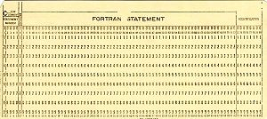

+++
title = "È ancora possibile apprendere le basi dell'informatica?"
slug = "e-ancora-possibile-apprendere-le-basi-dellinformatica"
url = "/2013/08/13/e-ancora-possibile-apprendere-le-basi-dellinformatica/"
date = "2013-08-13T11:51:33Z"
lastmod = "2013-08-13T11:51:33Z"
draft = false
description = "E se sì, qual è il modo migliore? Questo post mi è venuto in mente dopo aver letto alcuni articoli recenti sul blog di Antonio Cangiano, in particolare uno relativo…"
categories = ["Others"]
tags = ["Arduino","linux","Raspberry PI","studiare informatica"]
showHero = true
showTableOfContents = true

[cover]
image = "images/legacy/e-ancora-possibile-apprendere-le-basi-dellinformatica/cover-binary-large.jpg"
alt = "Binary Large"
hiddenInSingle = false
+++

E se sì, qual è il modo migliore? Questo post mi è venuto in mente dopo aver letto alcuni articoli recenti sul blog di Antonio Cangiano, in particolare [uno](http://programmingzen.com/2011/07/09/the-need-for-good-vocational-schools-for-programmers/) relativo alla capacità del mondo accademico di "costruire" buoni informatici, invece che pessimi scienziati. Questa semplificazione nel post citato non c'è, ma io ritengo che il nodo sia quello.

Più in generale c'è da chiedersi se il costante processo di trasformazione dei computer in elettrodomestici tuttofare possa contribuire alla formazione delle nuove generazioni di informatici. Prendete ad esempio i tablet e la loro diffusione tra i bambini. Oggi vedo praticamente ovunque bambini di 2-3 anni che armeggiano con un iPad come fosse un qualunque giocattolo della Chicco. Secondo alcuni questo è il segnale che le nuove generazioni hanno un ottimo rapporto con le nuove tecnologie, e sarà sempre meno necessario insegnargliene l'uso. Già l'uso. Ma rispetto a quello che c'è sotto, possono le nuove frontiere tecnologiche aiutare o fanno solo danni?

Partiamo dalla mia esperienza personale, che ha origine negli anni '80. A quel tempo se avevi un PC o anche un Commodore 64 avevi delle scelte molto limitate. Se anche pensavi di usare il computer esclusivamente per giocarci (giocattolo molto costoso, direi), comunque ti scontravi con il fatto che per eseguire il gioco dovevi un minimo avere confidenza con il famoso *prompt dei comandi * - una delle tante [invenzioni](http://programmingzen.com/2010/06/23/how-microsoft-is-changing-the-programming-world/) della Microsoft che preferiva non usare il termine *console*, diffuso nell'universo UNIX. E allora finivi per provare a capirci molto di più, soprattutto se non amavi i giochi. Dovevi per forza farci altro, altrimenti ti ritrovavi con un soprammobile impolverato. Per esempio, sia io sia mia sorella (più piccola di me di 3 anni) usavamo il computer. Lei ai videogiochi era un mostro: era capace di finirli in una giornata. Io, già coi miei 10 anni, ero meno abile e spesso mi infastidivano. Io ad un certo punto preferii cominciare a studiare l'oggetto. Mia sorella non ha seguito la strada di informatico, ma con quelle poche basi dell'epoca oggi si è messa su da sola un intero sito web, un negozio on-line ed ha saputo - senza aiuto di nessuno - fare anche delle modifiche al codice PHP. Capacità personali? Propensione?  Probabile, ma io dico che semplicemente lei negli anni '80 ha visto da vicino il concetto di file e directory (non cartella!), quello di "comando da eseguire" e qualche modifica con *edit* ad un file BAT l'avrà dovuta fare sicuramente. Oggi, un bambino che impara ad usare un iPad, che ha una forma di ostracismo tecnologico nei confronti del "file", potrà essere un utente più consapevole un domani? Io dubito fortemente.

Tuttavia voglio subito sgomberare il campo da un equivoco che potrebbe nascere: questo post non è basato sul classico modello del "non esistono più le mezze stagioni" o del "si stava meglio quando si stava peggio". Perché analizzando cosa c'è in giro, oggi le possibilità di apprendimento sono superiori e migliori (ci arrivo fra un po' a questo punto). Il problema è che ad essere peggiorata è la porta di accesso, rappresentata dai dispositivi mobile e dai PC. Sui dispositivi mobile già ho scritto, ma anche i PC non scherzano. Togliamo il mondo Mac, che rimane ancora una nicchia elitaria (specie per i prezzi di acquisto dei prodotti Apple). E togliamo anche il mondo Linux, a cui si accede quando già si è fatto il salto di qualità, o almeno lo si vuole fare. Resta, purtroppo, l'universo Microsoft.\
Avete avuto modo di vedere Windows 8 e la sua stupenda (?!) metro-style interface? Direbbe qualcuno è "agghiacciante". Ho provato a fare delle operazioni che con un qualunque altro computer avrei fatto in 5 secondi, impiegandoci tempi "biblici" per un informatico. E più illuminante è stata l'osservazione della mia ragazza: ma vedi, è come un tablet, è tutto molto più semplice!\
Semplice?!?!? Non direi proprio! Direi è tutto così compartimentato, chiuso in schemi fissi e che non fanno capire poi realmente cosa c'è sotto. E si ritorna al punto di cui sopra.

### Eppure oggi le cose vanno meglio

Direte: stai impazzendo? No. Affatto. E ve lo dimostro. Torniamo sempre indietro di un ventennio, agli inizi della diffusione di massa dell'informatica. Come vi dicevo a quel tempo farsi le basi era più naturale di oggi. Vero. Ma secondo voi costruirsi da zero un computer elementare, che ne so un [8080](http://it.wikipedia.org/wiki/Intel_8080) oppure lo stesso Commodore, era possibile? A parte [qualche esperimento dell'epoca](http://it.wikipedia.org/wiki/Sinclair_ZX80), la costruzione di un elaboratore elettronico era appannaggio di grandi aziende come IBM & co, che dopo anni di progettazione e investimenti milionari riuscivano a dare all'utente finale un elaboratore a prezzi non proprio popolari. Certo restava la parte di programmazione, compito dell'utente (inteso in senso lato), ma molti degli aspetti hardware restavano oscuri alle masse.

Oggi, invece, le cose sono cambiate. Grazie al progresso sorprendente dell'elettronica, sono disponibili delle piattaforme paragonabili a quei prodotti degli anni '80, ma dal costo irrisorio e soprattutto progettabili e montabili dall'utente stesso. Prendiamo [Arduino](http://arduino.cc/). Non è forse molto simile a quei primi PC degli anni '80? Ha 26Mhz (all'epoca, per vedere i 26Mhz si dovette attendere l'80386DX). Ha una memoria interna e una flash per caricare i programmi. Ha varie uscite digitali per comandare periferiche esterne. Ma soprattutto, troverete in rete decine di progetti fatti anche da ragazzi di 10-12 anni che ne clonano le funzionalità su breadboard per meno di 5€. Certo: non ha un'uscita video ([poi mica tanto vero](https://www.sparkfun.com/products/10593), ma sorvoliamo), 4k di RAM e 32K di Flash. Troppo elementare per paragonarlo ad un elaboratore *general purpose*? Allora prendiamo a modello la [Raspberry Pi](http://www.raspberrypi.org/): quello è un vero e proprio computer, che costa meno di €30 e con cui ci si possono fare le ossa con un sistema operativo serio ed educativo come Linux. Sì: ha un SoC BGA che ne inficia la riproducibilità in casa. Ma volendo in giro ci sono dei SoC ARM non BGA, che potrebbero essere usati in contesti educativi come scuole superiori o università per far vedere come costruirsi da zero un computer.\
Metteteci, infine, l'ovvia constatazione che grazie ad internet è possibile accedere liberamente ad una mole di informazioni che negli anni '80 ci sognavamo, e vedete che la mia affermazione non è affatto campata in aria.

Insomma, sul fronte hardware le cose sono decisamente migliorate. E il software?

### Il software è rimasto al palo

Chi guarda all'estetica dei sistemi operativi e dei programmi, o all'evoluzione di software mastodontici come AutoCAD, Photoshop, Ansys, ecc, riterrà che il titolo di questo paragrafo è una grande castroneria. Tuttavia, pensiamo un attimo a quello che c'è dietro. Molti, probabilmente, sono programmi scritti in C/C++, con tecniche di programmazione ormai consolidate (a punto che qualcuno si è divertito a raccoglierle - qualche anno addietro - in un catalogo di [pattern](http://it.wikipedia.org/wiki/Design_Patterns)). Certo anche nel software c'è stata un'evoluzione, ma prevalentemente è stata tecnologia, non tecnica. I concetti sono rimasti sostanzialmente quelli. Sono le librerie ad essere diventate enormi, complicate - badate non ho detto complesse. È stata la stratificazione software, il riuso a rendere i sistemi di oggi quello che sono. Ma i concetti nel software sono ormai fermi, da almeno un ventennio e forse pure di più.

Quindi non serve il PC all'ultimo grido. Non serve l'ultima versione di Windows. Non serve l'ultima versione di .NET e di Visual Studio o di Java. Servono le basi. E un "computer" di 26Mhz può dare molte più basi di un framework complicato ed involuto. I tecnicismi vengono dopo.  E quando le basi sono solide i tecnicismi sono "dettagli".

### Combattere l'obsolescenza

*"L'informatica è un settore ad elevata obsolescenza tecnologica e umana"*. Ricordo ancora con chiarezza queste parole pronunciate da mio zio che lavorava nel settore, un giorno caldo di fine agosto. Queste parole hanno un fondo di verità, ma anche un fondo di bugia. Quanti di noi conoscono persone che ormai hanno passato i 40, e magari sono nei 50, ed hanno difficoltà enormi nel continuare a lavorare nel mercato del lavoro informatico? Beh io diversi. Qualche tempo fa mi sono imbattuto in una persona. Vi racconto la sua storia - spero che se legge non se ne abbia a male.

Laureato in ingegneria elettronica negli anni '80, finì per entrare in un'azienda orbitante nella sfera di una grossa azienda di stato italiana. Azienda privata, ma "orbitante". Per anni si sono occupati di un sistema usato nell'ambito militare basato su software di una azienda americana che non citerò, nota per aver fatto solo guai in questo paese. Questo sistema - che secondo me era uno schifo già agli albori - è stato mantenuto in vita fino alla metà degli anni 2000, quando poi è stato dismesso per logiche politiche. L'azienda è entrata in crisi, e dopo vari escamotage all'italiana ha chiuso. Alcune decine di lavoratori finiti in mezzo ad una via. Questa persona oggi ha enormi problemi nella ricerca di un lavoro, con tutto quello che ne consegue. Quando ci ho parlato ho capito che:

- È rimasto completamente tagliato fuori dallo sviluppo tecnologico dell'informatica negli ultimi anni.
- Non ha mai avuto alcun interesse - e non è mai stato spinto a farlo - a vedere come i linguaggi e i sistemi stavano evolvendo.
- Purtroppo ho riscontrato basi molto deboli di fondamenti di informatica (la classica frase: *usavamo il C++ perché più potente del C*).

Insomma, cosa può offrire questo professionista che un neo-laureato sottopagato, abile ma al contempo acerbo, non può già offrire? E come, a questo punto, si può combattere l'obsolescenza?

Sicuramente un fattore importante per sopravvivere nell'informatica è avere una forte curiosità che va tenuta sempre in vita. Ci vuole passione, dedizione, la mente sgombera da pregiudizi. Anche se il lavoro ti porta ad occuparti per decenni di una sola tecnologia, bisognerebbe sempre guardarsi intorno, e trarre insegnamenti da altri ambienti, studiare nuovi linguaggi, capirne le sottigliezze. Ma soprattutto c'è un altro fattore da tenere sempre a mente.

### Non inseguire le mode, ma seguirle.

Come il sostiene il mio capo, l'informatica è la più giovane delle scienze matematiche. Ed ha subito gli effetti dell'industrializzazione dei prodotti. E del marketing. Questo comporta che ancora oggi spesso si confonde la moda del momento con il progresso vero e proprio della materia. E purtroppo troppo spesso le persone inseguono queste mode, si affannano e ne restano vittime. L'errore più grande che si commette poi è quello di considerare la moda come "eterna". Un esperto di moda propriamente detta ti direbbe che le mode passano e ricorrono. Quanti fenomeni dell'informatica sono ricorrenti? Prendete il *cloud computing*. Non è forse una riedizione migliorata - causa potenziamento delle reti geografiche - dei centri di calcolo degli anni '80? Per gran parte degli anni '90 e 2000 ci hanno detto che non c'era niente di meglio che avere il proprio server *in house*. E compravamo ferro e posti dove collocarlo al fresco. Oggi ci dicono che è meglio affidare a terzi i nostri dati. Mode che ricorrono, come i pantaloni a zampa larga.

La caratteristica delle mode ricorrenti è che alla fine hanno gli stessi principi di base: per questo vi dicevo che l'evoluzione dei concetti soggiacenti al software non c'è stata. E per questo, tornando al discorso di apertura, anche le università dovrebbero puntare a far capire i concetti di fondo, senza però né (solo) puntare a modelli totalmente decontestualizzati né inseguire le mode - ricordo un mio esame all'università il cui contenuto era il Flash di Adobe (e ricordo ancora oggi la sofferenza di quell'esame....). Perché non serve, al paese e alle persone, creare pessimi scienziati e pessimi programmatori: occorre creare individui consapevoli che con un mix di passione e dedizione sapranno discernere ciò che è di passaggio da ciò che resterà. Con un occhio critico che gli permetta di essere sul mercato fino ai 70 anni che i moderni *welfare state* impongono.
