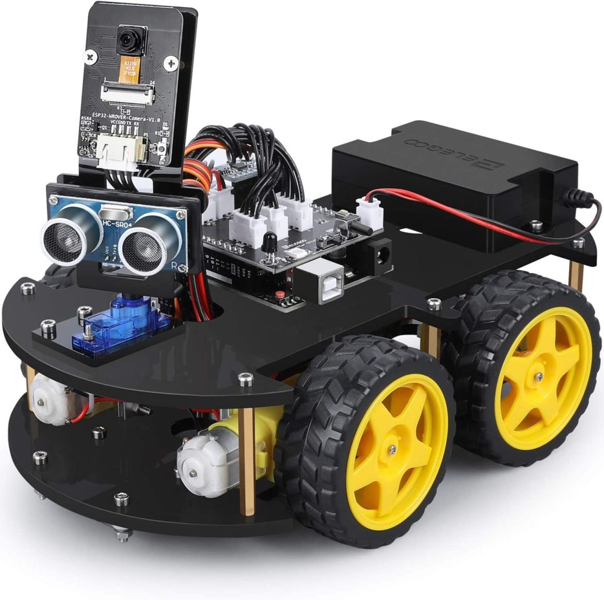
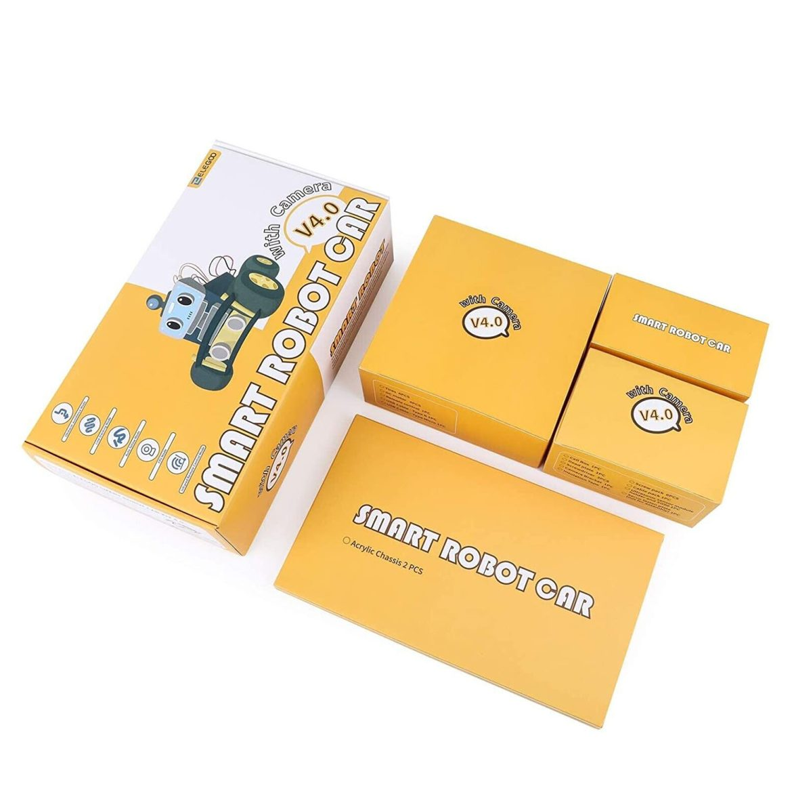
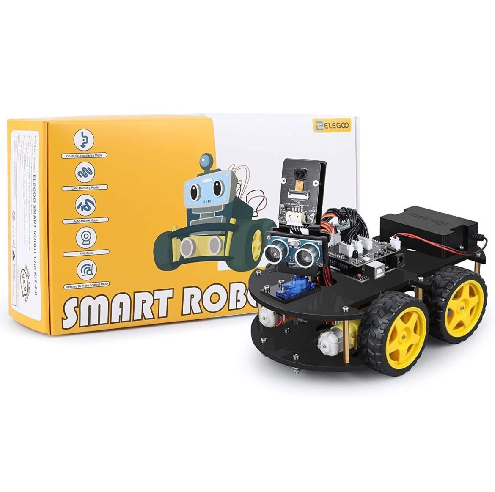
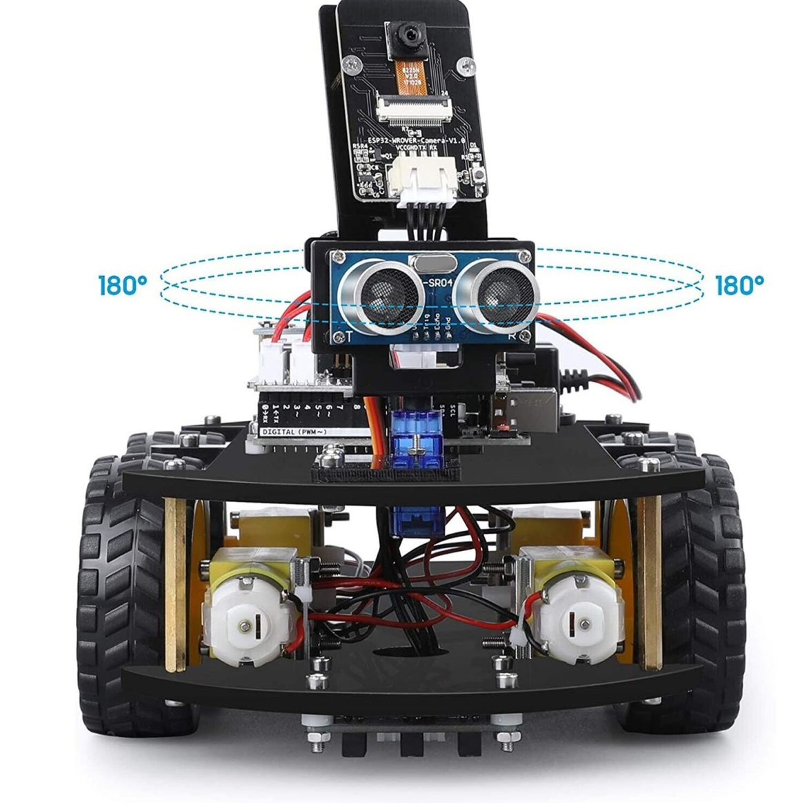
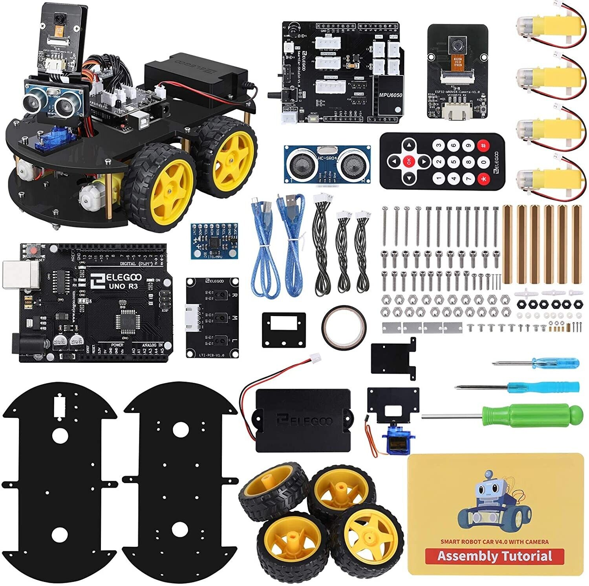

+++
title = "Elegoo Car Kit V4"
slug = "elegoo-carkit-v4"
url = "/2022/12/02/elegoo-carkit-v4/"
date = "2022-12-02T06:23:00Z"
lastmod = "2022-12-02T06:42:23Z"
draft = false
description = "I have one regret in my life. Robotics. When I was just a child, I spent a great part of my life playing with the Lego Technics. One day an…"
categories = ["Arduino","Electronics","Robotics"]
tags = ["Arduino"]
showHero = true
showTableOfContents = true

[cover]
image = "images/legacy/elegoo-carkit-v4/cover-141mfn06-elegoo-uno-r3-project-smart-robot-car.jpg"
alt = "141MFN06-elegoo-uno-r3-project-smart-robot-car"
hiddenInSingle = false
+++

Elegoo Car Kit v4.0

Elegoo Car Kit v4.0

Elegoo Car Kit v4.0

Elegoo Car Kit v4.0

Elegoo Car Kit v4.0

I have one regret in my life. Robotics. When I was just a child, I spent a great part of my life playing with the Lego Technics. One day an uncle of mine gave me a book, which at the time was also translated into Italian. The book was called *[The Robot Builder's Bonanza.](https://www.amazon.com/Robot-Builders-Bonanza-Inexpensive-Robotics/dp/0830608001) *There were not any microcontrollers for the hobbyists at the time, and it was not simple to put that book in action. 

Nowadays things are completely different. The Arduino revolution allowed any hobbyist to have fun with robotics with very little investment. There are hundreds of kits, sold on the web at a very ridiculous price, which allow to play with sensors, actuators, motors, etc. And in recent times things are becoming really interesting. With the advent of machine learning for the masses, there is the concrete possibility to build "smarter" robots at home with very limited knowledge.

For me it's time to get the hands dirty, and so I decided to buy one of those kit ready to be used. [Elegoo](https://www.elegoo.com/) is a company of the Chinese Silicon Valley (Shenzhen) that sells a very well done kit to make rovers. The kit comes in a very professional and stylish package: the quality is simply amazing if you consider that the kit costs less than [€70 on Amazon](https://amzn.to/3F1oUdf). The kit contains 24 kinds of module parts including an Arduino UNO, a motor shield, an obstacle avoidance module, a line tracing module, an infrared remote control and you can also control it via phone and tablets (Android and iOS) thanks to a dedicated board with a camera and an ESP32 MCU already pre-programmed. The kit is really simple to mount and it's suitable, according to me, for children from ten years and above. The kit is available with all the [necessary source code](https://www.elegoo.com/pages/arduino-kits-support-files) to hack it and have a lot of fun, IMHO. 

I have very ambitious plans for this rover :-D. So, stay tuned.

In the meantime, you can watch one of the reviews available on Youtube.

[Watch the embedded video](https://www.youtube.com/embed/iK6PL1tUtp0?feature=oembed)
