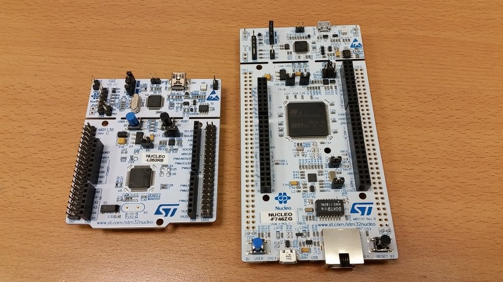
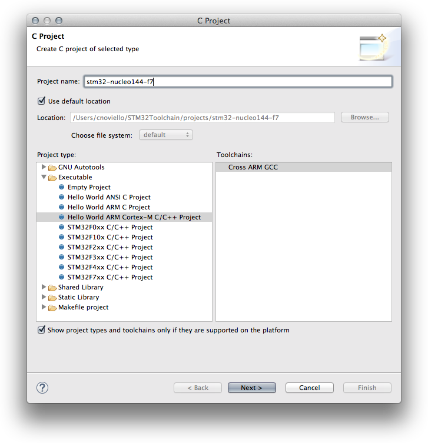
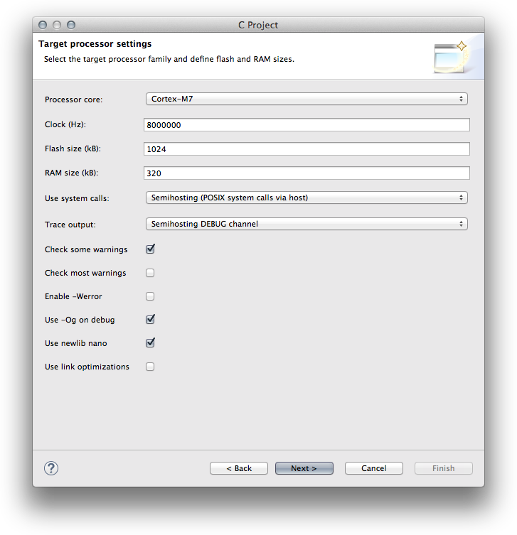
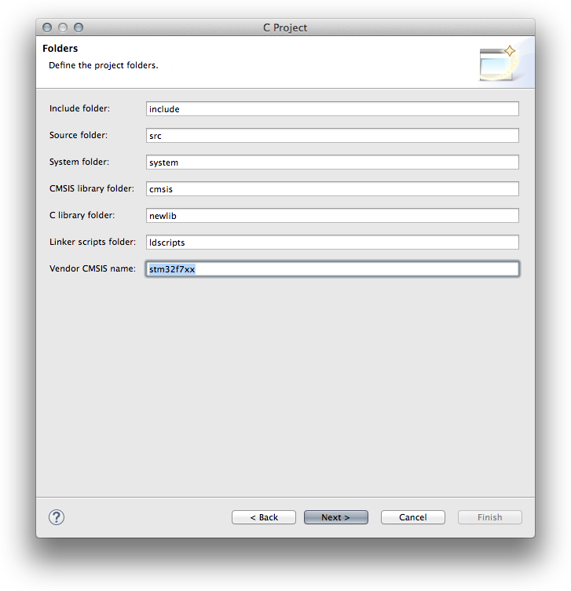
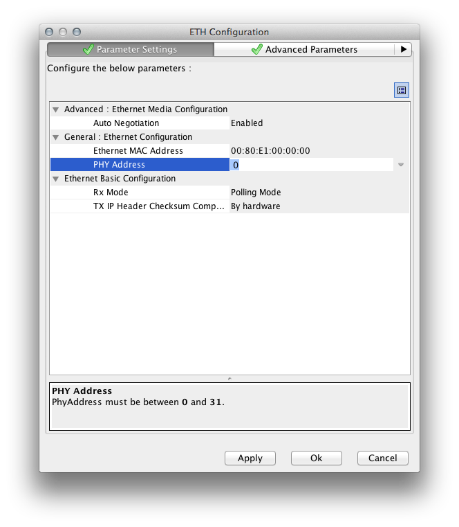
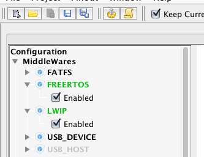
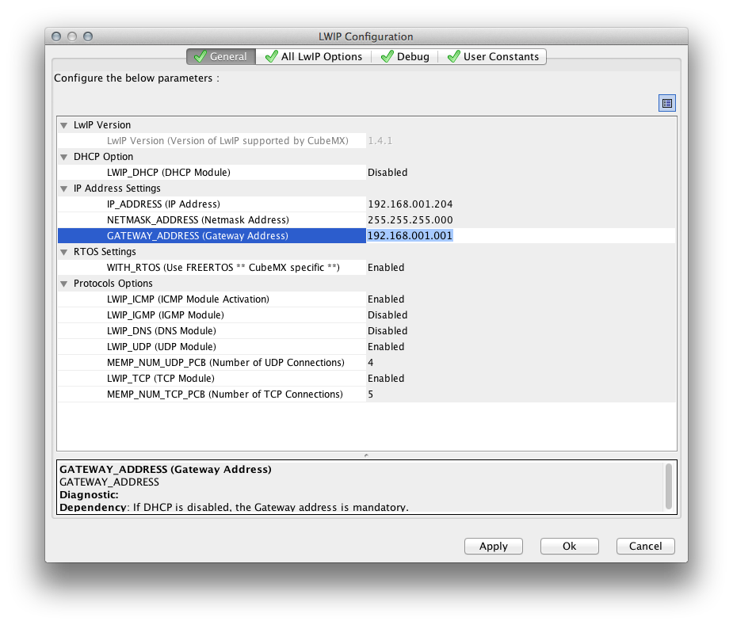
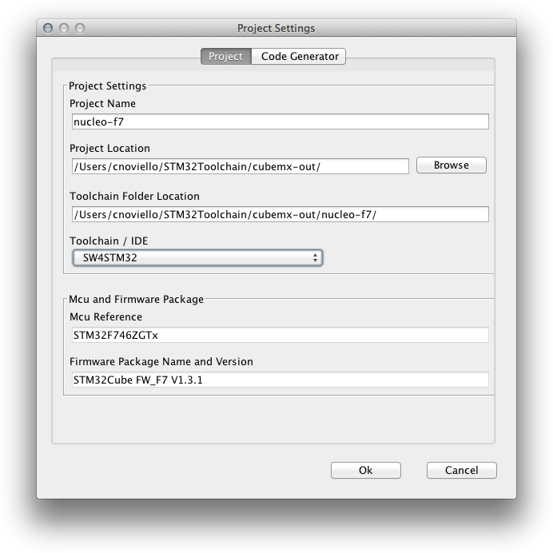
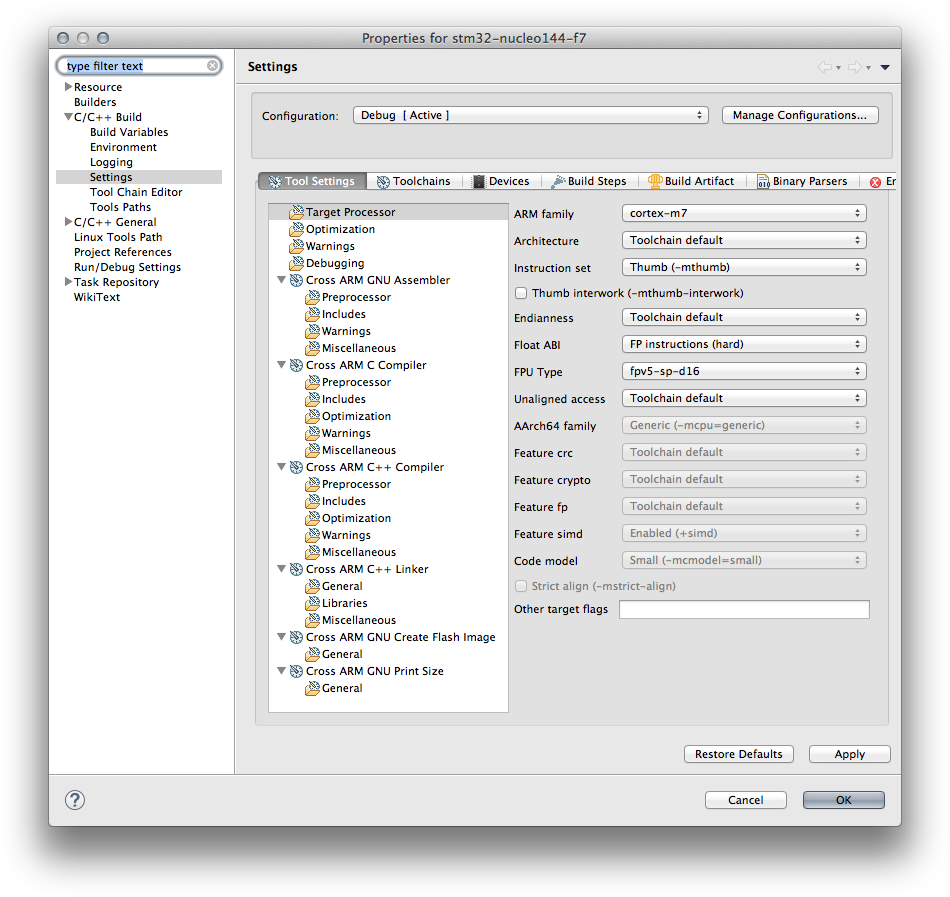

+++
title = "Getting started with the STM32 Nucleo-F746ZG"
slug = "getting-started-stm32-nucleo-f746zg"
url = "/2016/01/22/getting-started-stm32-nucleo-f746zg/"
date = "2016-01-22T17:30:28Z"
lastmod = "2016-01-22T17:30:28Z"
draft = false
description = "Finally the totally new Nucleo-F746 is in my hands! This is the first development kit of the Nucleo-144 line from ST, and I've to say that probably, at that street…"
categories = ["STM32"]
tags = ["ethernet","lwip","nucleo-144","stm32cubemx","stm32f7","stm32f746"]
showHero = true
showTableOfContents = true

[cover]
image = "images/legacy/getting-started-stm32-nucleo-f746zg/cover-nucleo-144-large-2.jpg"
alt = "nucleo_144_large"
hiddenInSingle = false
+++

Finally the totally new Nucleo-F746 is in my hands! This is the first development kit of the Nucleo-144 line from ST, and I've to say that probably, at that street price (~23\$), is the best development kit a maker can find on the market, if you consider that a genuine Arduino DUE costs more than 40\$ and its MCU is just a Cortex-M3.

[](01-nucleo-144-vs-nucleo-64.jpg)

Compared to the classic Nucleo-64, it looks impressive: it's more wider and offers a lot of more "standard" peripherals. The USER LEDs are now three (red, blue and green), and the power LED is now green. The most relevant thing is that the board comes with a LAN jack, magnetics and a SMSC phyther. This means that we can start developing IoT applications using the powerful Cortex-M7 core running at 216MHz. Respect to the STM32F746-Discovery, which was the first "cheap" F7 development board from ST, it doesn't provide an LCD display. However, the Nucleo-144 provides the most of MCU signal I/Os through the "Zio" connectors, while the Discovery-F7 only few signals routed to the Arduino-style connectors. If you are going to use the Nucleo-144 to develop a custom product, then it's the best option.

In this post I will show you the steps needed to start working with this fantastic piece of hardware. We'll use the LwIP stack to create a simple web server running on the Nucleo. The web-app will allow us to interact with Nucleo LEDs and USER BUTTON, using [bootstrap](http://getbootstrap.com/) and [jQuery](http://jquery.com/). The following video shows how the HTTP server works.

[Watch the embedded video](https://www.youtube.com/embed/ANfsMislJFg?feature=oembed)

I'll assume that you have a working Eclipse/GCC ARM tool-chain based on the excellent [GNU ARM Eclipse plug-ins by Liviu Ionescu](http://gnuarmeclipse.github.io/). If you don't have the whole tool-chain installed, please refer to the free sample of my [book about STM32 platform](https://leanpub.com/mastering-stm32): you'll find all the required instructions to getting started with those tools. It's completely useless repeat here more that 40 pages of instructions.


**Read carefully**

My book currently relies on OpenOCD 0.9. However, this release doesn't support the STM32F7, so you'll need a preview of the release 0.10. Liviu provides a precompiled release for Windows, Linux and MacOS. You can download it from [here](http://gnuarmeclipse.github.io/blog/2016/01/11/openocd-v0.10.0-201601101000-dev-released/#download).


### STEP1: Create a new Eclipse project

The first step is creating a new Eclipse project. Liviu Ionescu has recently updated the project templates, adding the support to STM32F7 MCUs. However, we use another procedure here: we'll first create a basic ARM C/C++ project, and then we'll import inside it a project generated by CubeMX, which simplify a lot the MCU configuration procedure. Moreover, it will allow us to quickly import the LwIP stack, which is used to develop TCP/IP applications with STM32 MCUs.

So, go to **File-\>New-\>C Project** and select the entry **Hello World ARM Cortex-M C/C++ Project**. Give the name you like to the project. Click on **Next.**

[](03-schermata-2016-01-21-alle-12-47-23.png)

In the next step select **Cortex-M7** from the **Processor core** entry, insert **1024** inside the **Flash size** field and **320** in the **RAM size** field, as shown below.

[](04-schermata-2016-01-21-alle-12-50-05.png)


**Where are those numbers coming from?**

Those numbers are nothing more than the size of FLASH and SRAM memories in a STM32F746 MCU. They are used to generate the right linker script, as we'll see next. 


Click on **Next**. In the next step leave all unchanged except for the **Vendor CMSIS** field: write **stm32f7xx** inside it, as shown below.

[](05-schermata-2016-01-21-alle-12-53-43.png)

Complete the project wizard leaving all standard options.

Now, before we import a CubeMX project inside this Eclipse project, it's better to modify the **ldscripts/mem.ld** file. By default, the GNU ARM plug-in assigns 0x00000000 as starting address for the FLASH memory, while in all STM32 MCUs the internal FLASH is mapped at 0x08000000. So, from the Eclipse IDE open the file **ldscripts/mem.ld** and write the first line of the MEMORY section as shown below:

...\
MEMORY\
{\
  FLASH (rx) : ORIGIN = **0x08000000**, LENGTH = 1024K\
  RAM (xrw)  : ORIGIN = 0x20000000, LENGTH = 320K\
...

Ok. The next important step is to **CLOSE** the Eclipse project, before we import the CubeMX.


**Do not skip this step! Close the Eclipse project before continuing the tutorial!!!!!**


### STEP2: Create a new CubeMX project

Now we need to create a new project in CubeMX. First of all, ensure that you have the latest version of CubeMX, which at time of writing this tutorial is the 4.12. This is the first version that supports the Nucelo-144 line-up, so it's important to have at least this release.

Launch CubeMX and start a new project. In the **New Project** wizard select the **Board Selector** tab, and choose the Nucleo-F746ZG from the list. Be sure that the flag "**Initialize all IP with their default mode**" is checked. Click on **OK** and wait for project generation.


**Read carefully**

At the time of writing this post, January 22th, 2016, a bug affects CubeMX 4.12. This bug is related to the project configuration for this Nucleo, and I've already [submitted it to ST](http://bit.ly/1WzS9Fi). CubeMX simply assigns a wrong address to the Ethernet Phyther. To fix this, go inside the **Configuration **section in CubeMX and click on the **Eth** button. In the **PHY Address** config, change the value from **1** to **0**, as shown below.

[](06-schermata-2016-01-22-alle-08-16-30.png)

Probably, when you read this post it will be fixed, but it's best to take a look.


Ok. Now we need to enable two middleware stacks: FreeRTOS and LwIP. From the IP Tree pane (the tree view on the left in CubeMX), enable FREERTOS and LWIP modules, as shown below.

[](07-schermata-2016-01-22-alle-08-28-53.png)

Now go inside the **Configuration **section in CubeMX and click on the **LWIP** button. In the **DHCP** section disable the DHCP module, and assign a static IP address as shown below:

[](08-schermata-2016-01-22-alle-08-30-51.png)

**The IP address must match your network configuration.** Click on the **OK** button. Ok. Now we are ready to generate the project code. Go in the **Project-\>Generate Code** menu. Choose the Project Name you like (I chose **nucleo-f7**), but ensure that the Toolchain/IDE selected is the **SW4STM32**, as shown below.

[](09-schermata-2016-01-22-alle-08-34-15.png)

Click on the **OK** button.

### STEP3: Import the CubeMX project in Eclipse

Now we have to import the project generated with CubeMX inside the Eclipse project made so far. To do this, we'll use a tool I've made. It's named CubeMXImporter, and it's available on [my github account](https://github.com/cnoviello/CubeMXImporter). The tool relies on **Python 2.7** (NOT 3.x) and the **lxml** library. [Here](http://www.element14.com/community/thread/48115/l/how-to-quickly-import-a-stm32cubemx-project) you can find all the installation instructions. Once CubeMXImporter is installed, open a terminal command line, and write the following command:

```
$ python cubemximporter.py <path-to-eclipse-project-folder> <path-to-cubemx-project>
```

For example, if you named the Eclipse project as ***stm32-nucleo144-f7*** and the CubeMX as ***nucleo-f7***, than the command must be invoked in the following way:

```
$ python cubemximporter.py <path-to-eclipse-workspace>/stm32-nucleo144-f7 <path-to-cubemx-output-directory>/nucleo-f7
```

CubeMXImporter will automatically import the project skeleton, the CubeF7 HAL and middleware libraries (LwIP and FreeRTOS) inside the Eclipse project.

Ok, now we can reopen the project in Eclipse. Once opened, click with the right mouse button on the project name in the Project Explorer view and select the **Refresh** entry.\
As suggested by the CubeMXImporter tool, we now need to do a couple of things manually. First of all, we need to specify the right FPU configuration for the Cortex-M7. So go inside the **Project Settings-\>C/C++ Build-\>Settings-\>Target Processor**. In the **Float ABI** field select "**FP instructions (hard)**" and in the **FPU Type** field select "**fpv5-sp-d16**", as shown below.

[](10-schermata-2016-01-22-alle-08-47-47.png)

Click on the OK. Now we have to select the right FreeRTOS algorithm. In the Project Explorer view, go inside the **Middlewares/Third_Party/FreeRTOS/Source/portable/MemMang** folder. Select the files **heap_1.c**, **heap_2.c**, **heap_3.c** and **heap_5.c**. Click with the right mouse button on them and select the entry **Resource Configurations-\>Exclude from build...**. Select all the project configurations and click on OK. Now we can compile the application and flash our Nucleo using OpenOCD (if you don't know how to use OpenOCD with the F7 platform, refer [to this other post](/?p=1715)).

If all went the right way, you should be able to ping your Nucleo board.

### STEP4: Building a simple HTTP Server

Now we are ready to build a simple HTTP Server using the LwIP stack. The first important thing we have to do is to fix the body of the SysTick_Handler() inside the **stm32f7_xx_it.c**. A [known CubeMX bug](https://my.st.com/public/STe2ecommunities/mcu/Lists/STM32Java/Flat.aspx?RootFolder=%2fpublic%2fSTe2ecommunities%2fmcu%2fLists%2fSTM32Java%2fstm32f4%20usb%20cdc%20problem&amp;FolderCTID=0x01200200770978C69A1141439FE559EB459D758000F9A0E3A95BA69146A17C2E80209ADC21&amp;TopicsView=https%3A%2F%2Fmy%2Est%2Ecom%2Fpublic%2FSTe2ecommunities%2Fmcu%2FLists%2FSTM32Java%2FAllItems%2Easpx&amp;currentviews=77) causes that the call to HAL_IncTick() function is omitted. So, we need to modify it in the following way:

``` c
void SysTick_Handler(void) {
  HAL_IncTick();
  osSystickHandler();
}
```

The main() code is quite simple: we first initialize the hardware, and then we create a new thread using the function StartDefaultTask().

``` c
int main(void) {
  /* Reset of all peripherals, Initializes the Flash interface and the Systick. */
  HAL_Init();

  /* Configure the system clock */
  SystemClock_Config();

  /* Initialize all configured peripherals */
  MX_ADC1_Init();
  MX_GPIO_Init();
  MX_USART3_UART_Init();
  MX_USB_OTG_FS_PCD_Init();

  /* Create the thread(s) */
  /* definition and creation of defaultTask */
  osThreadDef(defaultTask, StartDefaultTask, osPriorityNormal, 0, 128);
  defaultTaskHandle = osThreadCreate(osThread(defaultTask), NULL);

  /* Start scheduler */
  osKernelStart();
  
  /* We should never get here as control is now taken by the scheduler */
  while (1);
}
```

The function StartDefaultTask() dose nothing more than initializing the LwIP stack and starting the HTTP server.

``` c
void StartDefaultTask(void const * argument) {
  /* init code for LWIP */
  MX_LWIP_Init();

  http_server_netconn_init();
  /* Infinite loop */
  for(;;)  {
    osThreadTerminate(NULL);
  }
}
```

Explaining how the HTTP server works is outside the scope of this post: it would require a dedicated post. All the dirty job is done by the function http_server_serve(), which simply scans the HTTP request for some well known string. The rest of the work is performed by jQuery.

``` c
void http_server_serve(struct netconn *conn) {
  struct netbuf *inbuf;
  err_t recv_err;
  char* buf;
  u16_t buflen;

  /* Read the data from the port, blocking if nothing yet there. 
   We assume the request (the part we care about) is in one netbuf */
  recv_err = netconn_recv(conn, &inbuf);
  
  if (recv_err == ERR_OK)
  {
    if (netconn_err(conn) == ERR_OK) 
    {
      netbuf_data(inbuf, (void**)&buf, &buflen);
    
      /* Is this an HTTP GET command? (only check the first 5 chars, since
      there are other formats for GET, and we're keeping it very simple )*/
      if ((buflen >=5) && (strncmp(buf, "GET /", 5) == 0))
      {
          if (strncmp((char const *)buf,"GET /index.html",15)==0) {
              netconn_write(conn, (const unsigned char*)index_html, index_html_len, NETCONN_NOCOPY);
          }
          if (strncmp((char const *)buf,"GET /led1", 9) == 0) {
              HAL_GPIO_TogglePin(LD1_GPIO_Port, LD1_Pin);
          }
          if (strncmp((char const *)buf,"GET /led2", 9) == 0) {
              HAL_GPIO_TogglePin(LD2_GPIO_Port, LD2_Pin);
          }
          if (strncmp((char const *)buf,"GET /led3", 9) == 0) {
              HAL_GPIO_TogglePin(LD3_GPIO_Port, LD3_Pin);
          }
          if (strncmp((char const *)buf,"GET /btn1", 9) == 0) {
              if(HAL_GPIO_ReadPin(User_Blue_Button_GPIO_Port, User_Blue_Button_Pin) == GPIO_PIN_SET)
                  netconn_write(conn, (const unsigned char*)"ON", 2, NETCONN_NOCOPY);
              else
                  netconn_write(conn, (const unsigned char*)"OFF", 3, NETCONN_NOCOPY);
          }
          if (strncmp((char const *)buf,"GET /adc", 8) == 0) {
              sprintf(buf, "%2.1f °C", getMCUTemperature());
              netconn_write(conn, (const unsigned char*)buf, strlen(buf), NETCONN_NOCOPY);
          }
      }
    }
  }
  /* Close the connection (server closes in HTTP) */
  netconn_close(conn);
  
  /* Delete the buffer (netconn_recv gives us ownership,
   so we have to make sure to deallocate the buffer) */
  netbuf_delete(inbuf);
}
```

The **webpages/index.html** contains the HTML code. It is transformed in a C string using the UNIX command xxd:

```
xxd -i index.html > index.h
```

and embedded inside the final firmware (the STM32F7 has sufficient FLASH space to store a whole HTML file in it). The web-app is reachable going to http://\<nucleo-ip\>/index.html.

The complete project can be downloaded from [my github account](https://github.com/cnoviello/stm32-nucleo144-f7). For any doubt, don't hesitate to contact me.
