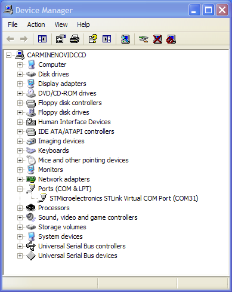
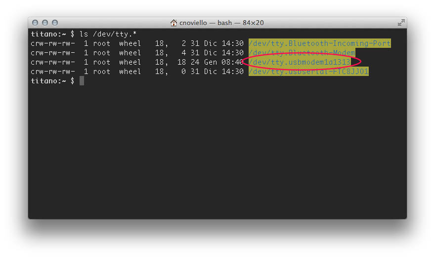
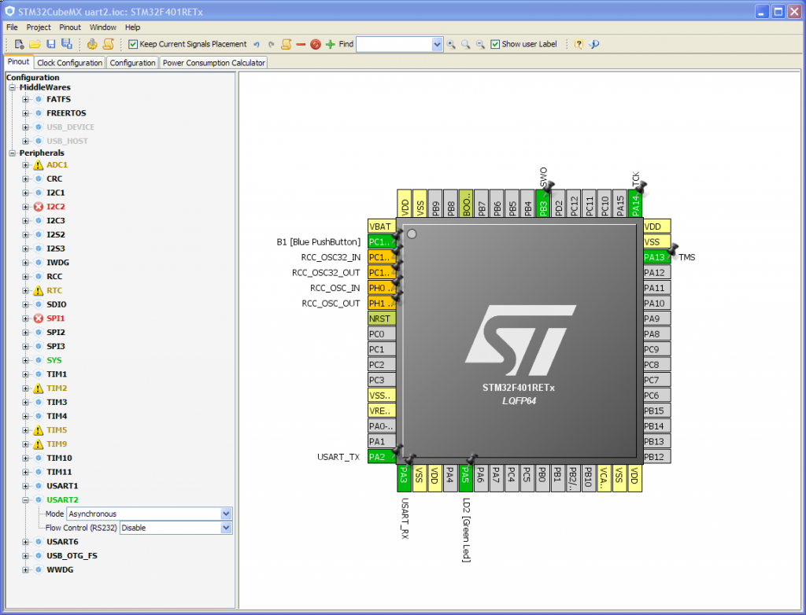
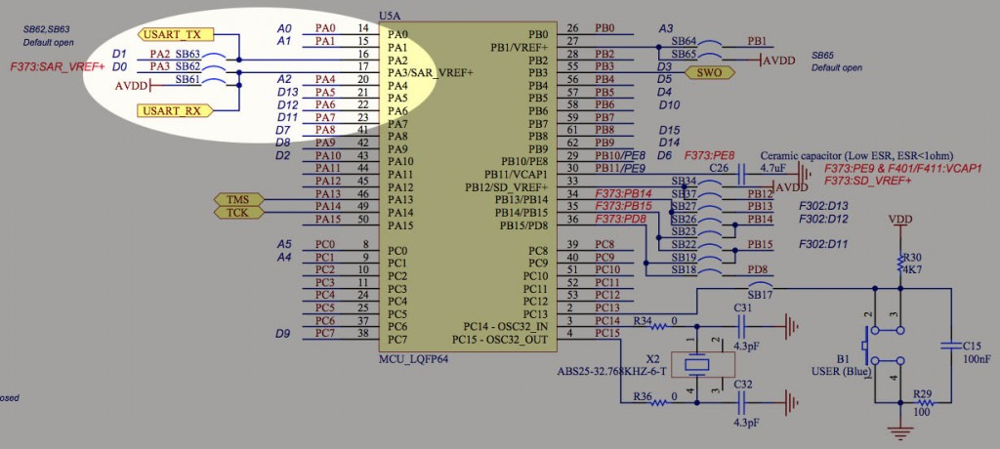
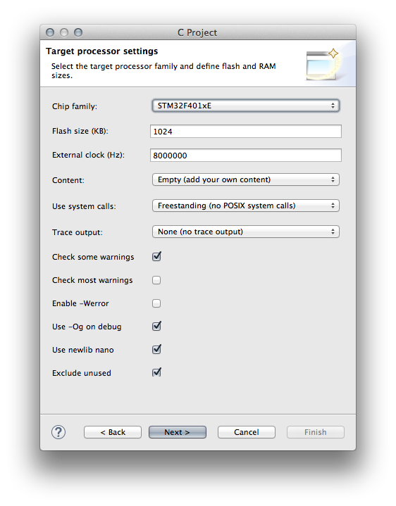
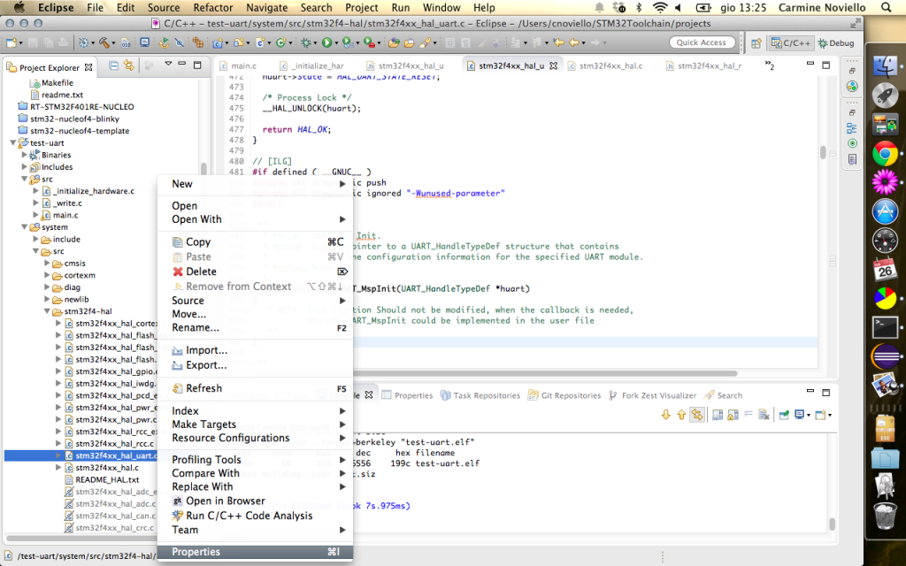
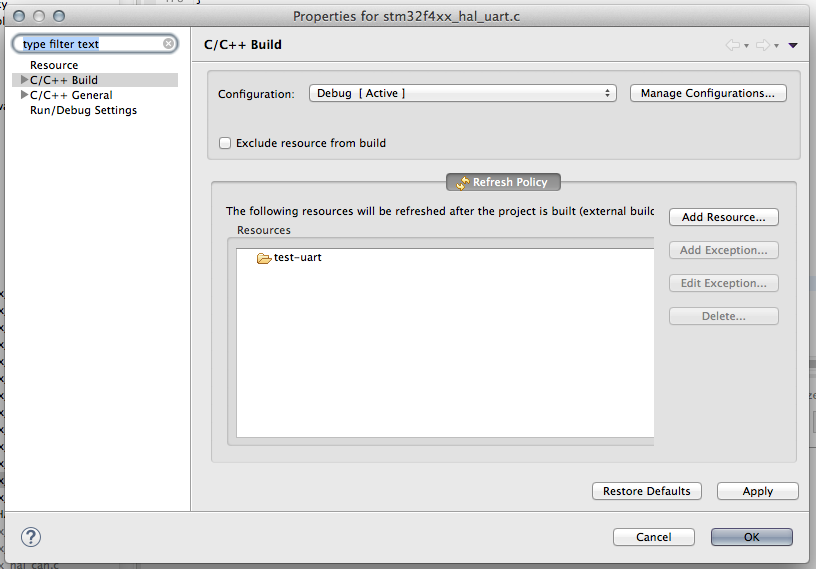
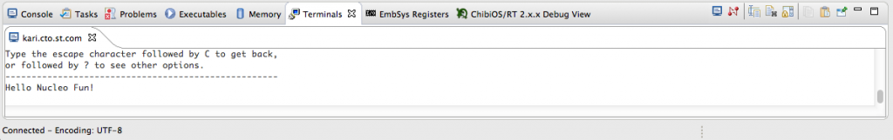

+++
title = "How to use STM32 Nucleo serial port"
slug = "how-to-use-stm32-nucleo-serial-port"
url = "/2015/03/02/how-to-use-stm32-nucleo-serial-port/"
date = "2015-03-02T07:17:28Z"
lastmod = "2015-03-02T07:17:28Z"
draft = false
description = "As we have seen in the previous tutorial about this new developing board from ST, the STM32 Nucleo provides an integrated ST Link v2.1 interface. ST Link is mainly designed…"
categories = ["Electronics","STM32"]
tags = ["stm32","stm32nucleo","uart","virtual com port"]
showHero = true
showTableOfContents = true

[cover]
image = "images/legacy/how-to-use-stm32-nucleo-serial-port/cover-how-to-use-stm32-nucleo-serial-port.jpg"
alt = "Serial concept."
hiddenInSingle = false
+++

As we have seen in the previous tutorial about this new developing board from ST, the STM32 Nucleo provides an integrated ST Link v2.1 interface. ST Link is mainly designed to allow flashing of target MCU trough the mini-USB interface. But, it provides at least another really useful feature: a Virtual COM port. When you install the ST-Link drivers, a new device appears in your hardware devices list: the ST-Link Virtual COM port.

If you use a Linux PC or a Mac, you'll find a new terminal in the /dev directory. Usually, this device is named something similar to tty.usbmodemXXXX, as shown below.

The serial port is mostly useful for two reasons: if you want to debug your firmware printing messages (not strictly necessary with the ARM architecture, since we can also use [ARM semihosting](/?p=1269 "Setting up a GCC/Eclipse toolchain for STM32Nucleo – Part III")) or if you want to exchange commands and messages between your Nucleo board and your PC (perhaps, using a dedicated application you are building).

In this post I'll show you how to properly configure and use the integrated virtual COM port of STM32 Nucleo board. But, before we start coding, it could be really useful take a look to the hardware. ST provides the [full hardware project](http://www.st.com/st-web-ui/static/active/en/resource/technical/layouts_and_diagrams/schematic_pack/nucleo_64pins_sch.zip) of the STM32 Nucleo (the board is designed using the [Altium Designer CAD](http://www.altium.com/), a professional CAD used in the electronics industry, but you are not required to have a so expensive piece of software to use your Nucleo). I'll assume the Nucleo-F401RE model, but it should be really easy to rearrange instructions to properly use your specific Nucleo.

### First: pinout

A complex yet flexible MCU like the STM32 provides I/Os that have "overloaded" functionalities.This means that, before we can use a peripheral (in our case, the USART), we need to configure the peripherals associated to corresponding pins. Looking to STM32CubeMX tool, we discover that the STM32F401RETx processor has 3 different USARTs: **USART1**, **USART2** and **USART6**.

\[lightbox full="http://www.carminenoviello.com/wp-content/uploads/2015/01/2015-01-24-08_52_46-STM32CubeMX-uart2.ioc\_-STM32F401RETx.png"\]\[/lightbox\]

Now we have to take a look to the Nucleo [schematics](04-mb1136.bin). As we can see in the following picture, the USART_TX and USART_RX ports are connected to PA2 and PA3 pins. This means that the Nucleo board is configured to use the USART2 peripheral of target MCU.

\[lightbox full="http://www.carminenoviello.com/wp-content/uploads/2015/01/stm32-nucleo-usart-pinout.jpg"\]\[/lightbox\]

Ok. We've grabbed all the necessary information related to the hardware needed to start coding.

### Second: the code

Before we start configuring the USART2 peripheral, we need a test project. We'll generate an empty project using the GCC ARM Eclipse plug-in, as shown in my series about the [GCC toolchain](/?p=998 "Setting up a GCC/Eclipse toolchain for STM32Nucleo – Part I") for the STM32 platform. When you generate the test project, you can using the following configuration parameters.

[](06-schermata-2015-01-24-alle-09-17-09.png)If you have followed my [previous tutorial](/?p=998 "Setting up a GCC/Eclipse toolchain for STM32Nucleo – Part I") about GNU Eclipse plug-in, you already know that the plug-ins generates an incorrect clock configuration for the Nucleo-F4 board. I've shown how to use the STM32CubeMX tool to generate the right clock initialization code. For the sake of simplicity, this is the code you have to put inside the **\_initialize_hardware.c** file.

``` c
void
configure_system_clock(void)
{
    RCC_OscInitTypeDef RCC_OscInitStruct;
    RCC_ClkInitTypeDef RCC_ClkInitStruct;

    __PWR_CLK_ENABLE();

    __HAL_PWR_VOLTAGESCALING_CONFIG(PWR_REGULATOR_VOLTAGE_SCALE2);

    RCC_OscInitStruct.OscillatorType = RCC_OSCILLATORTYPE_HSI;
    RCC_OscInitStruct.HSIState = RCC_HSI_ON;
    RCC_OscInitStruct.HSICalibrationValue = 6;
    RCC_OscInitStruct.PLL.PLLState = RCC_PLL_ON;
    RCC_OscInitStruct.PLL.PLLSource = RCC_PLLSOURCE_HSI;
    RCC_OscInitStruct.PLL.PLLM = 16;
    RCC_OscInitStruct.PLL.PLLN = 336;
    RCC_OscInitStruct.PLL.PLLP = RCC_PLLP_DIV4;
    RCC_OscInitStruct.PLL.PLLQ = 7;
    HAL_RCC_OscConfig(&RCC_OscInitStruct);

    RCC_ClkInitStruct.ClockType = RCC_CLOCKTYPE_SYSCLK|RCC_CLOCKTYPE_PCLK1;
    RCC_ClkInitStruct.SYSCLKSource = RCC_SYSCLKSOURCE_PLLCLK;
    RCC_ClkInitStruct.AHBCLKDivider = RCC_SYSCLK_DIV1;
    RCC_ClkInitStruct.APB1CLKDivider = RCC_HCLK_DIV2;
    RCC_ClkInitStruct.APB2CLKDivider = RCC_HCLK_DIV1;
    HAL_RCC_ClockConfig(&RCC_ClkInitStruct, FLASH_LATENCY_2);
}
```

Next, we have to add a function to configure the USART interface. We call it MX_USART2_UART_Init, as shown below.

``` c
UART_HandleTypeDef huart2;
...
void MX_USART2_UART_Init(void)
{
    huart2.Instance = USART2;
    huart2.Init.BaudRate = 115200;
    huart2.Init.WordLength = UART_WORDLENGTH_8B;
    huart2.Init.StopBits = UART_STOPBITS_1;
    huart2.Init.Parity = UART_PARITY_NONE;
    huart2.Init.Mode = UART_MODE_TX_RX;
    huart2.Init.HwFlowCtl = UART_HWCONTROL_NONE;
    HAL_UART_Init(&huart2);
}
```

The function is really self-explaining. huart2 is an instance of UART_HandleTypeDef descriptor. It's a struct used to configure the UART peripheral. However, this code is still not sufficient to use the UART. We need to configure the hardware part, setting the right pins and initializing the right clocks associated to UART peripheral. This work is done with the following hook function:

``` c
...
void HAL_UART_MspInit(UART_HandleTypeDef* huart)
{
  GPIO_InitTypeDef GPIO_InitStruct;
  if(huart->Instance==USART2)
  {
    __GPIOA_CLK_ENABLE();
    __USART2_CLK_ENABLE();

    /**USART2 GPIO Configuration
    PA2     ------> USART2_TX
    PA3     ------> USART2_RX
    */
    GPIO_InitStruct.Pin = GPIO_PIN_2|GPIO_PIN_3;
    GPIO_InitStruct.Mode = GPIO_MODE_AF_PP;
    GPIO_InitStruct.Pull = GPIO_NOPULL;
    GPIO_InitStruct.Speed = GPIO_SPEED_LOW;
    GPIO_InitStruct.Alternate = GPIO_AF7_USART2;
    HAL_GPIO_Init(GPIOA, &GPIO_InitStruct);
  }
}
...
```

Even in this case, the code is really self explaining. First, we need to initialize peripheral clock for PORTA GPIOs. Next, we need to enable the clock associated to UART2 peripheral. Finally, we have to proper configure PIN2 e PIN3 as UART2 TX and UART2 RX.

An important aspect to remark is that we don't need to explicit call this function in the initialization section. This is an *hook function* automatically called by the HAL_UART_Init() function which we call inside the function MX_USART2_UART_Init().  The right place to call this initialization function is inside the \_\_initialize_hardware() function in the  **\_initialize_hardware.c** file.

Ok. Now we only need to write a simple main() function to test the UART.

``` c
int main(int argc, char* argv[])
{
  char *msg = "Hello Nucleo Fun!\n\r";

  HAL_UART_Transmit(&huart2, (uint8_t*)msg, strlen(msg), 0xFFFF);
  while(1);
}
```

The main() is really simple: it simply prints a message on the UART and hangs for ever.

Before we can compile the whole project, we need to do another final operation. By default, the GNU-ARM plugin for Eclipse disables unused STM32 HAL files, in order to speed up compile operation. So, we need to enable the compilation of *stm32f4xx_hal_uart.c* file.\
Go in *Project Explorer-\>system-\>src-\>stm32f4-hal* and click with mouse right button on the *stm32f4xx_hal_uart.c* file, as shown in the following picture:

\[lightbox full="http://www.carminenoviello.com/wp-content/uploads/2015/02/Schermata-02-2457080-alle-13.25.27.png" title=""\]\[/lightbox\]

Click on "Properties" and go to *C/C++ Build* and uncheck "Exclude from build", as shown below.

\[lightbox full="08-schermata-02-2457080-alle-14-10-44.png" title=""\]\[/lightbox\]

Ok. Now we can compile the test project and upload on our Nucleo board using GDB and OpenOCD.

To see messages on the UART you have several options according the Operating System you use. On the Eclipse Marketplace you'll find several terminal emulator plug-ins. TCF is one of these. Another option for Windows OSes is to use [putty](http://www.chiark.greenend.org.uk/~sgtatham/putty/download.html). On Mac and Linux [ckermit](http://www.columbia.edu/~kermit/ckermit.html) is a suitable option.

\[lightbox full="http://www.carminenoviello.com/wp-content/uploads/2015/02/Schermata-02-2457080-alle-15.08.19.png" title=""\]\[/lightbox\]

You can download the whole project from my [github repository](https://github.com/cnoviello).

In a next article, I'll show you how to use the others Nucleo UARTs. Stay tuned 😉
