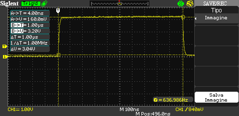
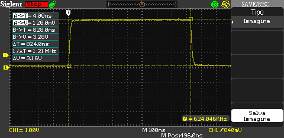
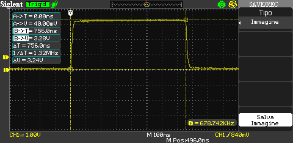
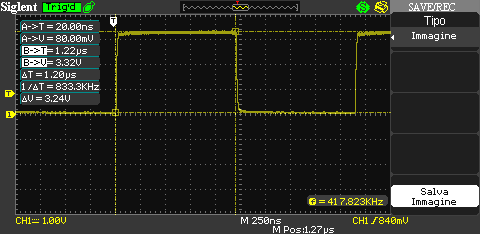
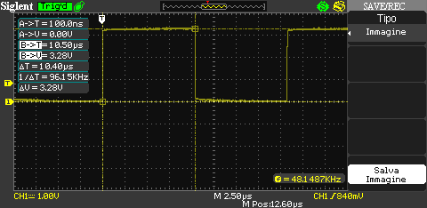

+++
title = "How to precisely measure microseconds with STM32"
slug = "precisely-measure-microseconds-stm32"
url = "/2015/09/04/precisely-measure-microseconds-stm32/"
date = "2015-09-04T09:41:12Z"
lastmod = "2015-09-05T05:08:36Z"
draft = false
description = "I received this apparently simply question from a reader of this blog: how can I delay a fistful of microseconds in STM32? That is, how to measure microseconds precisely in STM32?…"
categories = ["Electronics","Programming","STM32"]
tags = ["1us","delay","gcc","microsecond","spin","stm32"]
showHero = true
showTableOfContents = true

[cover]
image = "images/legacy/precisely-measure-microseconds-stm32/cover-stopwatch.png"
alt = "stopwatch"
hiddenInSingle = false
+++

I received this apparently simply question from a reader of this blog: how can I delay a fistful of microseconds in STM32? That is, how to measure microseconds precisely in STM32?

The answer is: there are several ways to do this, but some methods are more accurate and other ones are more versatile among different MCUs and clock configuration.

Let's consider one member of the STM32F4 family: STM32F401RE, the MCU that equips the STM32Nucleo-F401RE board. This micro is able to run up to 84Mhz using internal RC clock. This means that ever 1µs, the clock cycles 84 times. So, we need a way to count 84 clock cycles to assert that 1µs is elapsed (I'm assuming that you can tolerate the internal RC clock 1% accuracy).

Sometime is common to find code like this:

``` c
void delay1US() {
    #define CLOCK_CYCLES_PER_INSTRUCTION    X
    #define CLOCK_FREQ                      Y  //IN MHZ (e.g. 16 for 16 MHZ)

    volatile int cycleCount = CLOCK_FREQ / CLOCK_CYCLE_PER_INSTRUCTION;

    while (cycleCount--);        
    // 1uS is elapsed :-)
    // Sure?
    // :-/
}
```

But how to establish how many clock cycles are required to compute one step of the while(cycleCount--) instruction? Unfortunately, it's not simple to give an answer. Let's assume that cycleCount is equal to 1. Doing some tests (I'll explain later how I've done them), **with compiler optimizations disabled** (option -O0 to GCC), we can see that in this case the whole C instruction requires 24 cycles to execute. How is it possible that? You have to figure out that our C statement is unrolled in several assembly instructions, as we can see if we disassemble the firmware binary file:

``` c
...
 while(counter--);
 800183e:       f89d 3003       ldrb.w  r3, [sp, #3]
 8001842:       b2db            uxtb    r3, r3
 8001844:       1e5a            subs    r2, r3, #1
 8001846:       b2d2            uxtb    r2, r2
 8001848:       f88d 2003       strb.w  r2, [sp, #3]
 800184c:       2b00            cmp     r3, #0
 800184e:       d1f6            bne.n   800183e <main+0x3e>
```

Moreover, another source of latency is related to the fetch from internal MCU flash. So that instruction has a "basic cost" of 24 cycles. How many cycles are required if cycleCount is equal to 2? In this case the MCU requires 33 cycles, that is 9 additional cycles. This means that if we want to spin for 84 cycles cycleCount has to be equal to (84-24)/9, which is about 7.  So, we can write our delay function in a more general way:

``` c
void delayUS(uint32_t us) {
    volatile uint32_t counter = 7*us;
    while(counter--);
}
```

Testing this function with this code:

``` c
while(1) {
    delayUS(1);
    GPIOA->ODR = 0x0;
    delayUS(1);
    GPIOA->ODR = 0x20;
}
```

we can check using a decent oscilloscope, connected to a GPIO configured as GPIO_SPEED_HIGH, that this is what we expect:

[](01-sds000011.bmp)


***Hey dude, why are you using that code to drive the GPIO?***

I can't use HAL here, because we want to reduce CPU cycles to the minimum, so we need to modify GPIO peripheral register directly! Don't forget that even a simple procedure call, without parameter passing, costs CPU cycles due to branching and invalidation of cache pipeline.


Is this way to delay 1µs always consistent? The answer is NO. First of all, it works well only when this specific MCU (STM32F401RE) works at full speed (84Mhz). If you decide to use a different clock speed, you need to rearrange it doing tests. Second, it is subject to compiler optimizations.

Let's now enable GCC optimization for "size" (-Os). What results do we obtain? In this case we have that the delayUS() function costs only 72 CPU cycles, that is ~850ns. The scope confirms this:

 

[](02-sds000012.bmp)

And what happens if we enable the maximum optimization for speed (-O3)? In this case we have only 64 CPU cycles, that is our delayUS() lasts only ~750ns, as confirmed by our scope:

[](03-sds000021.bmp)

However, this issue can be addressed using specific GCC pragma directive:

``` c
#pragma GCC push_options
#pragma GCC optimize ("O0")
void delayUS(uint32_t us) {
    volatile uint32_t counter = 7*us;
    while(counter--);
}
#pragma GCC pop_options
```

Having said this, the fact remains that if we want use a lower CPU frequency or we want to port our code to a different MCU we need to redo tests again.


However, take in account that the lower the CPU frequency is the more difficult is to delay for 1µs precisely, because the number of cycles are fixed for a given instruction, but there is less amount of cycles in the same unit of time.


So, how can we obtain a precise 1µs delay without doing tests if we change hardware setup? The answer is: we need a hardware timer. And we have several options.

The first one comes from the previous tests. How have I measured CPU cycles? Cortex-M processors can have an optional debug unit that provides watchpoints, data tracing, and system profiling for the processor. One register of this unit is CYCCNT, which counts the number of cycles performed by CPU. So, we can use this special unit available in STM32 to count the number of cycles performed by the MCU during instruction execution.

``` c
uint32_t cycles = 0;

/* DWT struct is defined inside the core_cm4.h file */
DWT->CTRL |= 1 ; // enable the counter
DWT->CYCCNT = 0; // reset the counter
delayUS(1);
cycles = DWT->CYCCNT;
cycles--; /* We subtract the cycle used to transfer 
             CYCCNT content to cycles variable */
```

Using DWT we can build a more generic delayUS() routine in this way:

``` c
#pragma GCC push_options
#pragma GCC optimize ("O3")
void delayUS_DWT(uint32_t us) {
    volatile uint32_t cycles = (SystemCoreClock/1000000L)*us;
    volatile uint32_t start = DWT->CYCCNT;
    do  {
    } while(DWT->CYCCNT - start < cycles);
}
#pragma GCC pop_options
```

How much precise this function is? If you are interested to the best resolution at 1µs, this function isn't the best, as shown by the scope.

[](04-sds000031.bmp)

The best performance is achieved when the higher compiler optimization level is set. As you can see, for a wanted delay of 1µs the function gives about 1.22µs delay (22% slower). However, if we want to spin for 10µs, we obtain a real delay of 10.5µs (5% slower), which is more close to what we want.

[](05-sds00004.bmp)

Starting from 100µs delay the error is completely negligible.

Why this function is not so precise? To understand why this function is less precise from the other one, you have to figure out that we are using a series of instructions to check how many cycles are expired since the function is started (the while condition). These instructions cost CPU cycles both to update the internal CPU registers with the content of CYCCNT and to do comparison and branching. However, the advantage of this function is that it automatically detects CPU speed, and it works out of the box especially if we are working on faster processors.

Other solutions could be achieved using hardware timers, like TIMx and SYSTICK timers. However, I've obtained performances similar to delayUS_DWT() function.

If you want full control among compiler optimizations, the best 1µs delay can be reached using this macro fully written in assembler:

```c
#define delayUS_ASM(us) do {\
    asm volatile (  "MOV R0,%[loops]\n\t"\
            "1: \n\t"\
            "SUB R0, #1\n\t"\
            "CMP R0, #0\n\t"\
            "BNE 1b \n\t" : : [loops] "r" (16*us) : "memory"\
              );\
} while(0)
```

This is the most optimized way to write the while(counter--) function. Doing tests with the scope, I found that 1µs delay can be obtained when the MCU execute this loop 16 times at 84MHZ. However, this macro has to be rearranged if you processor speed is lower, and keep in mind that being a macro, it is "expanded" every time you use it, causing the increase of firmware size.

These are the best solution to obtain 1µs delay with the STM32 platform. If you think that other solutions can be better than these ones, feel free to comment below this post.
