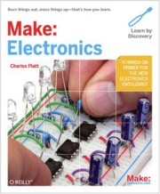
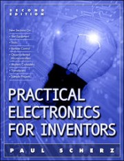

+++
title = "Primi passi con l'elettronica: da dove cominciare?"
slug = "primi-passi-con-lelettronica-da-dove-cominciare"
url = "/2011/06/06/primi-passi-con-lelettronica-da-dove-cominciare/"
date = "2011-06-06T06:00:08Z"
lastmod = "2013-07-30T08:13:37Z"
draft = false
description = "Da quanto è nato il filone \"elettronico\" di questo blog ho ricevuto diverse richieste via mail, Facebook e dal vivo da informatici \"pentiti\" - come me - che mi hanno…"
categories = ["Others"]
tags = ["libri elettronica","practical electronics for inventors","recensione"]
showHero = true
showTableOfContents = true

[cover]
image = "images/legacy/primi-passi-con-lelettronica-da-dove-cominciare/cover-bace17ee0a8efea40de4fcdd345e7406-large.jpeg"
alt = "bace17ee0a8efea40de4fcdd345e7406_large"
hiddenInSingle = false
+++

Da quanto è nato il filone "elettronico" di questo blog ho ricevuto diverse richieste via mail, Facebook e dal vivo da informatici "pentiti"  - come me - che mi hanno chiesto da dove cominciare per studiare seriamente l'argomento, senza sacrificare la praticità e la fruibilità immediata delle cose apprese.\
Quasi un anno fa avevo già [trattato l'argomento](http://www.carminenoviello.com/2010/07/10/mcu-programming-come-cominciare/), focalizzando l'attenzione in particolar modo sullo sviluppo firmware con i microcontrollori, nello specifico gli 8051 e derivati, proponendo dei libri di testo da cui poter attingere informazioni. Tuttavia, da quella carrellata di testi e link mancano, sostanzialmente, fonti da cui attingere le basi dell'elettronica. E la ragione è da ricercarsi nel fatto che con l'elettronica digitale ultramoderna, fatta di IC e micro superintelligenti, con decine di funzioni, librerie pronte all'uso, IDE potentissimi, ecc, si riescono a sviluppare soluzioni complete senza dover necessariamente sapere cosa succede in una giunzione p-n o, addirittura, la più elementare legge di Ohm. Anzi, alcune piattaforme molto famose (facciamo i nomi: Arduino) hanno proprio come marchio distintivo l'offrire un API talmente di alto livello e completa da rendere pressoché superfluo conoscere le basi di alcun che, almeno agli inizi.\
Quando le cose cominciano a complicarsi, o quando si vuole acquisire un'autonomia che permetta di spaziare e svilupparsi solide certezze, beh le basi ci vogliono e come, ed è importante studiare con disciplina ed estraniarsi un minimo dalle feature ultra astratte offerte dai produttori. Nel seguito, la mia ricetta sperimentata in prima persona.

A mio modo di vedere, per rendere il più efficace possibile lo studio è necessario sempre rimanere "con i piedi per terra". Questa affermazione ha un duplice significato:

- ***praticità***: è necessario procedere con lo studio di nuovi argomenti solo dopo che si comprende sia l'aspetto teorico di un concetto sia la sua ricaduta pratica (in sostanza, ponetevi sempre la domanda: a che serve?);
- ***credibilità***: allo stesso tempo è opportuno porsi degli obiettivi credibili. È perfettamente inutile procedere come un treno sugli argomenti se non si ha la totale certezza di averne colto tutti gli aspetti, soprattutto quelli pratici. La teoria è fondamentale, ma la teoria senza pratica non porta da nessuna parte. Infine, pensare di poter esaurire tutto lo scibile relativo ad un dato concetto è pressoché impossibile, anche perché molti punti si scoprono solo con la pratica e l'esperienza.

 

Se siete totalmente a digiuno di elettronica, e magari avete bisogno di acquisire manualità anche con strumenti come saldatori, ecc, consiglio l'acquisto di un libro 90/10, ossia un libro con il 90% di pura pratica e il 10% di teoria. Io ho avuto modo di leggere un libro dedicato all'elettronica della serie [*Make*](http://makezine.com/) di O'Reilly. L'autore è Charles Platt, ed il classico libro del tipo "*Teach yourself something in........*". Insomma, il libro è praticamente sola pratica ed è fortemente incentrato all'acquisizione di skill per usare la componentistica di base. La teoria riportata è largamente insufficiente per costruirsi delle solide basi, però è un ottimo testo per incominciare e per intervallare sessioni pratiche a sessioni più teoriche.\
I temi trattati sono quelli di base: nei primi capitoli si introducono i concetti fondanti dell'elettrotecnica e sono presentati gli strumenti minimi che non possono mancare nel corredo di chi vuole cominciare a fare elettronica. Si passa poi allo studio di alcuni componenti analogici (come il timer 555) e i loro usi. C'è poi una seconda parte del libro in cui vengono presentati tanti altri possibili usi della componentistica elettronica (c'è anche un cenno al digitale), ma secondo me è appena sufficiente per farsi un'idea. Poi bisogna andare su altro. Ripeto: ottimo per chi è totalmente a digiuno.

Se si è alla ricerca di un libro che non presenta l'elettronica esclusivamente da un punto di vista teorico, ma che invece usa un approccio più vicino all'uso pratico, e al tempo stesso offre una panoramica ampia, allora secondo me la seconda edizione di *[Practical Electronics for Inventors](http://www.amazon.it/Practical-Electronics-Inventors-Paul-Scherz/dp/product-description/0071452818)* di Paul Scherz è quello che fa per voi. Il titolo non deve assolutamente tranne in inganno: quel "Practical" non lo rende affatto un libro come *Make: Electronics* di cui vi ho parlato prima. Anzi, se non si seguono delle accortezze nella sua lettura rischia di essere un libro teorico e molto difficile per giunta.\
Si perché il libro va letto "saltando" tra i capitoli, come vi spiegherò a breve. Per capire bene il trucco che vi dirò, è molto importante leggere la prefazione dell'autore, e seguire attentamente le indicazioni che dà. Questo libro, infatti, ha un secondo capitolo (dopo il primo di pura prefazione al testo) immenso, di oltre 260 pagine, dedicato esclusivamente alla teoria e dove sono presentati gran parte dei concetti per fare elettronica analogica. Tuttavia, condensare tutta la teoria in appena 260 pagine, significa per forza di cosa dover "omettere" molti passaggi che in altri testi si trovano espansi su molti capitoli (ad esempio, la parte di fisica della materia che riguarda i semiconduttori è trattata molto superficialmente, e non vi nascondo che se non avessi studiato quegli argomenti all'università in un paio di esami dedicati forse non ne avrei ricavato alcun che). Tutto questo per dire che non dovrete assolutamente leggere il secondo capitolo tutto in un colpo perché, altrimenti, finirete per abbandonare l'intero testo dopo un po'. Il consiglio è quello di partire dai concetti base, che sono rinvenibili nelle prime 80-90 pagine, e poi saltare ai capitoli 3 e 4 dove sono presentati nella pratica i componenti passivi che "implementano" quei concetti e dove vedrete che molti aspetti teorici riportati nel secondo capitolo saranno ripresi e calati nel contesto pratico. Quando si capirà come leggere questo libro, scoprirete che è una vera e propria miniera di informazioni, che permette di costruirsi delle basi di partenza per muoversi in autonomia. L'intero volume sfiora le 1000 pagine, quindi potete ben capire la mole delle informazioni riportate.\
Tuttavia c'è un problema non di poco conto: questo libro è pieno zeppo di errori in molti esempi, soprattutto nella parte teorica. E purtroppo non c'è un'errata corrige ufficiale distribuita dall'editore e/o dall'autore. In rete di trovano degli errata sheet di terzi. Il più completo è reperibile [qui](http://www.eg.bucknell.edu/physics/ph235/errata.pdf), e vi consiglio di tenerlo costantemente sotto mano perché vi servirà tantissimo. Nonostante tutto, reputo comunque questo libro un ottimo testo per chi vuole addentrarsi seriamente nel mondo dell'elettronica.

Contemporaneamente allo studio di questo libro, consiglio anche di studiare i concetti di base della teoria dei circuiti da un libro di elettrotecnica, perché su questo punto forse *Practical Electronics for Inventors* è un po' troppo carente. O meglio, affronta l'argomento con eccessiva rapidità. Su consiglio del mio capo, che mi ha anche materialmente prestato la prima edizione del libro, ho preso a riferimento il libro *Elettrotecnica generale* di Mario Pezzi. La prima edizione è datata 1968, ma si trova in commercio da Zanichelli ancora [la seconda edizione](http://www.libreriauniversitaria.it/elettrotecnica-generale-ist-tecnici-industriali/libro/9788808025722). È un libro che consiglio vivamente, fatto molto bene e scritto con una chiarezza disarmante (si perché purtroppo più si va avanti e più piace complicare le cose agli "scienziati" moderni.....). La prima edizione la troverete anche "simpatica", visto il linguaggio che potremmo definire "aulico" se paragonato ai tempi d'oggi (non so, ma leggere destrogiro e sinistrogiro invece di orario e antiorario a me fa ridere 🙂 ).

Infine, quando ci si vuole cimentare nella realizzazione dei circuiti  (ma anche durante lo studio), può essere molto utile ricorrere ad un simulatore. Io sto usando con relativa soddisfazione [Multisim](http://www.ni.com/multisim/i/) della National Instruments, strumento molto potente che va ben oltre la semplice simulazione dei circuiti (copre l'intero ciclo di sviluppo e produzione). Segnalo anche che sulla rivista [*Elettronica In*](http://www.elettronicain.it/Index.asp) è in pubblicazione un corso a puntate su Multisim. Tuttavia, ricordate sempre che un simulatore è un simulatore, ed è sempre meglio sporcarsi le mani con una millefori e il saldatore e, magari, bruciare qualche componente: come dice lo slogan di *Make: Electronics* "*that's how you learn*".
