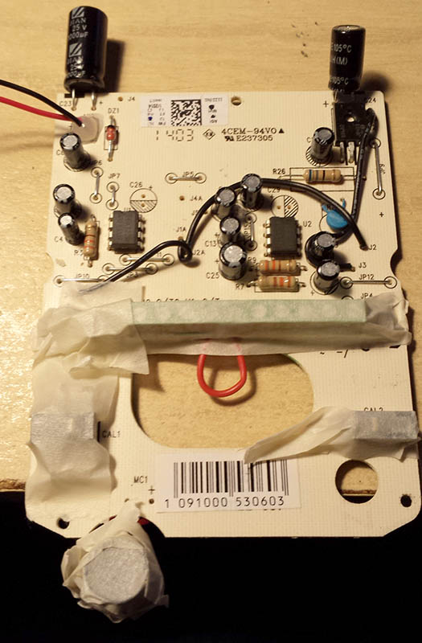
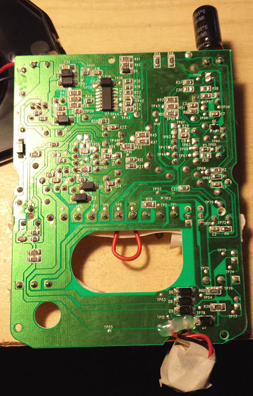
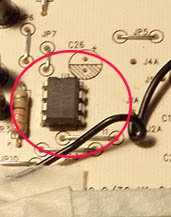
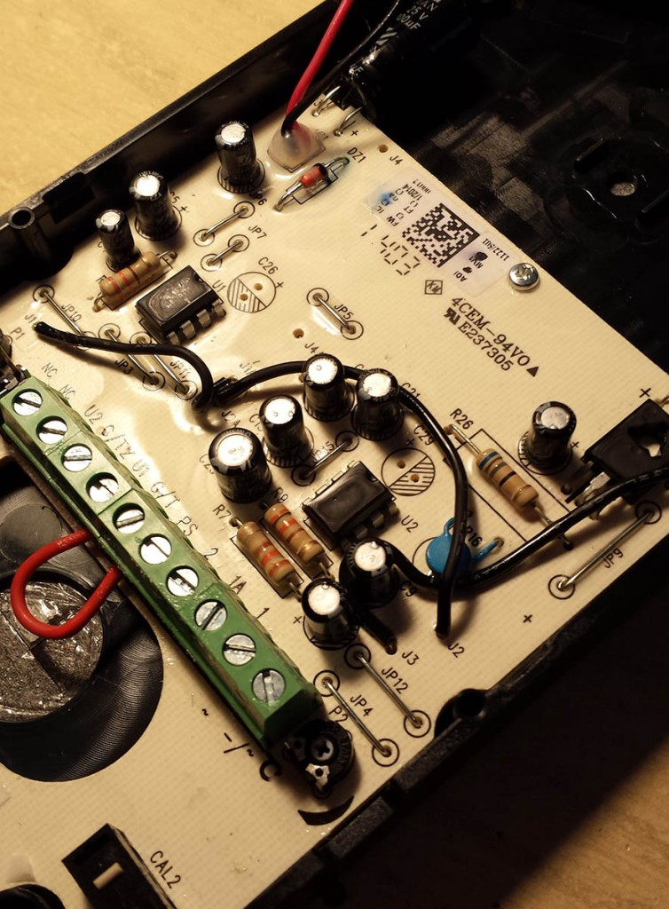

+++
title = "How to protect external door phone from ants and other phatogens"
slug = "protect-external-door-phone-ants-phatogens"
url = "/2015/01/25/protect-external-door-phone-ants-phatogens/"
date = "2015-01-25T08:49:27Z"
lastmod = "2015-01-25T08:49:27Z"
draft = false
description = "I live in the countryside. But that 2.0 campaign made of insects that eat almost everything, including capacitors and transistors. Let's be serious. Unfortunately, the red ants have decided that my external door phone…"
categories = ["Electronics"]
tags = ["ant","conformal coating","door phone","pcb","protection"]
showHero = true
showTableOfContents = true

[cover]
image = "images/legacy/protect-external-door-phone-ants-phatogens/cover-ants.jpg"
alt = "ants"
hiddenInSingle = false
+++

I live in the countryside. But that 2.0 campaign made of insects that eat almost everything, including capacitors and transistors.

Let's be serious. Unfortunately, the red ants have decided that my external door phone is a great place to nest. I tried several times to tell them that's not the case. But after two months they come back. And they mess up everything. Every 2-3 years I've to change the internal electronics of intercom (I ensure you that the formic acid destroy EVERYTHING). Door phones have become a widely-used consumer good (you can even buy kits at the supermarket..). This means that manufacturers have to save at any costs, and they can't even apply a little bit of conforming coating to protect electronics. And so, we have to change intercom every 2-3 years. It’s the economy, stupid.

I bought a Mikra intercom by URMET, but this time I decided to protect it myself, at a cost of a few tenths of a cent of euro. I opened the door phone, removed the PCB and masked all sensitive parts (terminals, microphone, switches, LEDs, jumpers configuration).

 After that, I took a spray of acrylic used for the protection of printed circuit boards (I use successfully [this one](http://it.farnell.com/pro-power/ppc121/pro-power-conformal-coating-400ml/dp/1765265) from Premier Farnell) and sprayed first the side with THT parts and then the back side with SMD components, waiting about 20 minutes between the two applications. Be very careful to well spray below PDIP components, because that is a very preferred place to lay their eggs.\

The final result is the following. In a few years I will let you know if I have succeeded:-D

\[lightbox full="http://www.carminenoviello.com/wp-content/uploads/2015/01/20150125_094013.jpg"\]\[/lightbox\]
