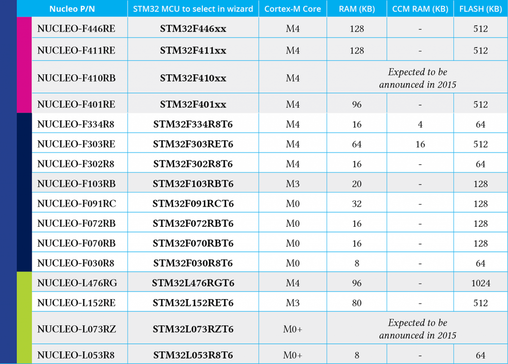

+++
title = "How to quickly import a STM32CubeMX project inside an Eclipse project"
slug = "quickly-import-stm32cubemx-project-eclipse-project"
url = "/2015/11/02/quickly-import-stm32cubemx-project-eclipse-project/"
date = "2015-11-02T14:08:08Z"
lastmod = "2016-02-02T10:14:11Z"
draft = false
description = "I've implemented a faster way to automatically import CubeMX project into an Eclipse tool-chain based on the GNU ARM Plugin, as described either on this blog and in my book. I've implemented…"
categories = ["STM32"]
tags = ["eclipse","st","stm32","stm32cubemx"]
showHero = true
showTableOfContents = true

[cover]
image = "images/legacy/quickly-import-stm32cubemx-project-eclipse-project/cover-stm32cubemx-eclipse-cpp.jpg"
alt = "stm32cubemx-eclipse-cpp"
hiddenInSingle = false
+++

I've implemented a faster way to automatically import CubeMX project into an Eclipse tool-chain based on the GNU ARM Plugin, as described either on [this blog](/?p=1590) and in [my book](/?page_id=1918).

I've implemented a bare-bone python script that simply "translates" a CubeMX project for the SW4STM32 (aka AC6) tool-chain in a project generated with the GNU ARM plugin. The script can be downloaded from [my github account](https://github.com/cnoviello/CubeMXImporter). Let's see how this works.

First of all, we have to generate a new Eclipse project using the GNU ARM Plugin. Go to **File-\>New-\>C Project** and select "Hello World ARM Cortex-M C/C++ project. You can choose the project name you want. Click on “**Next**“. Here we assume "**test1**" as Eclipse project name.

[](01-schermata-2015-06-04-alle-08-11-57.png)In the next step you have to configure your microcontroller. For example, for a STM32-F4 you have to choose Cortex-M4 core, while for a STM32-F0 you have to choose Cortex-M0. The Clock, Flash size and RAM parameters depend on your MCU. For a STM32F401RE you can use the same values shown in the following picture. **Set the other options as shown below**.[](02-schermata-2015-06-04-alle-08-14-12.png)

If you are using a Nucleo, this table extracted from my book shows the right values for all Nucleo boards.

[](03-ch4-table-nucleo-specs.png)

In the next step leave all parameters unchanged except for the last one: *Vendor CMSIS name*. Change it from DEVICE to **stm32f4xx** if you have a STM32F4 based board, or **stm32f1xx** for F1 boards, and so on. **Please, be sure to use this pattern, otherwise the script simply doesn't work**.[](05-schermata-2015-06-04-alle-08-24-02.png)Click on “**Next**“. You can leave the default parameters in the next steps. After a while, Eclipse will generate a new project for you. Now, click on the project root in the **Project Explorer**  view and click on "Close Project" entry. 

Now, use the CubeMX tool to configure your MCU according your needs. When finished, click on the **Project-\>Generate code** menu. In the **Project Settings** dialog give the name you want to the project and select an output directory where store the project. Here we assume that the CubeMX project name is "**mymcu**".  Choose **SW4STM32** as Toolchain/IDE (**this is really important, to not skip this step**) and generate the code.

Finally, to use the tool I've made, you can easily type the following command at terminal prompt:

``` c
$ python cubemximporter.py <path-to-eclipse-workspace>/test1 <path-to-cubemx-out>/mymcu
```

When finished, open the project "test1" in Eclipse, click with the right mouse button on the project root and choose "Refresh" (this will force the scan of the source tree, since it has been changed while the Eclipse project was closed). Finished. 🙂

Don't forget to update the file mem.ld, changing the FLASH origin address from 0x00000000 to 0x08000000.

The script now supports also the import of Middleware libraries (FatFS, FreeRTOS, LwIP).

**The script is designed to work both in Python 2.7 and 3.x. It requires the lxml library.**

Windows users can download a pre-compiled lxml package directly from here:

[https://pypi.python.org/packages/2.7/l/lxml/lxml-3.5.0.win32-py2.7.exe#md5=3fb7a9fb71b7d0f53881291614bd323c](https://www.element14.com/community/external-link.jspa?url=https%3A%2F%2Fpypi.python.org%2Fpackages%2F2.7%2Fl%2Flxml%2Flxml-3.5.0.win32-py2.7.exe%23md5%3D3fb7a9fb71b7d0f53881291614bd323c)

Linux and MacOS X users can install lxml using pip:

```
$ pip install lxml
```

Please, let me know if it worked for you 😉
