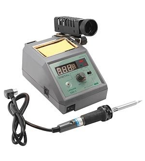

+++
title = "Recensione #4: Stazione saldante JBC CD-2B"
slug = "recensione-stazione-saldante-jbc-cd-2b"
url = "/2015/02/18/recensione-stazione-saldante-jbc-cd-2b/"
date = "2015-02-18T06:00:52Z"
lastmod = "2015-09-05T07:20:22Z"
draft = false
description = "Internet è piena di stazioni saldanti a meno di €100. Si tratta di prodotti cinesi, che vengono declinati in decine di marche ma che escono tutti dalla stessa fabbrica. Intendiamoci:…"
categories = ["Others"]
tags = ["cd-2b","jbc","recensione","saldatore","stazione saldatante"]
showHero = true
showTableOfContents = true

[cover]
image = "images/legacy/recensione-stazione-saldante-jbc-cd-2b/cover-jbc-cd-2sd-52.jpg"
alt = "JBC-CD-2SD_5"
hiddenInSingle = false
+++

Internet è piena di stazioni saldanti a meno di €100. Si tratta di prodotti cinesi, che vengono declinati in decine di marche ma che escono tutti dalla stessa fabbrica. Intendiamoci: per quello che costano sono ottimi prodotti. La mia prima stazione saldante, comprata ormai 5 anni fa, è costata €65 comprensiva di spese di spedizione. C'ho saldato qualche migliaio di schede, da componenti SMP TQFP128 a connettori su piani di massa di qualche decimetro quadrato.

Purtroppo, però, soprattutto negli ultimi tempi tale stazione si trovava a volte a lavorare anche 8 ore di fila. Il risultato è che ormai cambiavo più stili (badate bene, non ho detto punte, ma proprio l'intero stilo) che consumabili. Inoltre, è sempre stata molto scarsa di potenza. Le dichiarano da 60W, ma purtroppo hanno enormi difficoltà a saldare con leghe di stagno senza piombo (obbligatorio per la produzione in serie), perché richiedono temperature di lavoro più alte. La temperatura che queste stazioni mostrano è completamente aleatoria, e basta appoggiare la punta sulla scheda per far precipitare la temperatura di 100°C (anche se la stazione non ve lo mostrerà mai). Il risultato è che con schede con piani di massa state lì anche 10 secondi ad attendere che lo stagno fonda correttamente. Questo oltre ad essere un enorme dispendio di tempo, ha anche problemi più seri: il flussante è bello che evaporato, e siete costretti ad aggiungere più stagno del dovuto per saldare correttamente il componente.

\[amazon asin\[us\]=B00L2IUPI6&asin\[it\]=B000SHU4XS&template=Iframe Image\]

Arriva il momento in cui purtroppo bisogna ricorrere a prodotti di alta fascia, sviluppati da aziende leader di mercato e che valgono tutti i soldi spesi. Sono stato indeciso tra i due principali produttori europei in questo mondo: la tedesca [Weller](http://www.weller-tools.com/) e la spagnola [JBC](http://www.jbctools.com/). Alla fine, dopo aver letto forum, viste recensioni e fatte varie valutazioni tecniche, la mia scelta è caduta sulla JBC, che ha un catalogo più ampio e adotta delle soluzioni tecnologiche molto interessanti.

La JBC ha un catalogo sterminato, che va dalle stazioni modulari per uso industriale a quelle compatte *all-in-one*. Io per problemi di budget al momento ho dovuto optare per una *all-in-one*, ma in futuro dovrò sicuramente ricorrere ad un prodotto più professionale. Ma al momento va bene così. La scelta è andata sul modello [CD-2B](http://www.jbctools.com/cd-2bd-soldering-station-for-general-purposes-product-871.html), che ha caratteristiche che la rendono più polivalente sia per saldature THT sia SMD.

### Specifiche tecniche

Queste sono le specifiche tecniche dichiarate da JBC per questo modello:

|                                          |                        |
|------------------------------------------|------------------------|
| **Peso**                                 | 2.6 kg (5.7 lb)        |
| **Dimensioni**                           | 150x175x145 mm         |
| **Alimentazione**                        | 230V                   |
| **Potenza di uscita massima**            | 130W / 23.5V           |
| **Intervallo di selezione temperatura ** | 90-450 ºC / 190-840 ºF |
| **Temperatura operativa**                | 10-40 ºC / 50-104 ºF   |
| **ESD Safe**                             |                        |
| **USB station-PC**                       |                        |

Il modello CD-2B ha quindi una potenza di uscita di 130W, che la rendono idonea alla saldatura di schede che hanno fino a 4 piani di massa (chiaramente parliamo di schede multilayer). I piani di massa, infatti, hanno il brutto "vizio" di dissipare una quantità incredibile di calore, il che provoca che soprattutto con stagni ROHS non si riesca facilmente a saldare i componenti. Questo è un parametro molto importante da tenere in considerazione, soprattutto alla luce del fatto che le altre stazioni della serie "Compact line" di JBC hanno potenze di uscita nettamente inferiori, perché specifiche per altre applicazioni.

### Costruzione meccanica

La cosa che immediatamente balza all'occhio è la costruzione meccanica della stazione. Tutta la struttura esterna è in metallo, di eccellente fattura e con una verniciatura superficiale che dà una sensazione di prodotto di fascia molto alta. Tutti i supporti hanno degli ottimi accoppiamenti e una finitura all'altezza del prodotto. Il supporto per lo stilo è regolabile nell'inclinazione in base ai propri gusti, così come il supporto per il filo di collegamento dello stilo alla stazione, accessorio che evita che il filo dia fastidio sulla scrivania (e puntualmente finisce dove non deve finire). Il connettore del filo dello stilo alla stazione è del tipo a baionetta, ed è solido e non presenta incertezze nell'inserimento. Sul porta-spugnetta non c'è molto da dire: è in silicone per alte temperature (lo stesso materiale che oggi si usa per gli stampi da pasticceria - i miei preferiti 🙂 ), è provvisto di asole che aiutano a levare gli eccessi di stagno. Può alloggiare la spugnetta (inclusa) e l'acqua (io non sono un fan della pulizia con acqua delle punte del saldatore, secondo me meglio a secco). Sul retro della stazione c'è il classico connettore C14 per il cavo elettrico, l'interruttore a bilanciere di accensione e una porta USB per collegare la stazione USB al PC . Su questo ci torneremo dopo.

Il display LCD è monocromatico di colore blu e, oltre a mostrare la temperatura dello strumento e la potenza impiegata, permette di navigare tra i menu di impostazione. I tasti in gomma morbida permettono di aumentare/diminuire velocemente la temperatura ed entrare nel menu.

Infine parliamo dello stilo. La cosa che stupisce è la leggerezza: il peso è veramente minimo. L'impugnatura è ergonomica, e una sorta di spugna esterna favorisce il grip. Lo stilo è dotato di un comodissimo sistema di sgancio rapido delle punte. Ma di questo parlerò dopo.

### Funzionamento

La stazione si accede adoperando l'apposito pulsante sul retro, vicino al cavo di alimentazione. Comincia una fase di self test, durante la quale viene mostrata la versione del firmware. Dopo circa 6 secondi la stazione raggiunge la fase di *sleep*. In questa fase, per default, la temperatura è 180°C. Da quel momento in poi la stazione è pronta. Rimuovendo lo stilo dall'apposito supporto, in 3 secondi la temperatura dello stilo raggiunge la soglia impostata (di default 350°C), come potete vedere dal video che ho fatto.

[Watch the embedded video](//www.youtube.com/embed/ojZJmv-zPTk)

Reinserendo lo stilo nell'apposito supporto la temperatura scende nuovamente automaticamente alla temperatura di *sleep,* ossia 180°C. Questa temperatura è modificabile, e volendo si può portare alla stessa temperatura di esercizio. Tuttavia, è tale la velocità con cui la temperatura si innalza che vi garantisco che non c'è alcun vantaggio pratico nell'alzare la temperatura di *sleep*. Al contrario, solo in questo modo si evita che la punta (che per inciso costano non poco - si parte da €23 + IVA) si ossidi e si rovini. Ripeto: paragonando questa stazione ad un prodotto *low-cost* e vista l'incredibile velocità di riscaldamento, conviene lasciare tutto così com'è. Se la stazione rimane inattiva per 30 minuti (anche questo tempo si può modificare), la stazione entra in stato di ibernazione, e si spegne. Cosa che aiuta a risparmiare corrente e salvare le punte (quante punte ho rovinato perché ho dimenticato di spegnere il saldatore......).

La caratteristica dei saldatori JBC è la possibilità di sganciare velocemente le punte, tramite un meccanismo a baionetta. La stazione è dotata di un apposito supporto di sgancio, e questo permette di cambiare velocemente la punta, senza toccarla e senza usare strumenti che potrebbero rovinarla. Il seguente video vi mostra come.

[Watch the embedded video](//www.youtube.com/embed/VtAVCxWHGDM)

### Come va

Inutile dire che avete ormai abbondantemente capito che sono più che soddisfatto del prodotto. Certo, parliamo di un prodotto che costa quasi dalle 6 alle 10 volte un saldatore del far east. Probabilmente per usi hobbystici meglio andare sul prodotto economico, ma la velocità di riscaldamento quasi istantanea, la potenza reale d'uso, la qualità costruttiva, la legerezza dello stilo, la disponibilità di oltre 30 punte diverse e l'affidabilità del prodotto fanno valere questa stazione tutti i soldi che costa. Per usi professionali non c'è motivo per non sceglierla.

### Software

Come detto la stazione è dotata di una porta USB che permette di sia aggiornare il firmware (al momento non sembrano esserci aggiornamenti) sia controllare la stazione tramite l'apposito software JBC Manager, [scaricabile gratuitamente dal sito](http://www.jbctools.com/manager.html). Il software permette di controllare in remoto la stazione, cambiare le configurazioni, impostare i parametri, così come caricare profili di saldatura. Comunque, questo rappresenta un uso sicuramente molto ma molto spinto, che anche a livello professionale si usa poco, secondo me. Decisamente per grandi realtà produttive.

\[amazon asin\[us\]=B00ANZRT4M&asin\[it\]=B008OI6Q6C&template=Iframe Image\]

### Prezzi

Questo non è un prodotto hobbystico (certo che poi se l'hobby ci trascina, perché no...). La qualità e la tecnologia si paga. Io l'ho presa in offerta a €324 + IVA spedizione inclusa sul sito del distributore nazionale [Cepeitalia](http://www.cepeitalia.net/prodotti/27999/a37995-a37995-jbc-cd-2bd-stazione-saldante-compact-con-saldatore-t245-siringa-flussante.php). Badate bene che questa versione in offerta NON contiene le due punte come detto sul sito di JBC, ma solo quella piatta da 2.1mm. Occorre, secondo me, comprare almeno una punta circolare da 1mm di diametro, altrimenti con i componenti SMD sono dolori (meglio anche una da 0.6mm). Nell'offerta è inclusa una siringa di flussante. Le punte di ricambio per lo stilo di questa stazione (il modello 245) sono oltre 30. Purtroppo, unico neo, costano molto: si parte da €23 + IVA e si va anche oltre i €30 + IVA. Secondo me decisamente troppo per delle punte metalliche.
