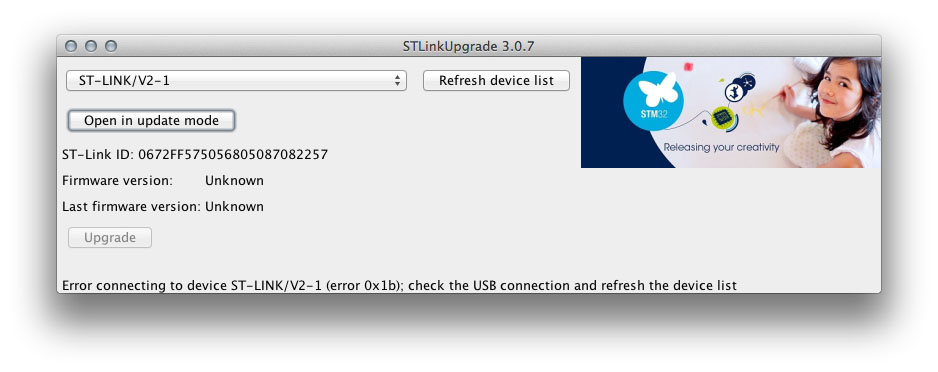
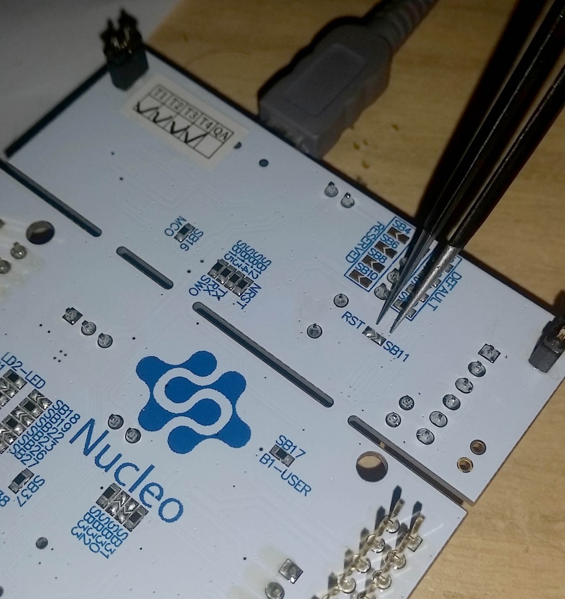

+++
title = "How to restore ST-LINK interface after a bad update (2.26.15 firmware)"
slug = "restore-st-link-interface-bad-update-2-26-15-firmware"
url = "/2016/02/26/restore-st-link-interface-bad-update-2-26-15-firmware/"
date = "2016-02-26T06:17:38Z"
lastmod = "2016-02-26T06:17:38Z"
draft = false
description = "Several people are reporting me issues with the latest 2.26.16 firmware update for the ST-LINK interface of their Nucleo. After flashing the ST-LINK 2.1 interface with this firmware release, the…"
categories = ["STM32"]
tags = ["2.26.15","issues","restore","st-link"]
showHero = true
showTableOfContents = true

[cover]
image = "images/legacy/restore-st-link-interface-bad-update-2-26-15-firmware/cover-schermata-2016-02-26-alle-06-52-09-copy.jpg"
alt = "Schermata 2016-02-26 alle 06.52.09 copy"
hiddenInSingle = false
+++

Several people are reporting me issues with the latest 2.26.16 firmware update for the ST-LINK interface of their Nucleo. After flashing the ST-LINK 2.1 interface with this firmware release, the debugging interface no longer works. The symptoms  are that it's no longer possible to use the interface, nor flash it again. The STLinkUpgrade 3.0.7 shows this error:

[Reading this post from an ST engineer](https://my.st.com/public/STe2ecommunities/mcu/_layouts/st/getshorturl.aspx?List=%7B74F499D6-C293-4561-BFB5-4F1489999957%7D&ItemId=15744), and thanks to the fact that I have saved an old ST-LINK firmware release (2.24.11), I successfully restored the ST-LINK interface.

Proceed in this way:

1.  Download this old ST-LINK firmware from [here](https://www.dropbox.com/s/bm0cq4qo1mui1t0/stsw-link007.zip?dl=0).

2.  Connect your development board to the USB interface.

3.  Do a quick shortcut between SB11 and RST pads (they are located on the bottom side of the board), as shown below:

    

4.  Start the STLinkUpgrade 3.0.3 (the one downloaded before) and downgrade the firmware.

5.  Disconnect your Nucleo board from USB and reconnect it again.
