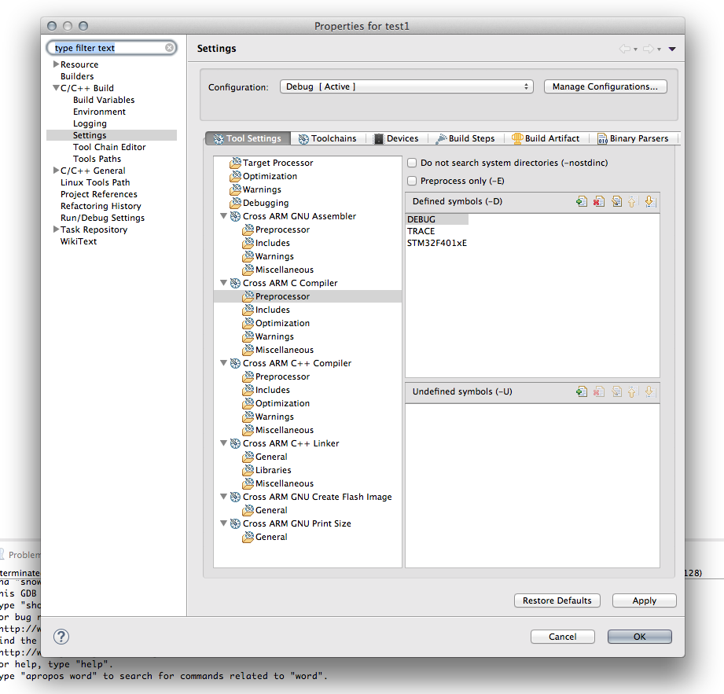
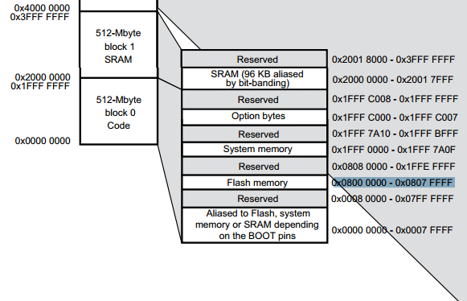
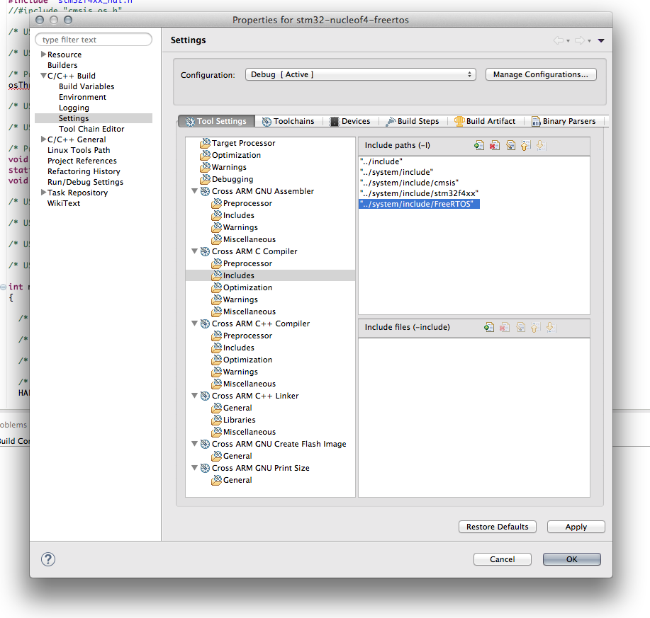
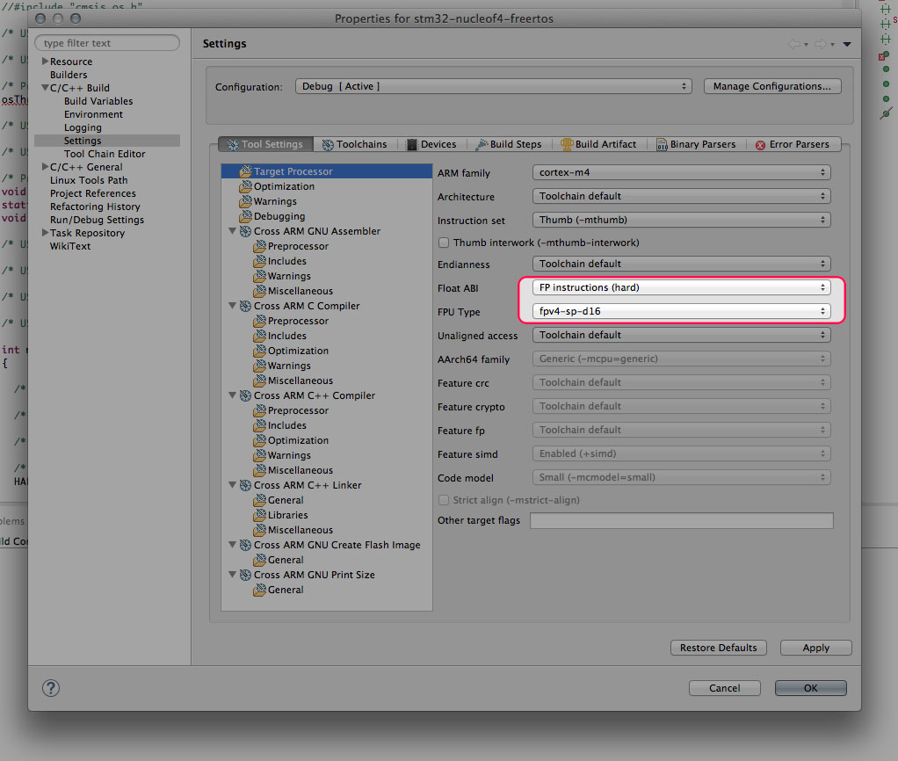
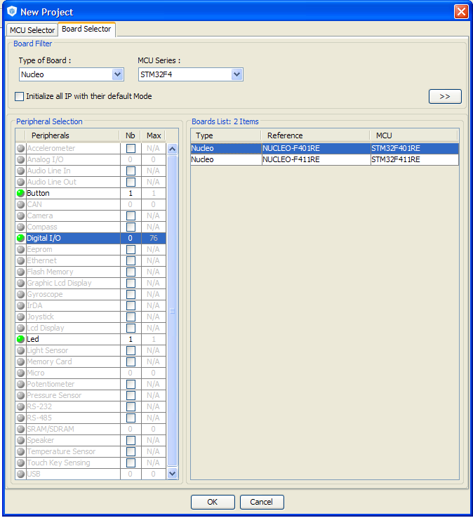
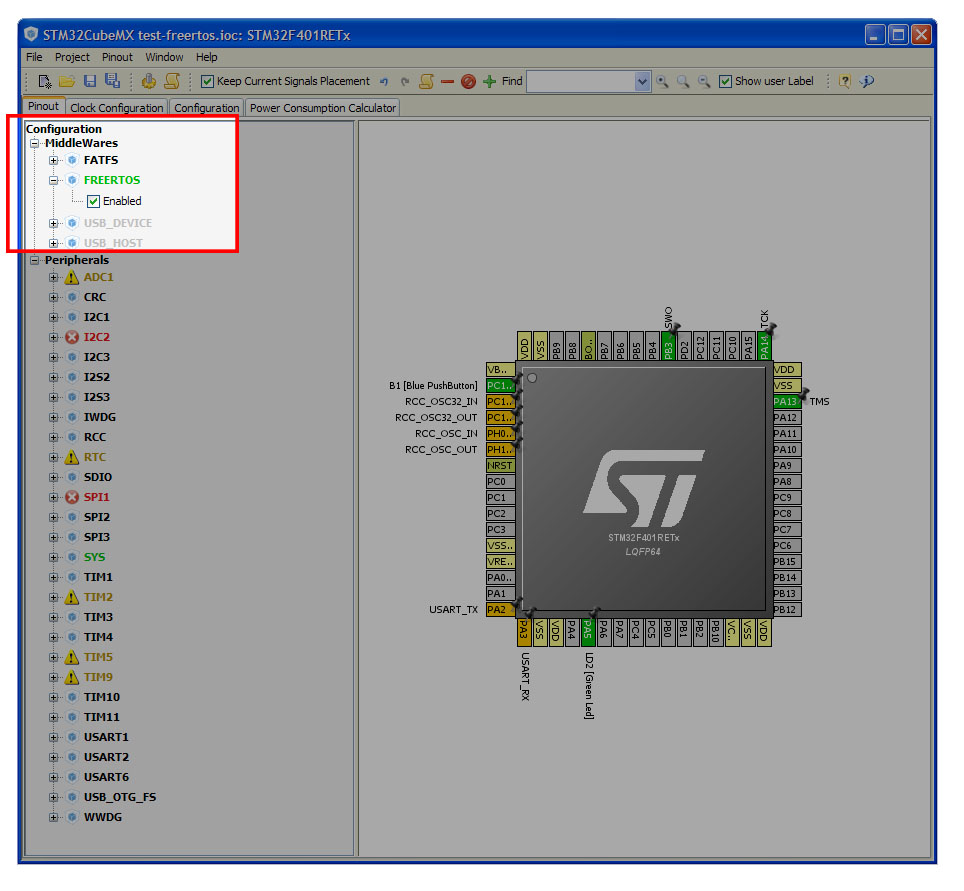
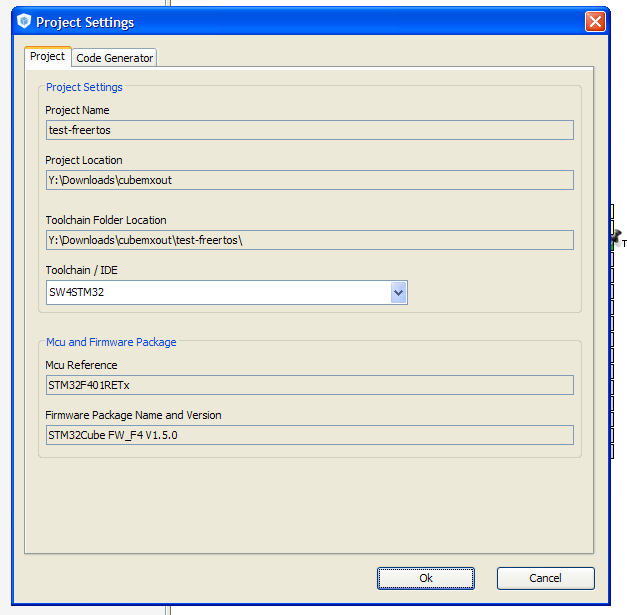
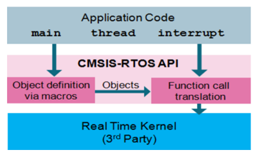

+++
title = "Running FreeRTOS on a STM32Nucleo using a free GCC/Eclipse toolchain"
slug = "running-freertos-stm32nucleo-free-gcceclipse-toolchain"
url = "/2015/06/22/running-freertos-stm32nucleo-free-gcceclipse-toolchain/"
date = "2015-06-22T05:50:14Z"
lastmod = "2015-06-22T05:50:14Z"
draft = false
description = "Using a micro like the STM32F4, able to run up to 160Mhz, with 512Kb of flash and about 100k of RAM, without using an operating system is a nonsense. Although…"
categories = ["Electronics","Programming","STM32"]
tags = ["eclipse","freertos","gcc","stm32","stm32nucelo"]
showHero = true
showTableOfContents = true

[cover]
image = "images/legacy/running-freertos-stm32nucleo-free-gcceclipse-toolchain/cover-big-thumb-5881bc19312dc8d7a4ae0f064daeba0e.jpg"
alt = "big_thumb_5881bc19312dc8d7a4ae0f064daeba0e"
hiddenInSingle = false
+++

Using a micro like the STM32F4, able to run up to 160Mhz, with 512Kb of flash and about 100k of RAM, without using an operating system is a nonsense. Although it's perfectly possible to use some forms of cooperative scheduling to execute firmware activities, basically this not convenient especially when dealing with low level events related to hardware (eg. interrupt handling) and aspects related to synchronization. As long as your firmware starts to grow, you'll need constructs to synchronize firmware activities, like queues or semaphores. Moreover, especially when dealing with low-power devices, a busy spin (while(some condition);) it's not the best solution if you have to fight with mAh.

FreeRTOS is probably the most diffused *Real Time Operating System* in the embedded world. There are several RTOSes around, both free and commercial, but probably FreeRTOS is the one that reached the maximum diffusion. I think that there are other valid alternatives to FreeRTOS, but there is no doubt that it's the most popular one with a good and official support from several MCU vendors. ST also provides a complete support to this OS, and it's distributed as middleware component inside the STCubeF4 framework. Moreover, STCubeMX tool is able to generate all the necessary code to initialize it.

Many of you asked me a tutorial on how to use FreeRTOS on the STM32Nucleo developing board using a free GCC/Eclipse tool-chain. As we'll se, once a complete tool-chain is defined, it's not a complex task to start programming with FreeRTOS. We'll develop a simple blinking led application, the "Hello world" of all hardware projects, and we'll use this project to show how to configure FreeRTOS and how to use tasks and semaphores.

### System requirements

As for past tutorials, I won't show you all the steps needed to setup the whole GCC/Eclipse tool-chain, but I'll assume:

- A complete Eclipse/GCC ARM tool-chain with required plugins as described [in this post](/?p=998). I’ll assume that the whole tool-chain in installed in C:\STM32Toolchain or ~/STM32Toolchain if you have a UNIX-like system.
- The [STM32Cube-F4 framework from ST](http://www.st.com/web/en/catalog/tools/PF259243) already downloaded and extracted inside the ~/STM32Toolchain/STM32Cube_FW_F4 directory (if your board is based on another STM32 family, download the corresponding STM32Cube package – I’m almost sure that the instructions are perfectly compatible).
- The latest version of FreeRTOS (it can be download from [here](https://sourceforge.net/projects/freertos/files/latest/download?source=files) - I've successfully tested the 8.2.1 release) extracted inside the ~/STM32Toolchain/FreeRTOSV8 directory.
- A STM32Nucleo-F401RE board (as I said before, arrange the instructions for your Nucleo if it differs).

### First step: create a skeleton project

In the first step of this tutorial we'll create a skeleton project. Once created, we'll import inside the project all the FreeRTOS related files. The procedure is almost the same described in [this post](/?p=1590), but I'll describe it again to clarify some steps. Then, we'll use CubeMX to generate configuration files we need to setup FreeRTOS and the main.c file.


If you are not interested in repeating the whole procedure, you can download the project from [my github repository](https://github.com/cnoviello/stm32-nucleof4/tree/master/stm32-nucleof4-freertos) and rearrange it if your tool-chain configuration differs.


So, let's create a basic project where we’ll put HAL library from ST and FreeRTOS sources. Start Eclipse and go to **File-\>New-\>C Project** and select “Hello World ARM Cortex-M C/C++ project. You can choose the project name you want (I chose “**stm32-nucleof4-freertos**“). Click on “**Next**“. In the next step you have to configure your processor. For a STM32-F4 you have to choose Cortex-M4 core, while for a STM32-F1 you have to choose Cortex-M3. The Clock, Flash size and RAM parameters depend on your Nucleo MCU. For Nucleo-F401RE you can use the same values shown in the following picture. **Set the other options as shown below**.

[](01-schermata-2015-06-04-alle-08-14-12.png)

In the next step leave all parameters unchanged except for the last one: *Vendor CMSIS name*. Change it from DEVICE to **stm32f4xx** if you have a STM32F4 based board, or **stm32f1xx** for F1 boards, and so on.

[](02-schermata-2015-06-04-alle-08-24-02.png)

Click on “**Next**“. You can leave the default parameters in the next steps. The final step is about the GCC tool-chain. You can use these values:

tool-chain name: **GNU Tools for ARM Embedded Processors (arm-none-eabi-gcc)**\
tool-chain path: **C:\STM32Toolchain\gnu-arm\4.8-2014q3\bin**.

The project generated by GNU ARM Plug-in for Eclipse is a skeleton containing Cortex Microcontroller Software Interface Standard (CMSIS) by ARM. However, the CMSIS package is not sufficient to start programming with a STM32 chip. It’s also required a vendor specific Hardware Abstraction Layer (HAL). In this tutorial I won't go into details of the project structure. If you need to know more about what the GNU ARM Plugin has generated, please refer to [this other post](/?p=1590).

Now, go in the Eclipse project and delete the following files:

- /src/\[main.c, Timer.c\]
- /include/Timer.h
- /system/include/cmsis/\[stm32f4xx.h,system_stm32f4xx.h\]
- /system/src/cmsis/\[system_stm32f4xx.c,vectors_stm32f4xx.c\]

Now we have to copy HAL and other files from STM32Cube to the Eclipse project.

- **HAL:** go inside the **STM32Cube_FW_F4/Drivers/STM32F4xx_HAL_Driver/Src** folder and drag **ALL** the files contained to the Eclipse folder **/system/src/stm32f4xx**. Eclipse will ask you how to copy these files in the project folder. Select the entry “Copy”. Next, go inside the **STM32Cube_FW_F4/Drivers/STM32F4xx_HAL_Driver/Inc** folder and drag **ALL** the files contained to the Eclipse folder /**system/include/stm32f4xx**. When finished, go inside the Eclipse folder **/system/src/srm32f4xx** and delete the file **stm32f4xx_hal_msp_template.c** (we'll use the one generated by CubeMX tool later).
- **Device HAL:** go inside the **STM32Cube_FW_F4/Drivers/CMSIS/Device/ST/STM32F4xx/Include** folder and drag **ALL** the files contained to the Eclipse folder **/system/include/cmsis**.\
  We now need another two files. If you remember, we've deleted so far two files from the generated project: system_stm32f4xx.c and vectors_stm32f4xx.c. We now need two files that do the same job (essentially, they contain the startup routines). The file vectors_stm32f4xx.c should contain the startup code when MCU resets. We'll use an assembler file provided by ST. Go inside **STM32Cube_FW_F4/Drivers/CMSIS/Device/ST/STM32F4xx/Source/Templates/gcc** folder and drag the file corresponding to your MCU inside the Eclipse folder **/system/src/cmsis**. In our case, the file is **startup_stm32f401xe.s**. Now, since Eclipse is not able to manage files ending with .s, we have to change the file extension to .**S** (capital 's'). So the final filename is **startup_stm32f401xe.S**.\
  Just another step. We still need a system_stm32f4xx.c file, but we need one specific for the MCU of our board. Go inside the **STM32Cube_FW_F4/Drivers/CMSIS/Device/ST/STM32F4xx/Source/Templates** folder and drag the **system_stm32f4xx.c** file inside the Eclipse folder **/system/src/cmsis**.

Ok. The HAL is mostly configured. To complete this part, we have to set a couple of things. First, we need to set a project global macro that defines our MCU type. This macro is required to compile the HAL correctly. For Nucleo-F401RE the macro is STM32F401xE (arrange it for your board if differs). Go inside the project properties (on the main Eclipse menu go to **Project-\>Properties**), then **C/C++ Build-\>Settings**. Click on **Tool Settings** and go in **Cross ARM C Compiler-\>Preprocessor**. Click on the Add icon ([](03-schermata-2015-06-04-alle-15-18-26.png)) and add the macro STM32F401xE.

[](04-schermata-2015-06-04-alle-15-16-21.png)

 

Second, we need to configure how the application is mapped in the MCU memory. This work is accomplished by the link-editor (ld), which uses the three .ld files inside the /ldscripts Eclipse folder. The file we are interested in is mem.ld, and we need to change the FLASH origin address from 0x00000000 to 0x08000000, as shown below:

``` c
...
  FLASH (rx) : ORIGIN = 0x08000000, LENGTH = 512K
...
```

Where does this number come from? It's not a magic number. It's simply the address where the internal MCU flash is mapped in all STM32 microcontrollers, as you can see in the picture below extracted from the MCU datasheet.

[](05-schermata-06-2457191-alle-21-59-45.png)

### Second step: import FreeRTOS sources in the project

The next main step is importing the FreeRTOS source files inside the project. ST already distribute with the STM32Cube framework a complete FreeRTOS source tree. However, it's not the latest available version. So we'll use the official release as stated in the *System requirements* paragraph.

Before staring importing files, we need two Eclipse folders in our project. Create one folder named FreeRTOS inside the **/system/include/** folder and another one inside the **/system/src** folder. Now:

- go inside **STM32Toolchain/FreeRTOSV8.2.1/FreeRTOS/Source/include** folder and drag **ALL** files contained to the Eclipse folder **/system/include/FreeRTOS**;
- go inside **STM32Toolchain/FreeRTOSV8.2.1/FreeRTOS/Source **folder and drag ALL **".c"** files to the Eclipse folder **/system/src/FreeRTOS**;

Now we need another couple of things. FreeRTOS is designed to be independent from the specific hardware. It's able to run on 35 different architectures and several compilers, both commercial and free. The part related to the specific hardware and compiler is contained inside the **STM32Toolchain/FreeRTOSV8.2.1/FreeRTOS/Source/portable **folder.  So:

- go inside\
  **STM32Toolchain/FreeRTOSV8.2.1/FreeRTOS/Source/portable/GCC/ARM_CM4F** folder and drag the file **port.c** inside the Eclipse folder **/system/src/FreeRTOS** and the file **portmacro.h** inside the Eclipse folder **/system/include/FreeRTOS** .

We still need another file from FreeRTOS distribution. FreeRTOS offers several heap management schemes that range in complexity and features. It's out of the scope of this article to explain the differences between the 5 heap schemes provided in FreeRTOS. What is important for us now, is that we need to import one of these schemes inside our Eclipse project. So:

- go inside **STM32Toolchain/FreeRTOSV8.2.1/FreeRTOS/Source/portable/MemMang** folder and drag the file **heap_2.c** inside the Eclipse folder **/system/src/FreeRTOS** (we need at least heap_2.c because we'll use osThreadTerminate() to terminate a task).

Ok. FreeRTOS is almost configured. We only need two other things. First of all, we have to make Eclipse aware of FreeRTOS include files. This means that we have to add **/system/include/FreeRTOS** folder inside the project include paths. Go inside the project properties, then **C/C++ Build-\>Settings**. Click on **Tool Settings** and then **Cross ARM C Compiler-\>Includes** and add the folder as shown below.

[](06-schermata-2015-06-17-alle-09-09-58.png)


If your Nucleo is not based on a STM32F4 MCU, **you have to skip the next step**.


Next, the FreeRTOS port for Cortex-M4 processors relys on the fact that Cortex-M4 processors have a dedicated Floating Point Unit (FPU). So, it's required that we enable this at compile time adding a specific command line parameter to GCC: -mfpu=fpv4-sp-d16. This can be simply done in Project settings. As before, go inside the project properties, then **C/C++ Build-\>Settings**. Click on **Tool Settings** and then **Target processor** and change **Float ABI** and **FPU Type** parameters as in the following screen capture.

### [](07-schermata-2015-06-17-alle-09-10-26.jpg)

### Step three: generate initialization files using CubeMX

As said before, ST gives full support to FreeRTOS. This dramatically simplifies all the configurations steps needed to initialize FreeRTOS. We'll use now CubeMX tool to generate all the code needed to setup our FreeRTOS based application.

Start STM32CubeMX and go to “**New Project**“. Click on the tab “Board Selector”. In “**Type of Board**” choose  **Nucleo**. In the “**MCU Series**” drop-down list choose your Nucleo target MCU version. Next, in the column labeled “**Peripheral Selection**“add “**1**” to rows Led and Button. In the “**Board List**” table, choose your exactly Nucleo version.Click on “**OK**“. CubeMX will show your target Nucleo MCU and its configuration. Now we have to enable FreeRTOS. In the tree view on the left side, open the FreeRTOS entry, and check "Enabled", as shown below.

[](09-schermata-2015-06-17-alle-11-26-16.jpg)

Now go to “**Project-\>Generate Code**” and fill the fields like in the following picture (arrange paths at your needs).

[](10-schermata-2015-06-17-alle-11-30-54.png)

Click on “**OK**” button. CubeMX will ask us if we want to download the latest version of STM32Cube framework. In our case, we can choose “NO” since we don't need it. Click on “Continue” in the next message box. When the generation ends, click on “Open Folder” Now:

- go inside the **test-freertos/Src** folder and drag ALL the content inside the Eclipse folder **/src**;
- in the same way, go inside the **test-freertos/Inc** folder and drag ALL the content inside the Eclipse folder **/include**.

#### Adding the CMSIS-OS wrapper from ST

In theory, what we have done until here is sufficient to start programming with FreeRTOS. However, if we rely on what is generated by CubeMX tool we aren't still able to compile the code correctly. The generated code is based on CMSIS-RTOS API, which is an abstract and standardized API abstracted from the specific RTOS. It's up to the developer (or the hardware vendor) to choose the real operating system, and adapt it to CMSIS-RTOS API. ST has developed its abstraction layer on the top of FreeRTOS. This wrapper is named CMSIS-OS. The role of CMSIS-OS wrapper is clearly described inside the [UM1722](http://www.st.com/st-web-ui/static/active/jp/resource/technical/document/user_manual/DM00105262.pdf) application note from ST.

[](11-schermata-2015-06-17-alle-11-37-59.png)

The idea under this is that using CMSIS-OS it's possible to change the RTOS at your need, without restructuring your project. I think that for simple tasks this can be true. However, when the project evolves it's usually really complex to abstract from RTOS services and peculiarities. However, to simplify this tutorial, we'll use the CMSIS-OS abstraction provided by ST, following these steps:

- go inside the **STM32Toolchain/STM32Cube_FW_F4/Middlewares/Third_Party/FreeRTOS/Source/CMSIS_RTOS** folder and drag the **cmsis_os.c** file inside the Eclipse folder **/system/src/FreeRTOS;**
- in the same way, copy the **cmsis_os.h** file inside the Eclipse folder **/system/include/FreeRTOS**.

We have completed the configuration procedure, and we can compile the whole project. If all went ok, you should obtain the binary files to upload on your Nucleo.

### Step four: customize the project

Now that we have a fully working project able to run FreeRTOS on our Nucleo, we can customize it a bit to do something more interesting. The idea is really simple. We'll develop an app with two working tasks: one of this waits until the user presses the blue button on the Nucleo; when this happens, it wakes up the other task locked on a semaphore; this task will start blinking the green LED forever. This example will give us the opportunity to see two of the main constructs implemented in a RTOS: tasks and semaphores.

In the RTOS world, a task is nothing more than a function running in a separated stack. CubeMX already generated for us a simple task in the main, which is created using the void StartDefaultTask(void const \*argument) function. We'll modify this function to wake up the other task when the user presses the blue button on the Nucleo. The other task will be represented by the void BlinkTask(void const \*argument) function. 

So, let's modify  main() function in this way:

``` c
int main(void)
{
  /* Reset of all peripherals, Initializes the Flash interface and the Systick. */
  HAL_Init();

  /* Configure the system clock */
  SystemClock_Config();

  /* Initialize all configured peripherals */
  MX_GPIO_Init();

  /* Create the threads and semaphore */
  osThreadDef(defaultTask, StartDefaultTask, osPriorityNormal, 0, 128);
  defaultTaskHandle = osThreadCreate(osThread(defaultTask), NULL);
  osThreadDef(blinkTask, BlinkTask, osPriorityNormal, 0, 128);
  blinkTaskHandle = osThreadCreate(osThread(blinkTask), NULL);
  osSemaphoreDef(sem);
  semHandle = osSemaphoreCreate(osSemaphore(sem), 1);
  osSemaphoreWait(semHandle, osWaitForever);

  /* Start scheduler */
  osKernelStart();
  
  /* We should never get here as control is now taken by the scheduler */

  /* Infinite loop */
  while (1);

}
```

In lines 77-80 we define and instantiate the two threads, one associated to StartDefaultTask() function and one to BlinkTask() function. osThreadDef() is a macro that creates a definition structure for our task. A task is defined by anassociated function, a priority type and a stack size. In a similar way, in lines 81-82 we create a binary semaphore (a binary semaphore is a synchronization construct that can have only two states: *available* and *not available*). In line 83 we acquire the semaphore (that is, the semaphore becomes *not available *for other tasks): in this way all other tasks waiting on that semaphore will be locked until it is released by another task. In our example project this semaphore is used to synchronize the thread blinkTask().  Let's now see the StartDefaultTask() function:

``` c
void StartDefaultTask(void const *argument)
{
  while(1) {
      if(!HAL_GPIO_ReadPin(GPIOC, GPIO_PIN_13)) {
          osSemaphoreRelease(semHandle);
          osThreadTerminate(NULL);
      }
  }
}
```

The task job is really simple: it waits until the user presses the blue button on the Nucleo. When this happens, it releases the semaphore and terminate.

Finally, let's the BlinkTask() function:

``` c
void BlinkTask(void const *argument)
{
    if(osSemaphoreWait(semHandle, osWaitForever) == osOK) {
        while(1) {
            HAL_GPIO_TogglePin(GPIOA, GPIO_PIN_5);
            osDelay(500);
        }
    }
}
```

Even in this case the function is really straightforward. The task is locked on the semaphore, which was acquired in the main function at line 83. When the semaphore is released by the StartDefaultTask() task (because user has pressed the button), it enters in a infinite loop, toggling the LD2 led each 500ms.

You can see the whole main file on [my github repository](https://github.com/cnoviello/stm32-nucleof4/blob/master/stm32-nucleof4-freertos/src/main.c), but despite some routines related to hardware initialization, the application code is fundamentally defined in these three blocks.

FreeRTOS provides many other functionalities. I suggest you to take a look to its [API documentation](http://www.freertos.org/a00106.html). Take in mind that the CMSIS-RTOS API covers only a minimal subset of the whole FreeRTOS API. For more information on CMSIS-RTOS API take a look [here](http://www.keil.com/pack/doc/CMSIS/RTOS/html/index.html).
