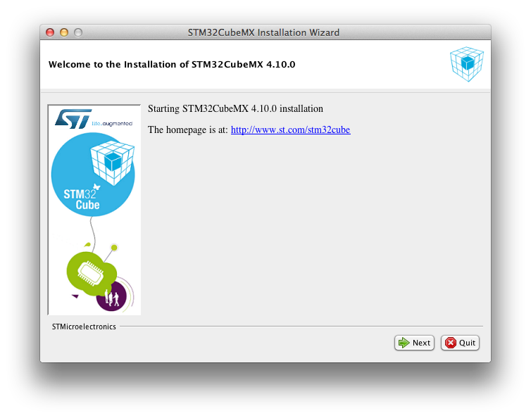
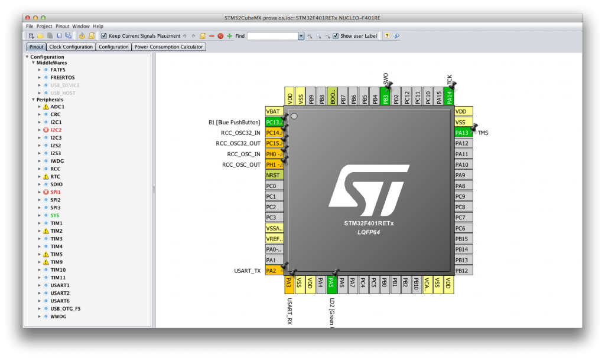

+++
title = "Running STM32CubeMX on Mac OS. Finally!"
slug = "running-stm32cubemx-macos-finally"
url = "/2015/09/09/running-stm32cubemx-macos-finally/"
date = "2015-09-09T06:20:05Z"
lastmod = "2016-03-28T09:22:25Z"
draft = false
categories = ["Electronics","STM32"]
tags = ["mac","mac osx","stm32","stm32cubemx"]
showHero = true
showTableOfContents = true

[cover]
image = "images/legacy/running-stm32cubemx-macos-finally/cover-stm32cubemx-macos.jpg"
alt = "stm32cubemx-macos"
hiddenInSingle = false
+++


**Read carefully**

This post is outdated, since the latest CubeMX 4.14 officially supports both Linux and MacOS. So, you no longer need to apply the instructions reported here.


Being a STM32 programmer on Mac OSX, I was frustrated every time I had to launch a virtual machine running Windows only to use the STM32CubeMX tool from ST. For those of you new to this program, it's a really useful graphical tool that allows to automatically generate setup files for a STM32 MCU according the configuration we need. For example, if we have the Nucleo-F401RE, which is based on the STM32F401RE MCU, and we want to use its user LED (marked as LD2 on the board), than STM32CubeMX will automatically generate all files required to configure the MCU (clock, peripherals port, and so on) and the GPIO connected to LED (port GPIO 5 on port A on Nucleo boards).

Finally, this morning, I discovered accidentally that the latest version of STM32CubeMX tool (4.10) works perfectly on Mac, even if ST hasn't released it yet. I had tested this procedure in the past with previous release of the tool, but there were issues with the graphical MCU render. Now all seems works correctly.

So, to use STM32CubeMX on your Mac (I think that instructions works well even on Linux), ensure that you have the latest Java (release 8 update 60) installed. Then download the tool from [ST website](http://www.st.com/web/catalog/tools/FM147/CL1794/SC961/SS1743/PF259242). The file is a ZIP archive. Once extracted, you'll find a file named SetupSTM32CubeMX-4.10.0.exe. This file is not a Windows PE file (the file format used by Windows executables), but it's just a JAR archive! And it's the installer that will install the tool on our Mac.

The installer need root privileges to work correctly. So, using the Terminal program, you can execute it using this command:

```
$ sudo java -jar ~/Downloads/SetupSTM32CubeMX-4.10.0.exe
```

After a while, the setup wizard will appear, as shown below.

[](01-schermata-2015-09-09-alle-08-10-18.png)

Follow the setup instructions. By default, the program is installed in /Applications/STMicroelectronics/STM32Cube/STM32CubeMX. Once setup is completed, at terminal line write this command:

```
$ java -jar /Applications/STMicroelectronics/STM32Cube/STM32CubeMX/STM32CubeMX.ex
```

After a while, STM32CubeMX will appear on the screen.

[](02-schermata-2015-09-09-alle-07-58-56.png)

Enjoy STM32CubeMX on your Mac 🙂
