+++
title = "Setting up a GCC/Eclipse toolchain for STM32Nucleo - Part I"
slug = "setting-gcceclipse-toolchain-stm32nucleo-part-1"
url = "/2014/12/28/setting-gcceclipse-toolchain-stm32nucleo-part-1/"
date = "2014-12-28T17:09:33Z"
lastmod = "2016-08-28T16:14:00Z"
draft = false
categories = ["Electronics","STM32"]
tags = ["arm cortex","eclipse","gcc","stm32","stm32nucleo","toolchain"]
showHero = true
showTableOfContents = true

[cover]
image = "images/legacy/setting-gcceclipse-toolchain-stm32nucleo-part-1/cover-stm32nucelo-gcc-eclipse-toolchain.jpg"
alt = "stm32nucelo-gcc-eclipse-toolchain"
hiddenInSingle = false
+++


**Please, read carefully.**

Thanks to the feedbacks I have received, I reached to the conclusion that it's really hard to cover a topic like this one in the room of a blog post. So, I started writing a book about the STM32 platform. In the free book sample you can find the whole complete procedure better explained. You can download it [from here](https://leanpub.com/mastering-stm32).


I recently got in my hands a new development board from STMicroelectronics: STM32Nucleo. It's a development board based on the STM32 MCU and it is compatible with the Arduino UNO pinout. This means that it's possible to use the hundreds of shields available for the Arduino. However this is true in theory, since the most important aspect of Arduino's world is the software (based on libraries, examples, and so on) made for this popular platform.

There are a lot of tutorials and guides around about how to start programming with the STM32 platform. ST provides an official framework, called [STM32Cube](http://www.st.com/web/catalog/tools/FM147/CL1794/SC961/SS1743/LN1897), born to speed up the development process on this platform. STM32 is a really powerful yet complex platform, and the learning curve of this microcontroller can be really high compared to a simpler platform like the Atmel AVR (Arduino is nothing more than a huge boilerplate of code around AVR family). However STM32Cube is not sufficient to start developing with your Nucleo board. You also need an IDE (not strictly needed, but really useful) and a compiler suite. ST provides official support (with documentation and examples) only for commercial IDE like IAR. And this is a great problem if you want simply to experiment with a low-cost platform like Nucleo (it costs less than €15). The good news is that you don't need a 5.000 dollars IDE: Eclipse and GCC is all you need (plus some other tools that we'll see in the next parts of this series). The bad one is the it's not simple or fast to setup-up a working tool-chain.

I spent more than two weekends to setup a working environment to code, compile, flash and debug applications on my STM32Nucleo board, doing several errors before obtaining a fully working environment. In this series, made of three parts, I want to share how to setup a tool-chain for STM32 platform. At the end of this first post we'll be able to compile an example program for the Nucleo (a simple blinking LED - the "*hello world*" in electronics) and to upload it on our board using [ST-Link Utility](http://www.st.com/web/en/catalog/tools/PF251168) from ST. I'll not show you too many details at once (but I assume that you know C language and fundamentals of MCU programming). To setup the tool-chain we'll use these two fundamental tools:

- **Eclipse**: it's a popular free and OpenSource IDE, widely used in the Java world, but also available for C/C++ programming. We'll use the latest stable version: 4.4 (called *Luna*).
- **GCC for ARM-Cortex**: STM32 is a family of microcontrollers with an ARM-Cortex core (M0, M3, M4, etc). This means that we can use one of the best compiler (or, probably, the best) available for free. We'll use the cross-compiler version for ARM-Cortex platform.

The minimum system and hardware requirements of this series are:

- Windows XP SP3 32bit  (the whole series is based on XP, but I think that Vista and 7 are also fine - for a 64bit platform, choose the corresponding package).
- An STM32Nucelo development board (the specific model is not relevant) - I'll base the examples on my board, STM32Nucleo-F401RE.
- Java 7 update 71 or later - **please, ensure you have the latest Java 7 version before you start installing other software (you can download it from [this page](https://www.java.com/it/download/manual_java7.jsp))**; don't say I didn't warn you.

 


**Warning:** I strongly suggest you to use a virtual machine to do all experiments. I advise against using a development/production PC you use for work. [VirtualBox](https://www.virtualbox.org/) is a free virtualization software you can use to do experiments with STM32 platform. When you'll be confident with the whole tool-chain, you can simply move it to the real PC without any risk.


### Install Eclipse Luna

The first step is to install Eclipse. Actually, Eclipse is not strictly required to start programming with the Nucleo board. GCC and few other tools are sufficient to compile and flash your MCU. If you are among those who like to code using just [Vim](http://www.vim.org/) editor (like myself), I'll write about this topic in a next post. In this series I'll try to keep low the learning curve and so I assume the use of Eclipse IDE. This tutorial is based on the latest version of Eclipse, called *Luna* (4.4 release). You can download the "Eclipse IDE for C/C++ Developers" release [from this page](https://www.eclipse.org/downloads/). This release is especially designed to develop application with C/C++ programming language.

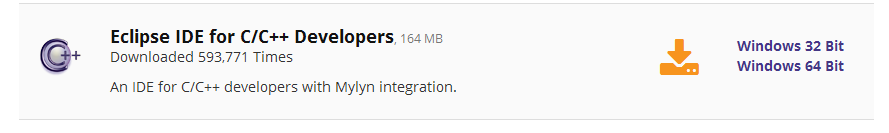The downloaded file is just a ZIP archive. You can expand it in the **C:\STM32Toolchain** folder (**N.B.: **that path is not mandatory, but I'll assume that you install the whole tool-chain in that location during these tutorials. If you decide to install the tool-chain elsewhere, please adapt my instructions consequently). When finished, you can launch the **C:\STM32Toolchain\eclipse\eclipse.exe **executable. The first time Eclipse starts, it will ask your for the default projects folder. I suggest to use the path **C:\STM32Toolchain\projects**. When the IDE is started, go to **Help-\>Install New Software...**. \[lightbox full="02-schermata-2014-12-20-alle-17-28-28.png"\]

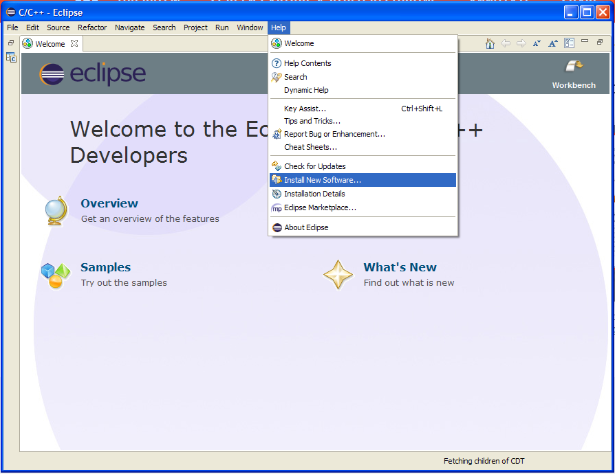\[/lightbox\] Next, select the C/C++ Development Tools repository and check only the entry "CDT Main Feature", as shown in the following picture.\[lightbox full="03-schermata-2014-12-20-alle-17-34-29.png"\]

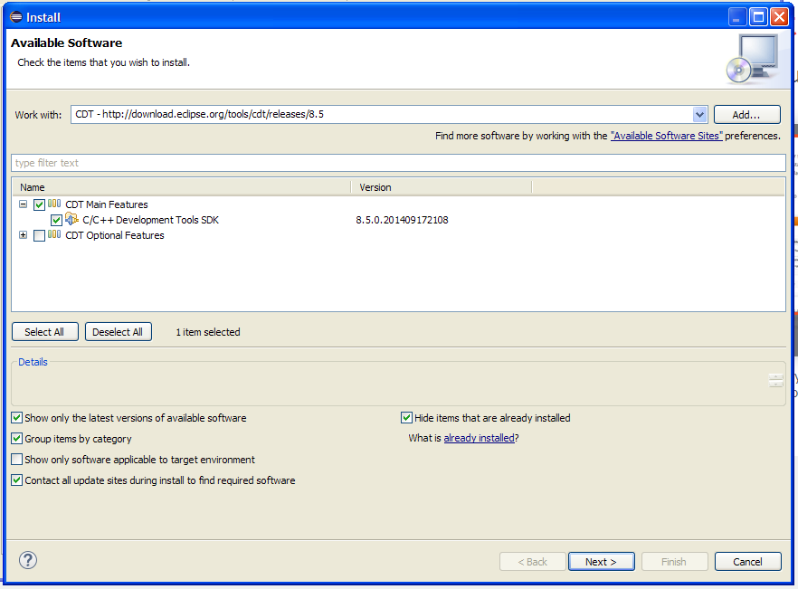\[/lightbox\]

Now, click on "Next" and follow the instructions. The installation requires some time to finish. At the end, restart the IDE as requested.

#### Install the GNU ARM plug-ins for Eclipse

Now we have to install the [GCC ARM plug-ins for Eclipse](http://gnuarmeclipse.livius.net/). These plug-ins add a rich sets of features to Eclipse CDT to interface GCC ARM tool-chain. Moreover, they provide specific functionalities for the STM32 platform. Plug-ins are developed and maintained by Liviu Ionescu, who did a really excellent work in providing support for the GCC ARM tool-chain. Without these plug-ins it's almost impossible to develop and run code with Eclipse for the STM32 platform. To install GCC ARM plug-ins go to **Help-\>Install New Software...** and click on the "**Add...**" button. Fill the text fields in the following way:

- Name: **GNU ARM Eclipse Plug-ins**
- Location: **http://gnuarmeclipse.sourceforge.net/updates**

and click the "**OK**" button. After a while, the complete list of available plug-ins will be shown. Select plug-ins to install as in the following picture:

\[lightbox full="04-schermata-2014-12-20-alle-17-44-45.png"\] 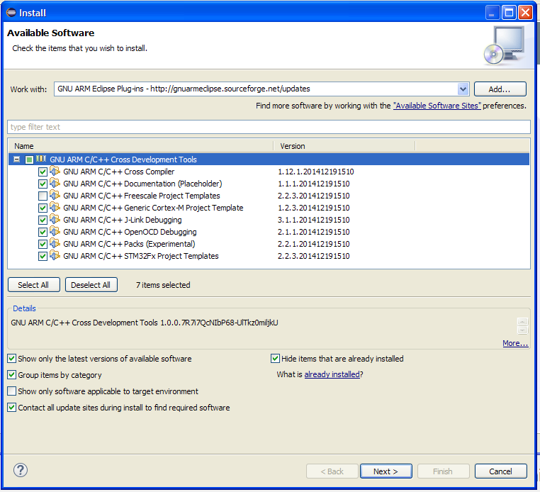\[/lightbox\]

Then, click on "**Next**" and follow the instructions. Restart the IDE when requested.

### Install the GCC ARM tool-chain

The next step is to install the GCC tool-chain for the ARM Cortex platform. You can download a prebuild version for your operating system from this [web site](https://launchpad.net/gcc-arm-embedded). I successfully  tested the [4.8-2014-q3-update](https://launchpad.net/gcc-arm-embedded/4.8/4.8-2014-q3-update) release. You can download the [installer](https://launchpad.net/gcc-arm-embedded/4.8/4.8-2014-q3-update/+download/gcc-arm-none-eabi-4_8-2014q3-20140805-win32.exe) and start the installation. When asked, install the tool-chain in the following directory **C:\STM32Toolchain\gnu-arm\4.8-2014q3** (as I said before, you can choose the path you want, but I'll assume this path in the next steps). IMPORTANT: I strongly suggest to leave unchecked the entry "**Add path to environment variable**", especially if you have other compilers or IDE installed on your PC (for example, if you use MinGW or similar package manager for Windows). Now go on with the next step.

### Install the Build Tools

Windows historically lacks of some tools that are a must in the UNIX world. One of these is *make*, the tool made by Richard Stallman that controls the compilation process of programs written in C/C++. If you have already installed a product like MinGW or similar, you can skip this process. If not, you can install the Build Tools package made by the same author of GCC ARM plug-ins for Eclipse. You can download setup program from [here](http://sourceforge.net/projects/gnuarmeclipse/files/Miscellaneous/). When asked, install the tools in these folder: **C:\STM32Toolchain\Build Tools**. Restart Eclipse.

### Install the ST Link drivers for STM32Nucleo board

This is a really important step. Pay attention to the next instructions. Before installing any other piece of software, it's convenient to install the drivers for the STM32Nucleo board.


**Important**: before install drivers, disconnect the board from the USB port\!


One of the key feature of Nucleo board is that it already provides the on-chip programmer for STM32 MCUs: the ST-Link. In fact, Nucleo boards are made of two parts: the ST-Link programmer (the one with USB connector) and the target board (the one with Arduino-style expansion headers).

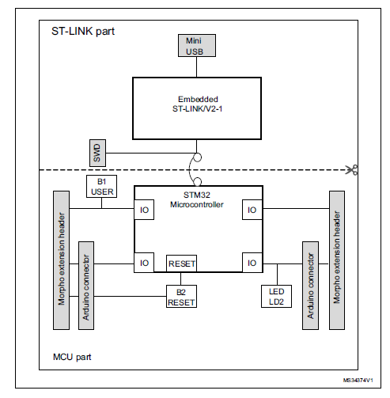It's important to highlight that different from the commercial ST-Link programmer, the Nucleo board provides a more recent version of ST-Link: the 2.1 version. This means that you have to update your drivers even if you already have an ST-Link programmer. You can download the latest drivers from [here](http://www.st.com/web/catalog/tools/FM116/SC959/SS1532/LN1847/PF260000). Install the drivers and check that everything works correctly. When you connect your board to the PC, you should see two new peripherals: the ST-Link programmer and a Virtual Com Port. If everything works correctly, you can go to the next step. 


**Important**: some Nucleo boards (like the mine) need a firmware update of the ST-Link part. After installed the drivers, you can download the firmware update from [here](http://www.st.com/web/en/catalog/tools/PF260217) and follow the instructions. **This step is really important!**


### Install STM32CubeMX and ST-Link Utility

When a STM32 MCU starts, it needs an hardware configuration to work correctly. This configuration is dependent of the specific MCU and the chosen hardware configuration. This configuration must be performed when the CPU boots-up. Unfortunately, this is not a trivial task and it requires a deep knowledge of the specific MCU. However, we have a more short way to do this work. ST provides a dedicated tool that generates the initialization code for us. This tool is called STM32CubeMX and it will come really useful in the next part of this tutorial. So you can start to download it from [here](http://www.st.com/web/catalog/tools/FM147/CL1794/SC961/SS1743/PF259242?icmp=stm32cubemx_pron_pr-stm32cubef2_apr2014&amp;sc=stm32cube-pr2) (you'll find the download link at the bottom of page). Install it following the suggested configuration.

To simplify this part of the tutorial we won't use any debugging tool inside the Eclipse IDE, but we'll use the official ST-Link Utility tool to flash our Nucleo boards. You can download this tool from [here](http://www.st.com/web/en/catalog/tools/PF258168). Install it following the suggested configuration. 


**Important**: install the ST-Link Utility only after you have already installed Nucleo drivers. I've installed ST-Link Utility before installing the board drivers, but I had several issues that prevented the board from working right.


 After the ST-Link Utility is installed, connect your Nucleo board to the PC and check if the ST-Link Utility sees the boards.


**READ CAREFULLY**: If you have Nucleo-F401RE board you can continue reading this tutorial. The generated code will work without any problems. However, these instructions a not suited for other type of Nucleos. I recently wrote a more general tutorial that covers also the other Nucleo boards (F1, F0, etc). You can read it here:

[http://www.carminenoviello.com/en/2015/06/04/stm32-applications-eclipse-gcc-stcube/](/?p=1590)


### Create a test project

Ok. A lot of work is already done. Now we have to check that all works correctly. We'll now create a test project (a simple blinking LED application) using the Eclipse plug-ins installed before.

First, start Eclipse and go to **File-\>New-\>C Project**. If you have a STM32Nucleo-F4 board, you can use the next configuration options. Otherwise, you have to adapt for your Nucleo processor family. You can choose the project name you want (I chose "**test1**"). Click on "**Next**". 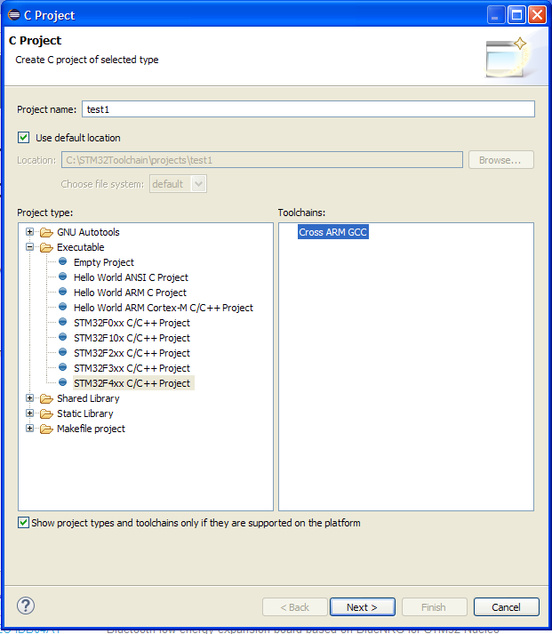In the next step you have to setup the right chip family for your Nucleo board. For the Nucleo-F401RE board the right family is STM32F401xE. **Important**: pay attention to select the right chip family, otherwise the test example may not work. Setup the remaining configuration parameters like in the following picture.

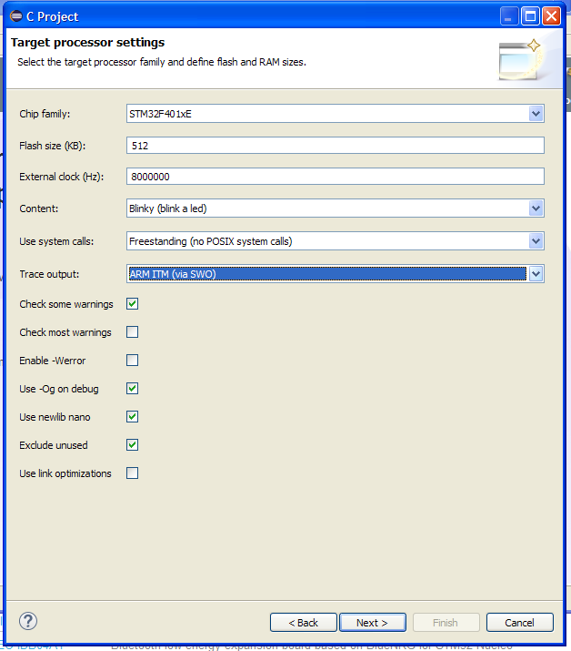Click on "**Next**". You can leave the default parameters in the next steps. The final step is about the GCC tool-chain. You can use these values:

tool-chain name: **GNU Tools for ARM Embedded Processors (arm-none-eabi-gcc)**\
tool-chain path: **C:\STM32Toolchain\gnu-arm\4.8-2014q3\bin**

Click "**Finish**".

Now, if this is the first time you get in touch with the Eclipse IDE, you could be a little bit mazed by its interface. Eclipse is a multi-window IDE, and windows can be organized in several groups called *perspective*, as they are called in the Eclipse gibberish. It's out from the goals of this article to explain how Eclipse works. I suggest you to play with the buttons marked in red in the following image. \[lightbox full="08-schermata-2014-12-20-alle-22-16-28.jpg"\] 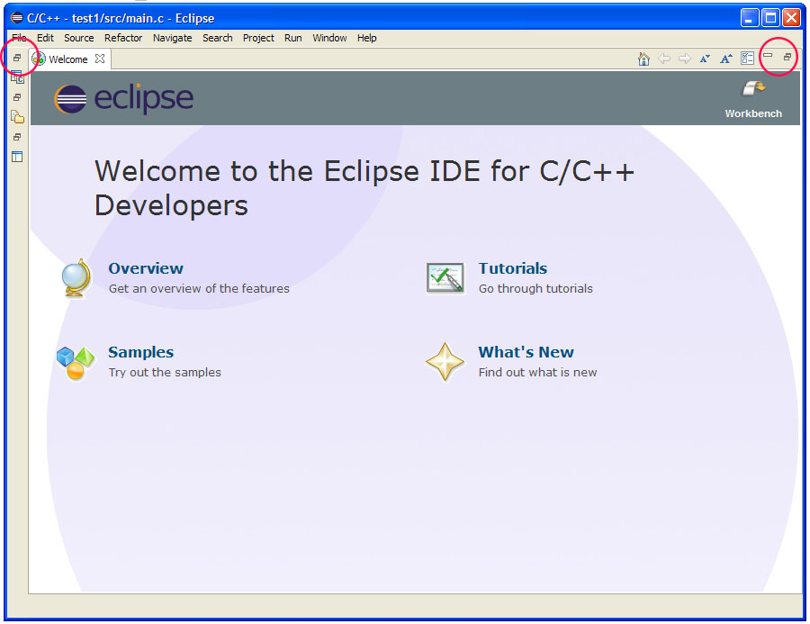\[/lightbox\] After some clicks, you should obtain an interface close to the one in the following image. \[lightbox full="09-schermata-2014-12-20-alle-22-22-50.png"\] \[/lightbox\]

### Let's compile the test project

Before we can compile the test project, we need to complete few other steps. However, let's start to become familiar with the IDE and let's try to compile the project. Go to **Project-\>Build all**. After few seconds, this error message will appear in the compiler console: 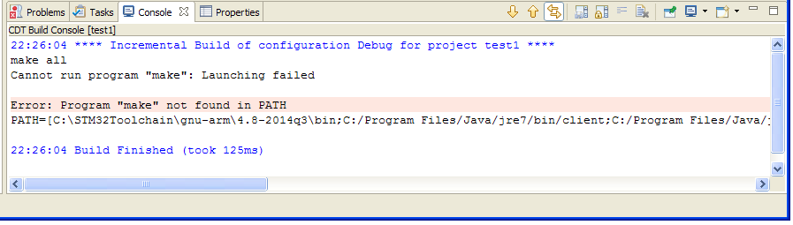This message simply means that the IDE can't find the *make.exe* program, used to compile source files. If you remember, we already installed the Build Tools in the previous steps. Now we have to set the correct path to Build Tools. Go to **Window-\>Preferences**. The Eclipse preferences window will appear. Go to **C/C++-\>Build-\>Environment** and click **Add**. 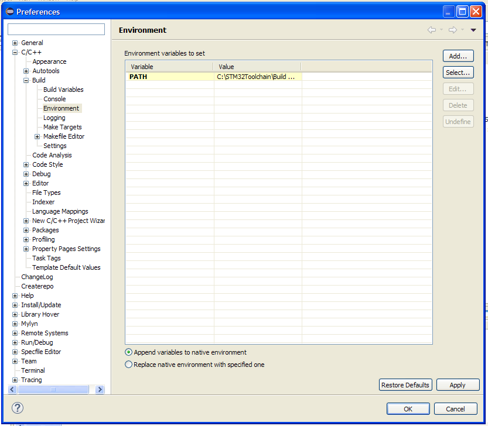Insert the string **Path** in the filed "Name", and **C:\STM32Toolchain\Build Tools;\${Path} **in the field "Value". Click first on "OK", then on "Apply" and lastly on "OK" again. Let's restart the build process going to **Project-\>Build all**. This time compilation will be longer. At the end, this message will appear on the compiler console.. 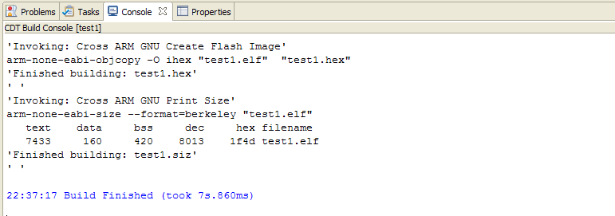Bingo. We have successfully compiled the test project for our Nucleo board.

### Flash the binary on the STM32Nucleo MCU

To upload the binary image to the Nucleo MCU we'll use the ST-Link Utility. Connect the Nucleo board to the PC. Start the ST-Link Utility and go to **Target-\>Connect**. LD1 LED (the one close to the mini-USB connector) will start blinking green/red and ST-Link Utility will show information about our Nucleo chip. Now, we simply can upload the binary image going to **Target-\>Program & Verify...**. A file selection window will show. Go to  **C:\STM32Toolchain\projects\test1\Debug** and select **test1.hex** file. The following window will appear. 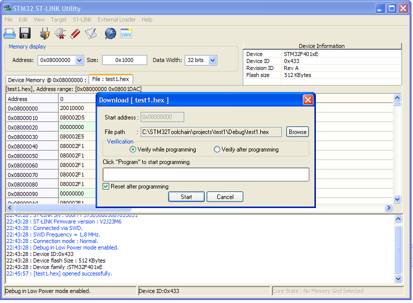Click "**Start**". After few seconds the upload is finished. We successfully programmed our Nucleo board 🙂

### Adapt the test code to the Nucleo board

Ok. Stop. Your board is not broken. The green LED (marked LD2 on the PCB) does not blinks because we need to do few other configuration steps. Do you remember STM32CubeMX? Now it's the right time to use it.

The template code generated by the GNU ARM plug-in for Eclipse is not designed to run on the Nucleo board, but it's designed to run on the more popular STM32 Discovery platform. So we need to adapt it to work correctly with our Nucleo board. We essentially need to modify two things: the MCU pin associated to the LED LD2 (it's mapped to a different pin on the Nucleo board) and the right oscillator configuration for our board. My Nucleo board version (STM32Nucleo-F401RE) does not provide an external oscillator, and we need to use the internal oscillator that allows our MCU to run "only" up to 84Mhz (amazing! :-)). You should check the right configuration for your Nucleo, since some of them provide an external oscillator. However, the solution I'm going to show we'll allow to setup correctly every Nucleo. STM32CubeMX will come in handy to accomplish this task.


For the sake of completeness, I've to say that ST distributes a CubeMX version as Eclipse plug-in. Unfortunately, this plug-in seems not working correctly. My Eclipse crashed and it's totally unusable unless I don't remove the CubeMX plug-in. Probably this plug-in isn't still tested with the Luna version. For this reason, I'll use the standalone version in these tutorials.


Start STM32CubeMX and go to "**New Project**". Click on the tab "Board Selector". In "**Type of Board**" choose  **Nucleo**. In the "**MCU Series**" drop-down list choose your Nucleo target MCU version. Next, in the column labeled "**Peripheral Selection**"add "**1**" to rows Led and Button. In the "**Board List**" table, choose your exactly Nucleo version.Click on "**OK**". CubeMX will show your target Nucleo MCU and its configuration. \[lightbox full="15-schermata-2014-12-21-alle-07-29-47.png"\] 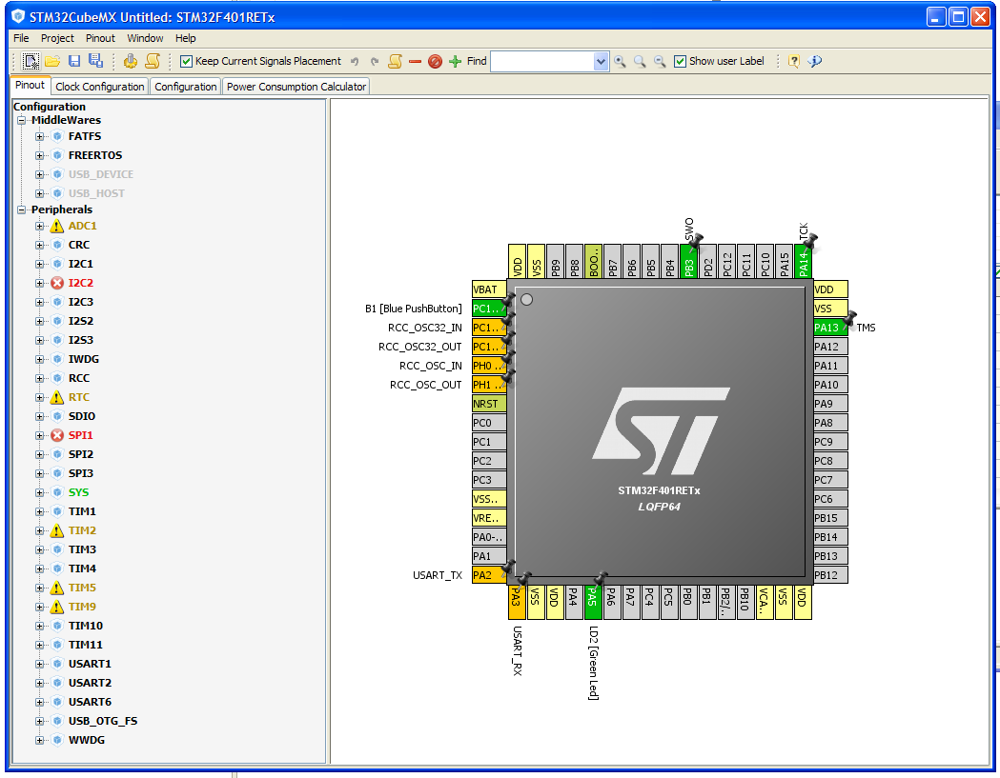\[/lightbox\]

A description of the CubeMX software is out of the goals of this tutorial. I'll give a deep description of this tool in a next post. We only use it to generate the right oscillator configuration. Go to "**Project-\>Generate Code**" and fill the fields like in the following picture. 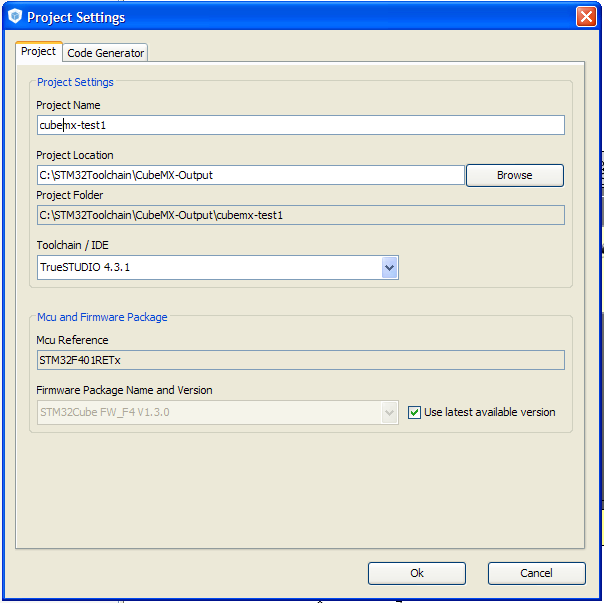Click on "**OK**" button. CubeMX will ask us if we want to download the latest version of STM32Cube framework. In our case, we can choose "NO" since the GNU ARM plug-in already provides the latest framework version. Click on "Continue" in the next message box. When the generation ends, click on "Open Folder" and go inside the "*src*" folder. Open "main.c" file and copy the whole content of the function SystemClock_Config(void). If you have the same Nucleo board I have, the generated code will be equal to this one.

``` c
RCC_OscInitTypeDef RCC_OscInitStruct;
  RCC_ClkInitTypeDef RCC_ClkInitStruct;

  __PWR_CLK_ENABLE();

  __HAL_PWR_VOLTAGESCALING_CONFIG(PWR_REGULATOR_VOLTAGE_SCALE2);

  RCC_OscInitStruct.OscillatorType = RCC_OSCILLATORTYPE_HSI;
  RCC_OscInitStruct.HSIState = RCC_HSI_ON;
  RCC_OscInitStruct.HSICalibrationValue = 6;
  RCC_OscInitStruct.PLL.PLLState = RCC_PLL_ON;
  RCC_OscInitStruct.PLL.PLLSource = RCC_PLLSOURCE_HSI;
  RCC_OscInitStruct.PLL.PLLM = 16;
  RCC_OscInitStruct.PLL.PLLN = 336;
  RCC_OscInitStruct.PLL.PLLP = RCC_PLLP_DIV4;
  RCC_OscInitStruct.PLL.PLLQ = 7;
  HAL_RCC_OscConfig(&RCC_OscInitStruct);

  RCC_ClkInitStruct.ClockType = RCC_CLOCKTYPE_SYSCLK|RCC_CLOCKTYPE_PCLK1;
  RCC_ClkInitStruct.SYSCLKSource = RCC_SYSCLKSOURCE_PLLCLK;
  RCC_ClkInitStruct.AHBCLKDivider = RCC_SYSCLK_DIV1;
  RCC_ClkInitStruct.APB1CLKDivider = RCC_HCLK_DIV2;
  RCC_ClkInitStruct.APB2CLKDivider = RCC_HCLK_DIV1;
  HAL_RCC_ClockConfig(&RCC_ClkInitStruct, FLASH_LATENCY_2);
```

This code is the right configuration for the system clock of our Nucleo board. As you can see, STM32 MCUs have a non-trivial clock configuration. CubeMX dramatically simplify this step, allowing us to concentrate on the application development. Copy the generate code inside the SystemClock_Config() function. Now, go back to Eclipse and open the file **\_initialize_hardware.c** contained in the "**src**" folder. Substitute the whole content of configure_system_clock(void) function with the one we have copied before. Now go to "**include**" folder and edit the file  **BlinkLed.h**. Go to line 30 and modify the LED port configuration in the following way:

``` c
#define BLINK_PORT_NUMBER               (0)
#define BLINK_PIN_NUMBER                (5)
#define BLINK_ACTIVE_LOW                (0)
```

In this way we are going to use the pin A5, where the LED LD2 is connected. Save all the modified files (pay attention to save all files since Eclipse will not automatically save them) and recompile the project. Now we can flash our Nucleo again using ST-Link Utility. The LED LD2 finally blinks 🙂 


**Attention**: I spent 4 damned hours before I've understood that ST-Link Utility doesn't load the .hex file every time it changes. This means that you are uploading the previous version of binary file. You have to reload it manually. To do this, click with the right button on tab named "test1.hex" and choose "Open file", as shown in the following picture. 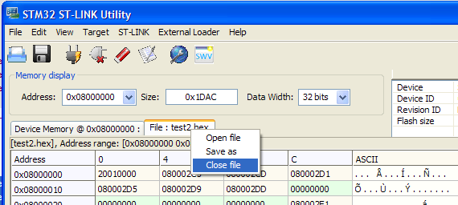


Mission accomplished. We've successfully programmed our Nucleo board. In the next post I'll show how to configure Eclipse to flash the MCU and to do step-by-step debugging. Stay tuned!

 

*This article is part of a series made of three posts. The second part is [here](/?p=1256 "Setting up a GCC/Eclipse toolchain for STM32Nucleo – Part II"), the third [here](/?p=1269 "Setting up a GCC/Eclipse toolchain for STM32Nucleo – Part III").*
