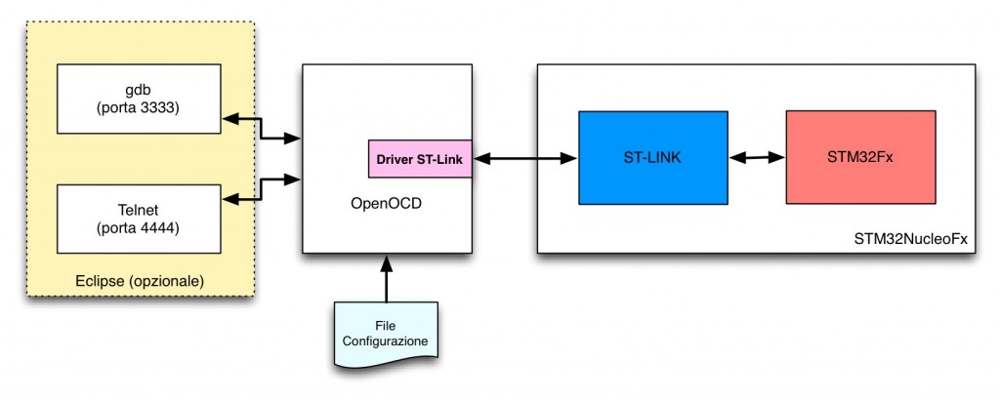
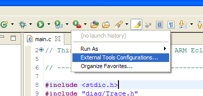
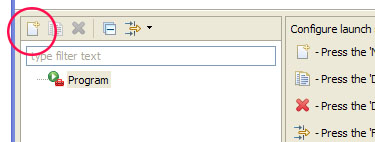
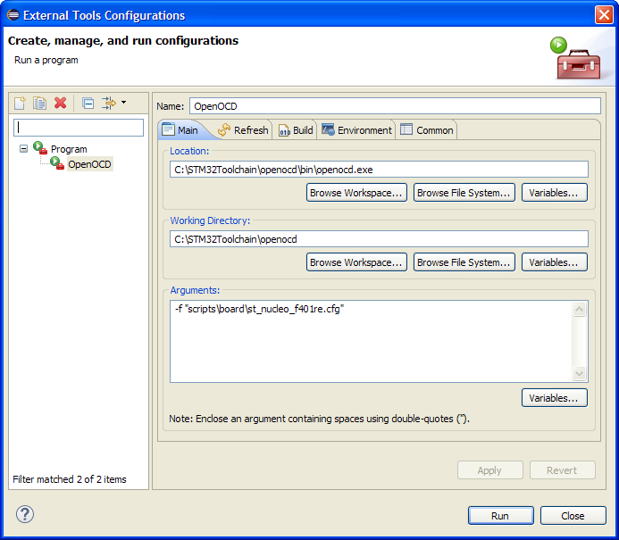
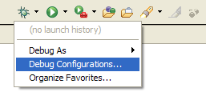
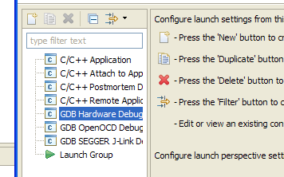
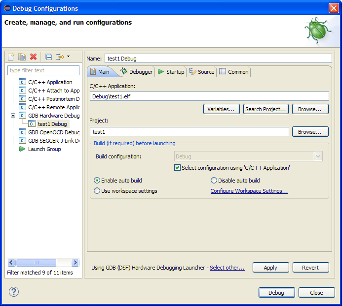
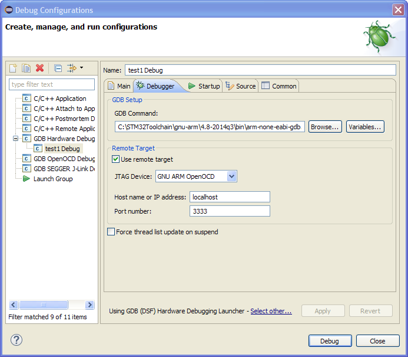
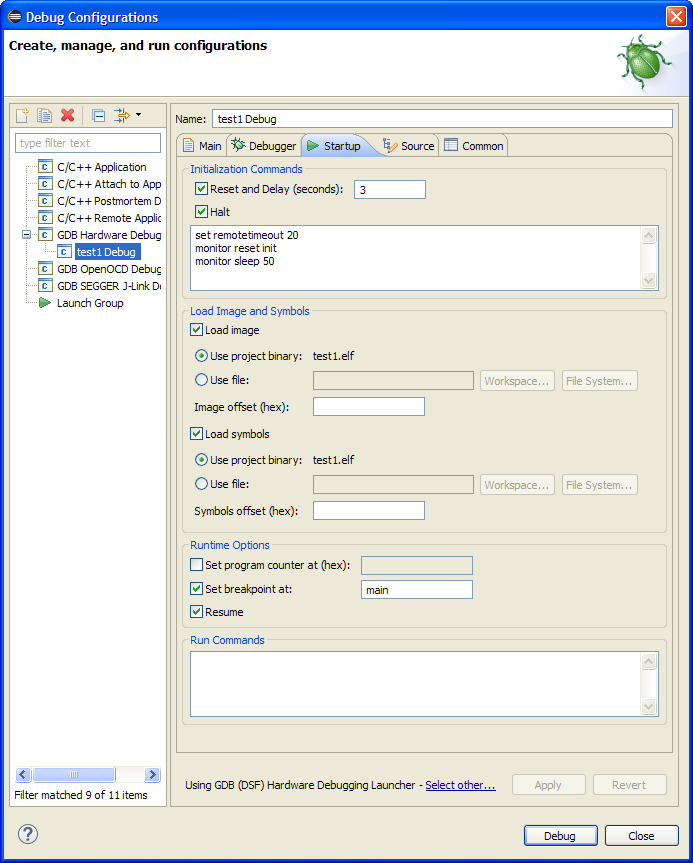

+++
title = "Setting up a GCC/Eclipse toolchain for STM32Nucleo – Part II"
slug = "setting-gcceclipse-toolchain-stm32nucleo-part-2"
url = "/2015/01/07/setting-gcceclipse-toolchain-stm32nucleo-part-2/"
date = "2015-01-07T14:13:50Z"
lastmod = "2016-08-28T16:14:46Z"
draft = false
categories = ["Electronics","STM32"]
tags = ["eclipse","gcc","openocd","stm32","stm32nucleo","toolchain"]
showHero = true
showTableOfContents = true

[cover]
image = "images/legacy/setting-gcceclipse-toolchain-stm32nucleo-part-2/cover-stm32nucelo-gcc-eclipse-toolchain.jpg"
alt = "stm32nucelo-gcc-eclipse-toolchain"
hiddenInSingle = false
+++


**Please, read carefully.**

Thanks to the feedbacks I have received, I reached to the conclusion that it's really hard to cover a topic like this one in the room of a blog post. So, I started writing a book about the STM32 platform. In the free book sample you can find the whole complete procedure better explained. You can download it [from here](https://leanpub.com/mastering-stm32).


In the [first part](/?p=998 "Setting up a GCC/Eclipse toolchain for STM32Nucleo – Part I") of this series we've successfully setup a minimal yet working tool-chain to develop applications for the STM32 family (we've especially focused on STM32Nucleo developing board). We've based the tool-chain over the Eclipse IDE and the GCC cross-compiler for ARM Cortex platform. We've also created a test project (a simple blinking LED) and uploaded it on our Nucleo using the ST-Link Utility.

This might be enough to develop every type of application based on the STM32 family. Using the Nucleo integrated Virtual COM port, we could print messages to debug the firmware (this is the common way to debug Arduino sketches). However, we can use just few other tools to do a live debugging on our Nucleo, placing breakpoints, doing step-by-step debugging, accessing to internal registers and memory.

In this post we'll focus on how to use GDB to do step-by-step debugging. We'll configure it as client of another tool, which is able to interface the Nucleo through the ST-Link interface: OpenOCD.

### Install OpenOCD

[OpenOCD](http://openocd.sourceforge.net/) is a really challenging project started by Dominic Rath. OpenOCD has the aim to develop a sort of universal On-Chip-Debugger able to interface the most common MCU platforms on the market. OpenOCD is designed to interface ARM-Cortex-M processors and it provides drivers to connect to ST-Link debugging interface. OpenOCD is distributed as Open Source software. Freddie Chopin has created the precompiled version of this tool for Windows.

Before to start installing OpenOCD, I would like to say a few words about how OpenOCD works, especially when it's used to debug STM32 MCUs. I think that a knowledge of how the debug process works, even partial one, can be really useful to better understand how to customize the debugging environment.

\[lightbox full="http://www.carminenoviello.com/wp-content/uploads/2014/12/OpenOCDarchitettura.jpg"\]

OpenOCD and ST-Link interaction

\[/lightbox\]

To flash a MCU (and eventually to debug it) we usually need an external piece of hardware called *programmer *(sometimes, they are also called *dongle*, *on-chip programmer*, etc). Every MCU manufacturer produces at least one type of programmer for a given MCU family. For the STM32 platform ST provides a family of programmers named ST-Link. The Nucleo board already integrates the ST-Link programmer (and it's even detachable from the main board and it can be used as stand-alone programmer). So we don't need any external hardware tool to flash our Nucleo MCU.\
OpenOCD has all drivers needed to interface the ST-Link programmer and it's configured using some scripts file. These files contain commands that instruct OpenOCD to connect to the ST-Link interface of our Nucleo using the USB port and put OpenOCD in "server mode" on the 3333 TCP port. GDB will use this port to exchange commands with OpenOCD. Moreover, OpenOCD uses the additional TCP port 4444 to accept commands by the user through a telnet session. Thanks to these connections, OpenOCD can be instructed to upload the firmware on the target MCU, to setup breakpoints, to inspect memory status and so on. However, this work can be automatized and made simpler using Eclipse and the plug-ins we installed in the [first part](/?p=998) of this series.

Let's install OpenOCD. First we have to download the latest version of OpenOCD for Windows from [here](http://www.freddiechopin.info/en/download/category/4-openocd). I suggest to use at least 0.8 version or later, since I experienced several problem using the Nucleo with OpenOCD 0.7. The download file is a ZIP archive compressed using [7-zip utility](http://www.7-zip.org/). Extract the archive content inside the **C:\STM32Toolchain** directory. Next, rename the OpenOCD directory from *openocd-0.8.0* to simply *openocd*. Next go inside the **C:\STM32Toolchain\openocd\bin** directory and rename the file *openocd-0.8.0.exe* in *openocd.exe*. 


This operation is not strictly needed. However, this will allow us to update OpenOCD when a new release is available without changing Eclipse configurations.


### Setting up Eclipse

Once that OpenOCD is installed, we need to properly configure the Eclipse IDE to work with GDB and OpenOCD. There are two ways to configure Eclipse and OpenOCD:

- **Method 1**: the first method consists in configuring Eclipse so that it automatically starts first OpenOCD and then GDB at each debug session.
- **Method 2**: the second method consists in configuring OpenOCD as an *External Tool* that is started once, and then configuring GDB to connect to OpenOCD through the 3333 TCP port.

The plug-ins we installed in the first part of this series allow us to use both the configuration methods. However, I experienced some issues with the first method. Unfortunately, it often happens that OpenOCD can't connect to ST-Link debugger when it is repeatedly started/stopped. The only solution to this issue is removing the Nucleo board from USB port and connecting it again. I read around that is a problem related with the driver provided from ST. However, I wonder why this doesn't happen with the ST-Link Utility. I think that this is probably a issue related on how OpenOCD and ST-Link drivers interact. So, the best solution is to start once OpenOCD, and use GDB to connect to it using 3333 TCP port.

In the rest of this post I assume that you've already opened and compiled the *test1* project made in the [first post](/?p=998). Click the "External tools" configuration icon, and then click on "**External Tools Configurations....**", as shown in the following picture

Now, click on the "**New launch configuration**" icon, as shown below

The configuration window shows. Fill the configuration fields as shown in the following picture: \[lightbox full="04-2014-12-25-10-39-45-external-tools-configurations.png"\]

\[/lightbox\]

This is the meaning of each field.

**Location**: is the absolute path where we have installed OpenOCD, that is **C:\STM32Toolchain\openocd\bin\openocd.exe**.\
**Working Directory**: is the OpenOCD process working directory (that is, the *cwd* in UNIX operating systems). This path is used as base for paths in OpenOCD scripts and configuration files.\
**Arguments**: are the arguments passed to the command line to OpenOCD. In our case we have to pass configuration script for our Nucleo board (my board is the STM32Nucleo-F401RE one; if you have a different Nucleo, check in **C:\STM32Toolchain\openocd\scripts\board** directory for the right configuration file).

What does the *st_nucleo_f401re.cfg* file exactly contain? It's a configuration script, which contains these commands:

``` c
# This is an ST NUCLEO F401RE board with a single STM32F401RET6 chip.
# http://www.st.com/web/catalog/tools/FM116/SC959/SS1532/LN1847/PF260000

source [find interface/stlink-v2-1.cfg]

source [find target/stm32f4x_stlink.cfg]

# use hardware reset, connect under reset
reset_config srst_only srst_nogate
```

The first source command says to OpenOCD to load the configuration file for the ST-Link interface (pay attention that the ST-Link programmer embedded in the Nucleo has a different firmware version from the stand-alone ST-Link programmer). This other file contains the instructions to identify the right USB interface.\
The other source command says to OpenOCD to load the configuration file that describes the STM32F4 MCU on the Nucleo board.\
Click on "**Apply**" and then on "**Run**". You'll see these messages in the Eclipse console

``` c
Open On-Chip Debugger 0.8.0 (2014-04-28-08:39)
Licensed under GNU GPL v2
For bug reports, read
    http://openocd.sourceforge.net/doc/doxygen/bugs.html
srst_only separate srst_nogate srst_open_drain connect_deassert_srst
Info : This adapter doesn't support configurable speed
Info : STLINK v2 JTAG v23 API v2 SWIM v6 VID 0x0483 PID 0x374B
Info : using stlink api v2
Info : Target voltage: 3.245204
Info : stm32f4x.cpu: hardware has 6 breakpoints, 4 watchpoints
```

Moreover, LD1 LED (the one close to the mini-USB connector) starts blinking green/led. This means that OpenOCD has established the connection to the ST-Link debugger correctly. Now we need to configure GDB. Click on debug configuration menu and then "**Debug Configurations....**" like in the following picture:

In the next window we need to select first "**GDB Hardware Debug**" entry and then click on "**New launch configuration**" iconIn the next windows you'll see a series of tabs (Main, Debugger, Startup, Source, Common). In the "**Main**" tab select "**Enable auto build**". \[lightbox full="07-2014-12-25-10-58-25-debug-configurations.png"\]\[/lightbox\] In the "**Debugger**" tab configure field as shown in the following picture: \[lightbox full="08-2014-12-25-10-53-39-debug-configurations.png"\]\[/lightbox\]

This is what each fields means.

**GDB Command**: is the path where GDB is installed. In our case is  **C:\STM32Toolchain\gnu-arm\4.8-2014q3\bin\arm-none-eabi-gdb.exe**.\
**JTAG Device**: is the programmer type we are using. Select "**GNU ARM OpenOCD**".\
**Host name** e **Port number**: this field must be set to **localhost** and **3333**.

Now go to "**Startup**" tab and configure each field as shown in the following picture: \[lightbox full="09-2014-12-25-10-54-02-debug-configurations.png"\]\[/lightbox\]

Click on"**Apply**" and then on "**Debug**". After few seconds, our test program will be loaded on the Nucleo. The execution will automatically stop at  the main() function. We have successfully configured Eclipse to debug applications for our Nucleo board. I won't give details on how to setup breakpoints, to do step-by-step debugging, and so on. I assume you are familiar with these debugging instruments. In the next part of this series I'll show other debug related tools.

 

*This article is part of a series made of three posts. The first part is [here](/?p=998 "Setting up a GCC/Eclipse toolchain for STM32Nucleo – Part I"), the third [here](/?p=1269 "Setting up a GCC/Eclipse toolchain for STM32Nucleo – Part III").*
