+++
title = "Setting up a GCC/Eclipse toolchain for STM32Nucleo – Part III"
slug = "setting-gcceclipse-toolchain-stm32nucleo-part-iii"
url = "/2015/01/16/setting-gcceclipse-toolchain-stm32nucleo-part-iii/"
date = "2015-01-16T07:12:39Z"
lastmod = "2016-08-28T16:15:28Z"
draft = false
categories = ["Electronics","STM32"]
tags = ["eclipse","EmbSysRegView","gcc","semihosting","stm32","stm32nucleo"]
showHero = true
showTableOfContents = true

[cover]
image = "images/legacy/setting-gcceclipse-toolchain-stm32nucleo-part-iii/cover-stm32nucelo-gcc-eclipse-toolchain.jpg"
alt = "stm32nucelo-gcc-eclipse-toolchain"
hiddenInSingle = false
+++


**Please, read carefully.**

Thanks to the feedbacks I have received, I reached to the conclusion that it's really hard to cover a topic like this one in the room of a blog post. So, I started writing a book about the STM32 platform. In the free book sample you can find the whole complete procedure better explained. You can download it [from here](https://leanpub.com/mastering-stm32).


Let's recap what we've done in the two previous parts of this series. In the [first part](/?p=998 "Setting up a GCC/Eclipse toolchain for STM32Nucleo – Part I") we've configured Eclipse and GCC to build applications for the ARM-Cortex platform. We've used the GNU ARM Eclipse plug-ins to generate a minimal yet working example (a simple blinking LED app) for our STM32 Nucleo board. Next, we've used the CubeMX tool from ST to generate the right initialization code for our Nucleo. Lastly, we used ST-Link Utility to upload generated binary code on the target MCU. In the [second part](/?p=1256 "Setting up a GCC/Eclipse toolchain for STM32Nucleo – Part II") we've taken a deeper look in the debug topic. We've configured OpenOCD and GDB to allow step-by-step execution of our application on the Nucleo target MCU.

In this post we'll see additional debugging facilities that can be really useful during the debugging process of our firmware. First, we'll install an Eclipse plug-in that allows us to inspect internal MCU registers. Second, we'll see how to configure ARM semihosting, a capability of ARM CMSIS framework that allows to print messages coming from target MCU on the OpenOCD console.

### Install EmbSysRegView

When we are doing live debugging of a firmware on the target MCU, it could be really useful to inspect MCU register, especially if we are using integrated peripherals like UART, SPI, CAN and so on. An advanced micro like the STM32F4 has a really high number of internal registers, which can have different configurations. For example, a physical PIN can have several logical functions that are enabled with different settings of dedicated registers.  [EMBedded SYStems REGister VIEW](http://embsysregview.sourceforge.net/) (below only EmbSysRegView) is an excellent Eclipse plug-in that allows to access to internal memory mapped registers of ARM Cortex MCUs. Follow this procedure to install the plug-in.

Go to **Help-\>Eclipse Marketplace...** and write "**embsysregview**" in the"**Find**" textbox. Click on "**Install**" when the plug-in is shown.

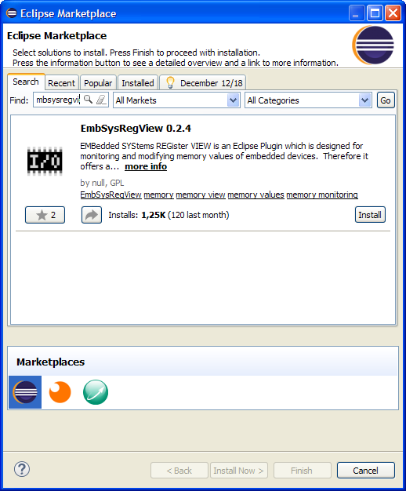In the next page check all entries and click on "**Confirm**". 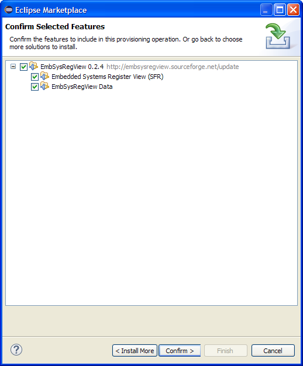In the next page accept the license and click on "**Finish**". Eclipse will complete the installation after a while. Restart the IDE.

Now we need to configure EmbSysRegView for our target MCU (my Nucleo has the STM32F401RE). Go to **Window-\>Preferences** and then **C/C++-\>Debug-\>EmbSys Register View** and choose your micro, as shown in the following picture. \[lightbox full="03-2014-12-26-10-43-02-preferences.png"\]

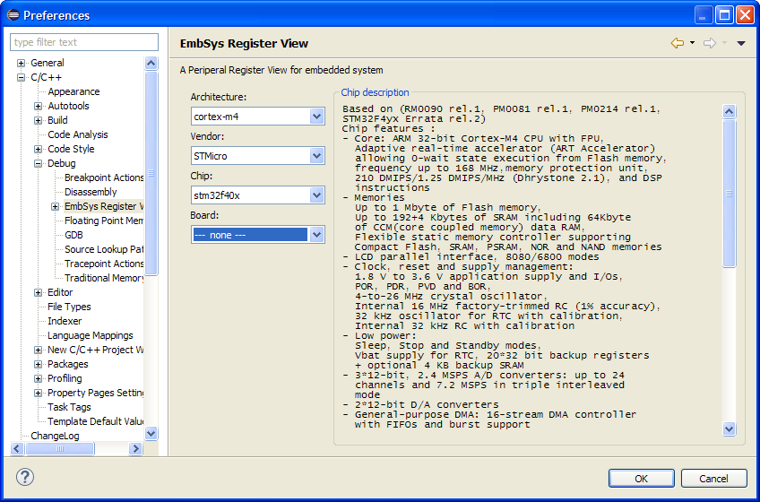\[/lightbox\] Next, start debugging our *test1* project (the test project we've created in the [fist part](/?p=998 "Setting up a GCC/Eclipse toolchain for STM32Nucleo – Part I")). To show the EmbSysRegView console, go to **Window-\>Show View-\>Other...**. In the selection dialog, go to **Debug** and then **EmbSys Registers**. Click on **OK**.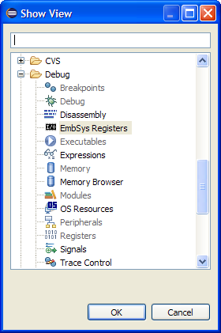The EmbSysRegView console appears in the bottom area, as shown below. \[lightbox full="05-2014-12-26-10-48-11.png"\]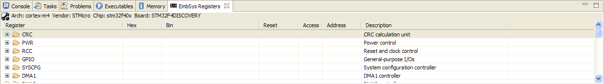\[/lightbox\] The EmbSysRegView plug-in is really intuitive. Let's see an example. Open the **BlinkLed.c** file and insert a breakpoint at line 23, inside the function blink_led_init(), where the port A is configured so that the pin 5 is used as output (Nucleo LED LD2 is connected to that pin).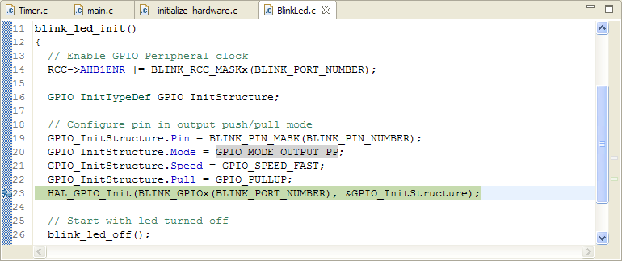Press the run icon on the Eclipse toolbar. When the execution will automatically block at that instructions, open the EmbSysRegView console and select GPIO-\>GPIOA entry. By default, registers inspection is disabled (you realize this looking at the icon - it's grey when inspection is disabled, green otherwise).\[lightbox full="07-2014-12-26-11-35-53.png"\]

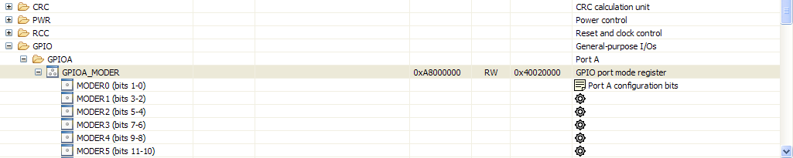\[/lightbox\] Click twice on the icon close to the register name. The icon switches to green. \[lightbox full="08-2014-12-26-11-40-08.png"\]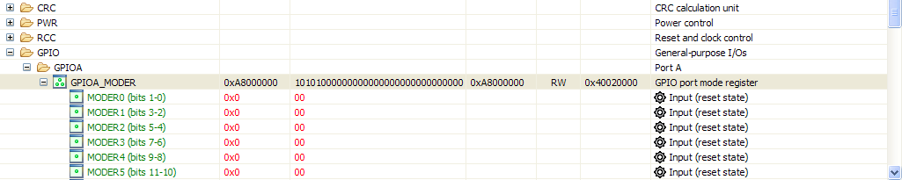\[/lightbox\] Now, let's execute the instruction at line 23 clicking on Step-Over icon (). EmbSysRegView will show that the MODER5 register has changed status. \[lightbox full="10-2014-12-26-11-44-00.png"\]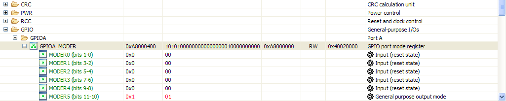\[/lightbox\]   


 The fist time you'll use EmbSysRegView, you notice a damned annoying behavior. When you do step-by-step debugging, the OpenOCD console takes the focus. This hides the EmbSysRegView console and you can't see when registers change their status. To address this, go in the OpenOCD console and click with the right mouse button. Choose "**Preferences**". \[lightbox full="11-2014-12-26-11-51-45-greenshot.png"\]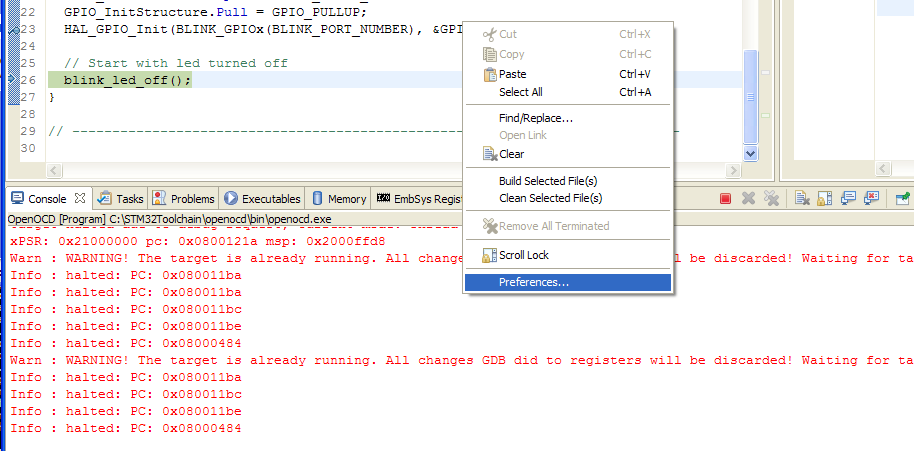\[/lightbox\] In the next window, UNCHECK "Show when program writes to standard out" and "Show when program writes to standard error" entries.


If you click on a register you can change its value too. For example, if we restore the MODER5 register from 0x1 to 0x0 , the LED LD2 stops blinking, since the pin is now configured as input pin. You can modify registers value only when the firmware execution is halted.

### How to print messages using ARM Semihosting

During the firmware development, it can be really useful to printout messages to understand the firmware execution. Sometimes, it's important to print the content of variables in order to understand if the program is working right. Arduino offers this functionality using the embedded virtual serial port. This operation is also possible with the Nucleo, since it provides a dedicated virtual serial port too. However, the ARM CMSIS framework (which is embedded in the STM32Cube library) provides a dedicated mechanism to this type of operation: the *semihosting*. ARM semihosting is a sort of *remote procedure call*. For example, the printf() function is called on the Nucleo MCU, but effective execution takes place on the PC connected to the board. This allows to abstract from specific hardware (video terminal, keyboard, etc) and code to control it (device drivers). The code running on the STM32 micro is "only responsible" of passing parameters to the PC through OpenOCD. Let's see an example. For the sake of simplicity, we'll start a new project, using following options during Project wizard.

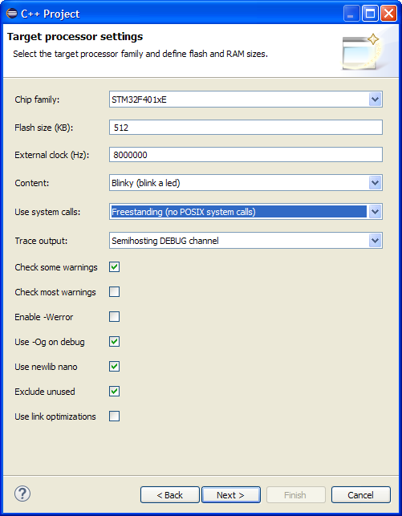When the project is generated, give a look to **main.c** file. You'll notice the use of trace_XXX functions. These functions use ARM semihosting to effectively print message on OpenOCD console. To test the project, we need to properly configure Nucleo clock inside configure_system_clock() in **\_initialize_hardware.c **file and LED LD2 port in **BlinkLed.h**, as shown in the [first part](/?p=998 "Setting up a GCC/Eclipse toolchain for STM32Nucleo – Part I") of this series. Moreover, we need to create the debug configuration as seen in the second part, but we have to add the instruction monitor arm semihosting enable to the GDB configuration, as shown in following picture:

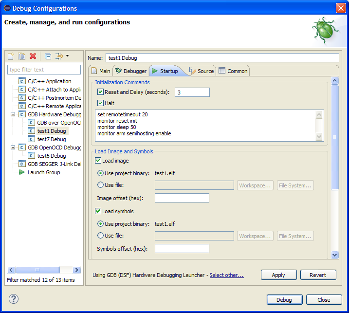The "monitor" instruction is a prefix command that is used to transfer the remaining command from GDB to OpenOCD using 4444 TCP port. This means that OpenOCD will receive the instruction "arm semihosting enable" which enables semihosting.

Now you can start debugging the test application. You'll see the messages printed in the main() function in the OpenOCD console, as shown below: \[lightbox full="14-2014-12-27-12-24-19-debug-test2-src-timer-c-eclipse.png"\]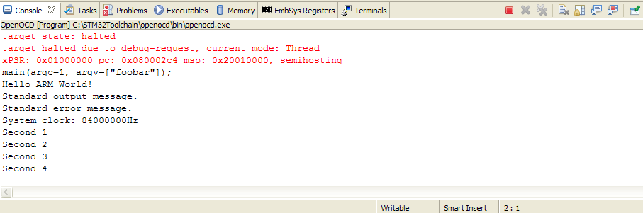\[/lightbox\]

This post ends this series about on how to setup a fully working tool-chain for the STM32 Nucleo board using Eclipse, GCC, OpenOCD. Even if we specifically addressed the Nucleo development board, these instructions are still valid for the STM32 Discovery platform too. You'll only need to arrange proper configurations of specific hardware, but I think that the instructions I've given are sufficient to allow everyone to setup its working environment.

 

*This article is part of a series made of three posts. The first part is [here](/?p=998 "Setting up a GCC/Eclipse toolchain for STM32Nucleo – Part I"), the second [here](/?p=1256 "Setting up a GCC/Eclipse toolchain for STM32Nucleo – Part II").*
