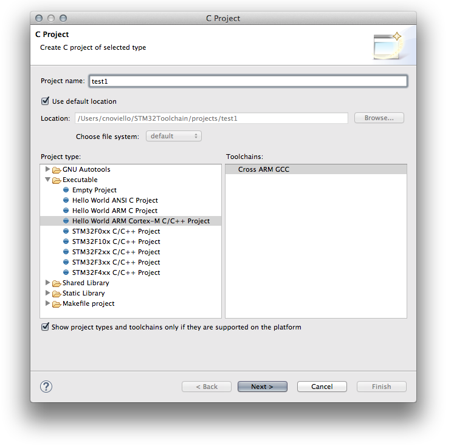
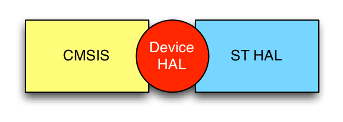
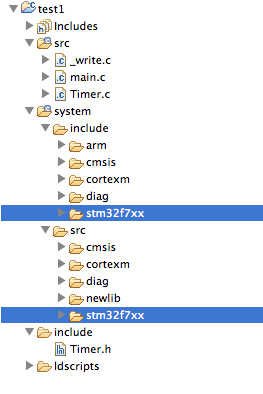
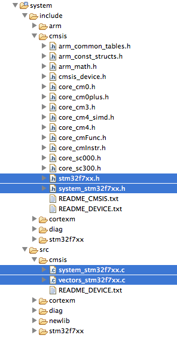
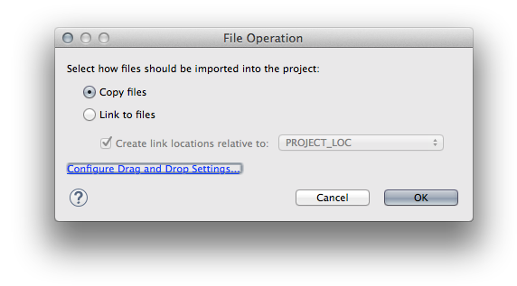
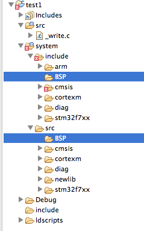
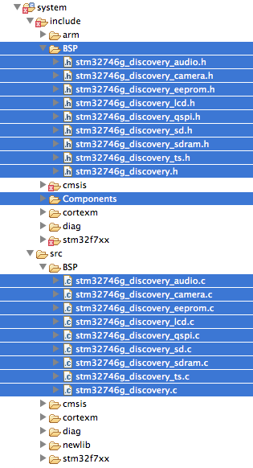
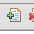
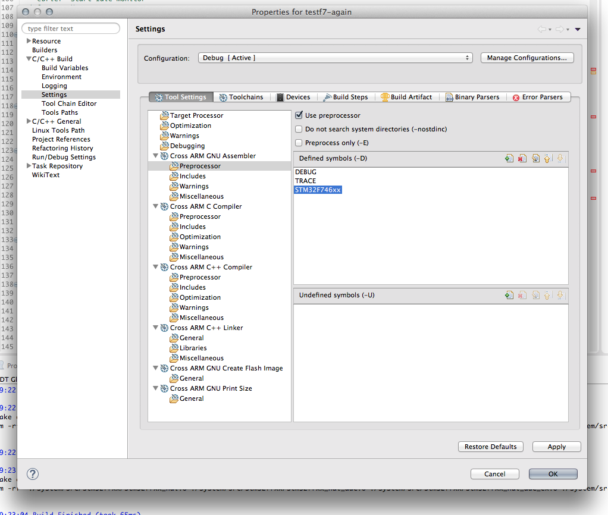
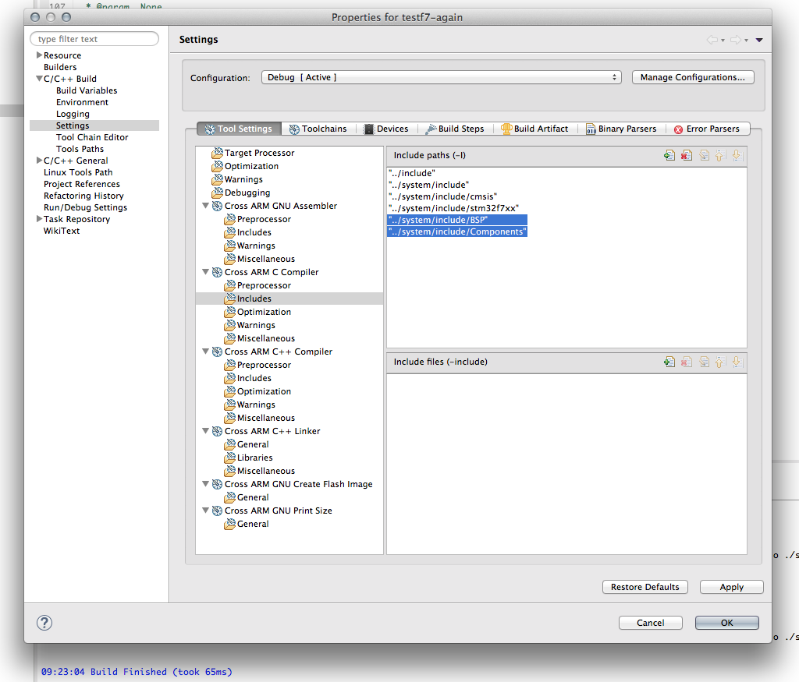

+++
title = "Getting started with STM32F746G-DISCO"
slug = "started-stm32f746g-disco"
url = "/2015/07/13/started-stm32f746g-disco/"
date = "2015-07-13T05:06:56Z"
lastmod = "2016-02-09T17:36:16Z"
draft = false
description = "ST Microelectronics recently expanded its portfolio of STM32 microcontrollers with the new STM32F7 family. These are the new best-in-class MCUs from ST, with a Cortex-M7 core able to run up…"
categories = ["Electronics","Programming","STM32"]
tags = ["eclipse","gcc","openocd","stm32","stm32f7","stm32f7discovery","tutorial"]
showHero = true
showTableOfContents = true

[cover]
image = "images/legacy/started-stm32f746g-disco/cover-stm32f7-disco-eclipse-gcc1.jpg"
alt = "stm32f7-disco-eclipse-gcc"
hiddenInSingle = false
+++

ST Microelectronics recently expanded its portfolio of STM32 microcontrollers with the new STM32F7 family. These are the new best-in-class MCUs from ST, with a Cortex-M7 core able to run up to 216Mhz (future releases will run up to 400Mhz with 2000 CoreMark index), with an internal flash up to 1Mb and 360Kb of RAM. STM32F7 is also able to run from external flash memory without performance penalty, thanks to a L1 cache (this is probably the most interesting aspect of these MCUs). STM32F7 are targeted for High-end embedded applications, especially to multimedia ones, and I think that it's far from low-budget applications and hobbyist uses. At the time of writing, these MCUs are quite pricy, ranging from 12€ to 20€/pcs for low-volume orders. This is definitely a really high price, especially if you consider that [you can find around](https://www.olimex.com/Products/Components/IC/A20/) Cortex-A7 MCUs for less than 10€. But I think that the price will be dramatically reduced in the future.

ST releases two development kits to start programming with STM32F7 MCUs. One is the [STM32756G-EVAL](http://www.st.com/web/catalog/tools/FM116/SC959/SS1532/LN1199/PF261640) kit. It's really expensive (about €600), and it's targeted to professional users. It's with no doubt the most complete kit for this platform, but it's too expensive for me 🙂 Finally, ST has released the classical discovery kit for this platform: [STM32F746G-DISCO](http://www.st.com/web/catalog/tools/FM116/SC959/SS1532/LN1848/PF261641?s_searchtype=partnumber#). It's sold with a really aggressive price (about €45), and it has a lot of interesting features:

- **STM32F746NGH6** microcontroller featuring **1 Mbytes of Flash memory** and **340 Kbytes of RAM**, in BGA216 package (*yes, BGA. Don't try strange things with your board, because it's really difficult to change the micro if something goes wrong*).
- On-board ST-LINK/V2-1.
- USB functions: virtual COM port, mass storage, debug port.
- **4.3-inch 480x272 color LCD-TFT with capacitive touch screen**
- Camera connector
- SAI audio codec
- Audio line in and line out jack.
- Stereo speaker outputs
- Two ST MEMS microphones
- SPDIF RCA input connector
- Two pushbuttons (user and reset)
- **128-Mbit Quad-SPI Flash memory**
- **128-Mbit SDRAM (64 Mbits accessible)**
- **Connector for microSD card**
- RF-EEPROM daughterboard connector
- USB OTG HS with Micro-AB connectors
- USB OTG FS with Micro-AB connectors
- **Ethernet connector compliant with IEEE-802.3-2002**
- Five power supply options:
  - ST LINK/V2-1 (*ensure that your USB port is able to provide up to 500mAh*)
  - USB FS connector
  - USB HS connector
  - VIN from Arduino connector
  - External 5 V from connector
- Power supply output for external applications: 3.3 V or 5 V
- **Arduino Uno V3 connectors**

STM32F746G-DISCO is currently the cheapest solution to start playing with this platform. A Nucleo-F7 is expected to be released for the end of 2015. STM32Fx-Discovery lovers, however, will be a little bit disappointed by the fact that this board doesn't expose all MCU pins to convenient pin headers, as it happens for other Discovery boards. There are only few signals routed to the Arduino-style connectors, on the bottom of the board. If you need access to other pins, probably it is better to address the more professional STM32756G-EVAL kit. However, bear in mind that STM32F7 was designed to be pin-to-pin compatible with the STM32F4 family. Moreover, consider that another interesting feature of Cortex-M7 cores it that they are binary compatible with Cortex-M4. I made a small test and I can confirm that this is true.

ST also released the STCubeF7 framework to start programming with these MCUs, with a complete HAL and tens of examples especially to test the discovery board functionalities. This is really useful to have a pleasant start with this platform.

In this article I'll show you the needed steps to start programming with this development board using a free Eclipse/GCC tool-chain. We'll create a simple app that prints a jumping string on the LCD, as shown in this video:

[Watch the embedded video](https://www.youtube.com/embed/KnuefWCcfBA?feature=oembed)

Even if the application is really trivial, it will give us the opportunity to set-up a complete environment to start programing with STM32F746G-DISCO board.

### Assumptions and requirements

In this tutorial I’ll assume you have:

- A complete Eclipse/GCC ARM tool-chain with required plugins as described [in this post](/?p=998) or in [my book about STM32 development](/?page_id=1918). I’ll assume that the whole tool-chain in installed in C:\STM32Toolchain or ~/STM32Toolchain if you have a UNIX-like system.\
  


The linked post is designed to cover the Nucleo-F4 development board. However, the process to setup the tool-chain is perfectly valid for all STM32 MCUs, and it's completely useless to repeat it here. There is only an important difference, however. At the time of writing this post (13th July 2015) the official stable release of OpenOCD is the 0.9 and it doesn't support the STM32F7 processor. We'll need to compile a "patched" version of OpenOCD able to support the STM32F746G-DISCO board. So, if you don't already have OpenOCD installed in your tool-chain, you can skip instructions about it in that tutorial, and follow the instructions here.


- The latest version of [STM32Cube-F7 framework from ST](http://www.st.com/web/en/catalog/tools/PF261909) already downloaded and extracted.
- an STM32F746G-DISCO board. I think that it’s also simple to arrange this procedure for other boards.

### Create an empty project

The fist step is creating a skeleton project where we’ll put HAL library from ST. So, start Eclipse and go to **File-\>New-\>C Project** and select “Hello World ARM Cortex-M C/C++ project. You can choose the project name you want (I chose “**test1**“). Click on “**Next**“.

[](01-schermata-2015-06-04-alle-08-11-57.png)In the next step you should configure the processor characteristics. But, since the GNU ARM Plugin still lacks of a support for Cortex-M7 processors, you can completely skip this step, leaving the settings as shown in the following picture:[](02-schermata-2015-06-04-alle-08-14-12.png)In the next step leave all parameters unchanged except for the last one: *Vendor CMSIS name*. Change it from DEVICE to **stm32f7xx**. Click on “**Next**“. You can leave the default parameters in the next steps. The final step is about the GCC tool-chain. You can use these values:

tool-chain name: **GNU Tools for ARM Embedded Processors (arm-none-eabi-gcc)**\
tool-chain path: **C:\STM32Toolchain\gnu-arm\4.8-2014q3\bin**

Click “**Finish**“.

### Importing STM32Cube-HAL in the Eclipse project

Ok. Now we can start importing HAL files in our project. The project generated by GNU ARM Plug-in for Eclipse is a skeleton containing Cortex Microcontroller Software Interface Standard (CMSIS) by ARM. CMSIS is a vendor-independent hardware abstraction layer for the Cortex-M processor series. It enables consistent and simple software interfaces to the processor for interface peripherals, real-time operating systems, and middleware. It’s intended to simplify software re-use and reducing the learning. However, the CMSIS package is not sufficient to start programming with an STM32 chip. It’s also required a vendor specific Hardware Abstraction Layer (HAL). This is what ST provides with its STM32Cube framework.

[](03-cmsis-hal1.png)

The above diagram try to explain better all the components involved in the final firmware generation. CMSIS is the universal set of features developed by ARM, and it’s common to all Cortex-M vendors  (ST, ATMEL, etc). ST HAL is the hardware abstraction layer developed by ST for its specific devices, and it’s related to the STM32 family (F0, F1, etc). The Device HAL is a sort of “connector” that allows the two subsystem to talk each other. It’s a really simplified view, but this is sufficient to start programming with this architecture.

Let’s have a look to the generated project.

[](04-schermata-2015-07-12-alle-06-50-41.png)

- /src and /include folders contain our “main” application. The plug-in generated a bare bone main.c file. We don’t use these files, as we’ll seen soon, but we’ll place our “main” in that folder.
- /system folder essentially contains the ARM CMSIS package.
- /system/include/stm32f7xx and /system/src/stm32f7xx are the folders where we’ll place the STM32Cube HAL.
- /ldscripts contains script for the GNU Link Editor (ld). These scripts instruct the linker to partition the memory and do several stuffs in configuring interrupts and entry point routines.

Let’s now have a look to cortexm subfolder.

[](05-schermata-2015-07-12-alle-06-53-38.png)[\
](06-schermata-2015-06-04-alle-14-00-20.png)The files I’ve highlighted in blue in the above picture are generated automatically by the GNU ARM Eclipse plug-in. They are part of what it’s called the *Device HAL* in the previous diagram. These files are substantially empty, and should be replaced by custom code, both specific for the single vendor (ST in our case), both specific for the given MCU. We are going to delete them.

So the first step is downloading the latest version of [STM32Cube-F7](http://www.st.com/web/en/catalog/tools/PF261909) (or the one corresponding to your MCU) from ST web site, unpack it and place it inside the folder C:\STM32Toolchain.  Once extracted, rename the folder from STM32Cube_FW_F7_V1.1.0 to STM32Cube_FW_F7.

Next, go in the Eclipse project and delete the following files:

- /src/\[main.c, Timer.c\]
- /include/Timer.h
- /system/include/cmsis/\[stm32f7xx.h,system_stm32f7xx.h\]
- /system/src/cmsis/\[system_stm32f7xx.c,vectors_stm32f7xx.c\]

Now we have to copy HAL and other files from STM32Cube to the Eclipse project.

- **HAL:** go inside the **STM32Cube_FW_F7/Drivers/STM32F7xx_HAL_Driver/Src** folder and drag **ALL** the files contained to the Eclipse folder /**system/src/stm32f7xx**. Eclipse will ask you how to copy these files in the project folder. Select the entry “Copy”, as shown below (use always this choice):\
  [](07-schermata-2015-06-04-alle-14-31-59.png)Next, go inside the **STM32Cube_FW_F7/Drivers/STM32F7xx_HAL_Driver**/Inc folder and drag **ALL** the files contained to the Eclipse folder /**system/include/stm32f7xx**.
- **Device HAL:** go inside the **STM32Cube_FW_F7/Drivers/CMSIS/Device/ST/STM32F7xx/Include** folder and drag **ALL **the files contained to the Eclipse folder **/system/include/cmsis**.\
  We now need another two files. If you remember, we’ve deleted so far two files from the generated project: system_stm32f7xx.c and vectors_stm32f7xx.c. We now need two files that do the same job (essentially, they contain the startup routines). The file vectors_stm32f7xx.c should contain the startup code when MCU resets. We’ll use an assembler file provided by ST. Go inside **STM32Cube_FW_F7/Drivers/CMSIS/Device/ST/STM32F7xx/Source/Templates/gcc** folder and drag the startup_stm32f746xx.s file inside the Eclipse folder **/system/src/cmsis**. Now, since Eclipse is not able to manage files ending with .s, we have to change the file extension to .**S** (capital ‘s’). So the final filename is **startup_stm32f746xx.S**.\
  Just another step. We still need a system_stm32f7xx.c file. but we need one specific for the MCU of our board. Go inside the **STM32Cube_FW_F7/Drivers/CMSIS/Device/ST/STM32F7xx/Source/Templates** folder and drag the **system_stm32f7xx.c** file inside the Eclipse folder **/system/src/cmsis**.
- **CMSIS: **the STM32Cube_F7 package contains the updated release of CMSIS includes. The ones included by GNU ARM Eclipse plug-in are rather old. So, let's update them. Go inside the **STM32Cube_FW_F7/Drivers/CMSIS/Device/Include** folder and drag **ALL **the files contained to the Eclipse folder **/system/include/cmsis**. When prompted, ask "Yes to all" to overwrite existing files.
- **BSP**: the STM32F746G-DISCO board is a complex piece of hardware with several components (display, memories, audio devices, etc). This requires specific software modules to properly handle all those functionalities and to simplify the development process. ST grouped them in a software layer, named Board Support Package (BSP). Let's import it in our project. First create two folders named BSP into the **/system/include** and **/system/src** Eclipse folders, as shown below.\
  [](08-schermata-2015-07-12-alle-07-39-32.png)\
  Go inside the **STM32Cube_FW_F7_V1.1.0/Drivers/BSP** folder and drag the Components subfolder inside the **/system/include** Eclipse folder. Next, go inside the **STM32Cube_FW_F7_V1.1.0/Drivers/BSP/STM32746G-Discovery** folder and drag all **\*.h** files inside the **/system/include/BSP** Eclipse folder, and all **\*.c** files in **/system/src/BSP**. The following picture shows the final result.\
  [](09-schermata-2015-07-12-alle-07-45-08.png)
- **Utilities**: go inside the folder **STM32Toolchain/STM32Cube_FW_F7** folder and drag the **Utility** subfolder inside the root of your Eclipse project (for the sake of completeness, I have to say that the whole content of this folder is not needed. However, to simplify this tutorial drag it entirely. When finished, you can try by your self what delete from it - **Media** and **PC_Software** subfolders are not needed).

We are almost at the end of the whole procedure. We only need to setup few other things. First, we have to declare which MCU we are using defining a global macro inside the project configuration. Go inside the project properties (on the main Eclipse menu go to **Project-\>Properties**), then **C/C++ Build-\>Settings**. Click on **Tool Settings** and go in **Cross ARM C Compiler-\>Preprocessor**. Click on the Add icon ([](10-schermata-2015-06-04-alle-15-18-26.png)) and add the macro STM32F746xx. Repeat this step also for **Cross ARM GNU Assembler** and **Cross ARM C++ Compiler** sections.

[](11-schermata-2015-07-12-alle-09-44-53.png)

Second, we have to setup the proper Cortex core for the STM32F7. Without leaving the project settings dialog, go in **Target Processor** section and choose **cortex-m7**. Now we have to make Eclipse aware of other include folders (the folder **BSP** and **Components** we have added to the project). Go in **Cross ARM C Compiler-\>Preprocessor** and add **"../system/include/BSP"** and **"../system/include/Components"** to the **Includes** section, as shown below.

[](12-schermata-2015-07-12-alle-09-49-04.png)

You can close che Project Settings dialog clicking on "OK". Finally, open the** ldscripts/mem.ld** file and set the FLASH and RAM memory regions in the following way :

``` c
...
MEMORY
{
  FLASH (rx) : ORIGIN = 0x08000000, LENGTH = 1024K
  RAM (xrw) : ORIGIN = 0x20000000, LENGTH = 320K
...
```

Ok. The framework is essentially configured and we can start programming our Discovery board. The complete procedure should now use the STCubeMX tool to properly generate HAL configuration and initializations files. However, this would require a separated tutorial. To simplify this post, I'll skip this step. You can find other tutorials on my blog that show how to do this. If you are not new to STM32 programming, it will be really easy to start programming using this bare bone project.

To finish the tutorial, you can take a complete example project from [my github account](https://github.com/cnoviello/stm32-discof7/tree/master/stm32-discof7-lcdtest) and copy all files contained in /src and /include folders in the corresponding Eclipse folder (or, if you want, you can import the whole project and start testing it). The **main.c** file is really simple. This is the excerpt of main() function:

``` c
int main(void)
{
    /* Enable the CPU Cache */
    CPU_CACHE_Enable();

    /* STM32F7xx HAL library initialization */
    HAL_Init();

    /* Configure the system clock to 216 MHz */
    SystemClock_Config();

    /* Configure LCD : Only one layer is used */
    LCD_Config();

    /* Our main starts here */
    uint16_t ypos = 0, ymax = 0;
    int8_t yincr = 1;
    BSP_LCD_SetTextColor(LCD_COLOR_WHITE);
    BSP_LCD_SetBackColor(LCD_COLOR_BLACK);

    while(1) {
      if(ypos == 0) {
          yincr = 1;
          ymax = BSP_LCD_GetYSize();
      } else {
          yincr = -1;
          ymax = 0;
      }

      for(;yincr == 1 ? ypos < BSP_LCD_GetYSize() - Font24.Height : ypos > 0; ypos+=yincr) {
          BSP_LCD_DisplayStringAt(0, ypos, (uint8_t*)"Hello to everyone!", CENTER_MODE);
      }
    }
}
```


During the compilation process you'll see a lot of warnings to the Eclipse CDT console. To disable them, go in the **Project Settings-\>C/C++ Build-\>Settings** and in the **Warnings** sections uncheck the entry "Enable all common warnings (-Wall)".


### Building OpenOCD

As I've said at the beginning of this tutorial, the current stable release of OpenOCD (0.9) can't be used to flash STM32F7 processors, since they have a different internal flash from other STM32 MCUs, which requires a different programming procedure. Fortunately, Rémi PRUD'HOMME (I think an ST engineer) has submitted a patch to OpenOCD to enable support STM32F7 family and STM32F746-DISCO board. This patch has been merged in the development OpenOCD repo. So, we can compile a custom version easily. However, I'll not give instructions on how to compile OpenOCD on the Windows platform (read [this comment](/?p=1715#comment-59910) to download a precompiled patched version). Please, check OpenOCD instructions about this.

First let's clone the development repo of OpenOCD in this way:

``` c
$ cd ~/STM32Toolchain
$ git clone http://openocd.zylin.com/p/openocd.git openocd-stm32f7
```

Next, we can compile OpenOCD in the following way:

``` c
$ ./bootstrap
$ ./configure --enable-stlink
$ make -j4
```

Once compiled, you can configure Eclipse to use this version of OpenOCD. If you are new to this procedure, please refer [to this post](/?p=1256). To start OpenOCD from command line, type:

``` c
$ cd ~/STM32Toolchain/openocd-stm32f7/tcl
$ ../src/openocd -f board/stm32f7discovery.cfg
```

If all is OK, these messages appears on command line:

```
Open On-Chip Debugger 0.10.0-dev-00200-gdb56a3b (2016-02-09-16:12)
Licensed under GNU GPL v2
For bug reports, read
    http://openocd.org/doc/doxygen/bugs.html
Info : The selected transport took over low-level target control. The results might differ compared to plain JTAG/SWD
adapter speed: 2000 kHz
adapter_nsrst_delay: 100
srst_only separate srst_nogate srst_open_drain connect_deassert_srst
Info : Unable to match requested speed 2000 kHz, using 1800 kHz
Info : Unable to match requested speed 2000 kHz, using 1800 kHz
Info : clock speed 1800 kHz
Info : STLINK v2 JTAG v24 API v2 SWIM v11 VID 0x0483 PID 0x374B
Info : using stlink api v2
Info : Target voltage: 3.216820
Info : STM32F756.cpu: hardware has 8 breakpoints, 4 watchpoints
```

### Conclusions

With the instructions of this tutorial, you are ready to starting having fun with your new toy 🙂 I hope all instructions are clear. If they worked for you, please consider leaving a comment on the bottom. I really appreciate it 😉
