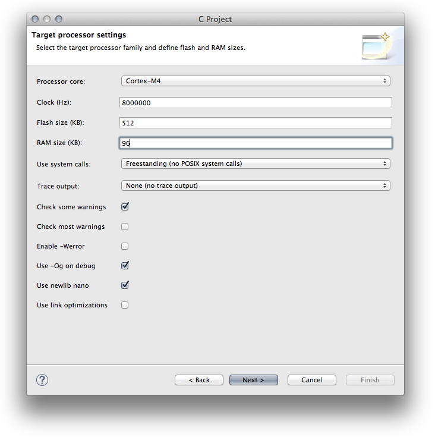
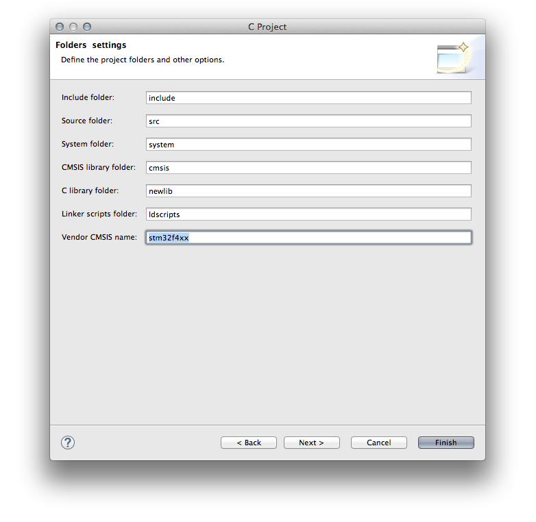
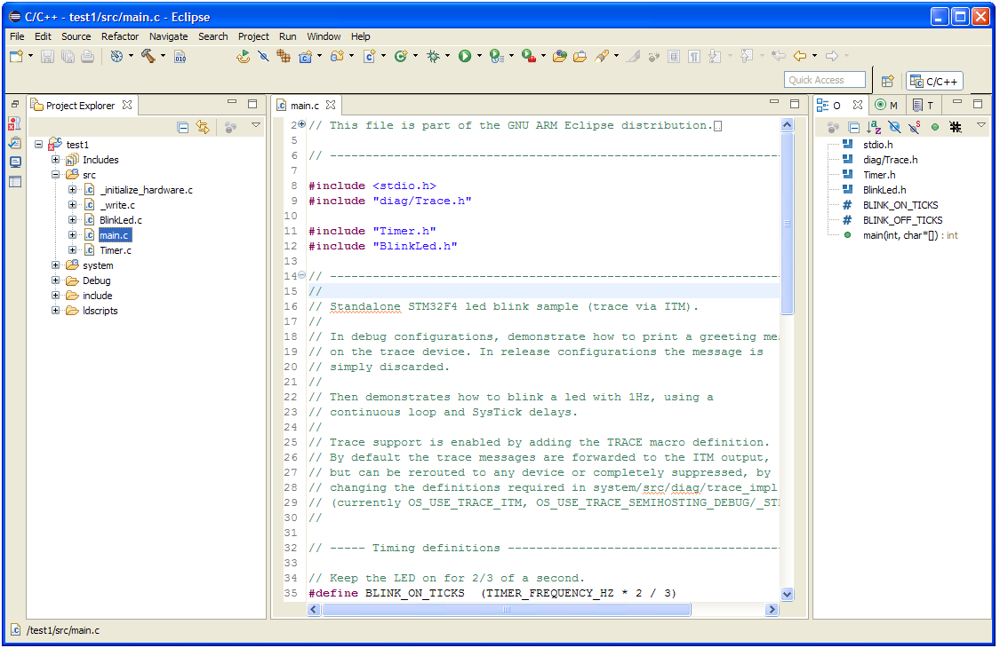
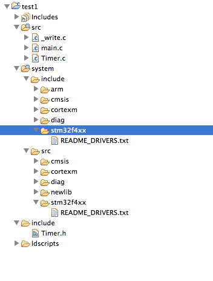
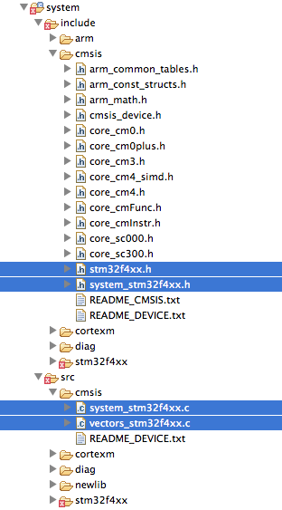

+++
title = "Build STM32 applications with Eclipse, GCC and STM32Cube"
slug = "stm32-applications-eclipse-gcc-stcube"
url = "/2015/06/04/stm32-applications-eclipse-gcc-stcube/"
date = "2015-06-04T14:13:18Z"
lastmod = "2022-11-23T12:25:42Z"
draft = false
categories = ["Electronics","STM32"]
tags = ["eclipse","gcc","stm32","toolchain","tutorial"]
showHero = true
showTableOfContents = true

[cover]
image = "images/legacy/stm32-applications-eclipse-gcc-stcube/cover-stm32-butterfly.jpg"
alt = "stm32 butterfly"
hiddenInSingle = false
+++


**Please, read carefully.**

Thanks to the feedbacks I have received, I reached to the conclusion that it's really hard to cover a topic like this one in the room of a blog post. So, I started writing a book about the STM32 platform. In the free book sample you can find the whole complete procedure better explained. You can download it [from here](https://leanpub.com/mastering-stm32).


If you landed to this page, you probably already know that I've covered this topic in the past. [I showed in a series made of three posts](/?p=998) how to successfully setup a complete Eclipse/GCC ARM tool-chain to develop applications for the STM32Nucleo-F4 developing board. Since then, many people have reported me positive feedback on that tutorial. But, some of them had serious troubles in getting those instructions working for other STM32 families (F0, F1 and so on). This was mainly caused by the [GNU ARM Eclipse plug-in](http://gnuarmeclipse.livius.net/blog/), or rather by the included templates in the plug-in.  When a new project is created using the plug-in wizard, a template is used depending on processor family. Unfortunately, the plug-in author has updated just the template for STM32-F4 family to the more recently STM32Cube-F4 HAL framework from ST (which still supports only commercial IDE.....), leaving the other templates still based on the old Standard Peripheral Library, which is no longer supported by ST and STM32CubeMX tool used in my tutorial. *This causes my instructions to be wrong for processor families different from STM32-F4. *

In this post I'll show you how to setup from scratch an Eclipse project to develop applications for STM32 platform using the latest version of STM32Cube-Fx framework (the latest version available at time of writing is 1.6 for F4). Unfortunately, at the moment I can test these instructions only on a STM32-F4 processor, but I'm going to buy other Nucleo boards to do tests. In this article I won't explain again all the steps required to install Eclipse and GCC on your computer. If you still haven't installed the base tool-chain, you can start reading from [this post](/?p=998) and stop to the paragraph named "*Create a test project*". When ready, you can come back here again and continue the reading.

Before starting create our new test project, I would like to say something about why using Eclipse/GCC as tool-chain to develop STM32 firmware. Because this is a really common question from newbies.

### Why choose Eclipse/GCC as tool-chain for STM32

This is a really common question: which tool-chain is the best one to develop apps for STM32? The question is unfortunately not simple to answer. Probably the best answer is that it depends on the application. First of all, the audience should be divided between professionals and hobbyists. Company ofter prefers to use commercial IDEs with annual fees that allow to receive technical support. You have to figure out that in business time means money and, sometimes, commercial IDE can reduce the learning curve (especially if we consider that ST gives explicit support to these environments). However, I think that even companies (especially if they are small organizations) can take great advantages in using an open source tool-chain.

According to me, these are the most important advantages in using a Eclipse/GCC tool-chain for embedded development with STM32 MCU:

- **It's GCC based**: GCC is probably the best compiler on the earth, and it gives excellent results even with ARM based processors. ARM is nowadays the most widespread architecture (thanks to the diffusion of embedded systems in the last years), and GCC is used by many hardware and software manufacturers as foundation tool for their platform.
- **It's cross-platform**: if you have a Windows PC, the latest sexy Mac or a Linux server you'll be able to successfully develop, compile and upload the firmware on your development board with no difference. Today this is not a secondary aspect.
- **Eclipse diffusion**: a lot of commercial IDE for STM32 (like TrueSTUDIO and others) are also based upon Eclipse, which becomes a sort of standard. There are a lot of useful plug-in for Eclipse you can download with just one click. And it's a product that evolves day by day.
- **It's Open Source**: ok. I agree. For such giant pieces of software it's really hard to try to understand their internals and modify the code, especially if you are an hardware engineer committed to transistors and interrupt management. But if you get in trouble with your tool, it's more simple to trying to understand what goes wrong with an open source tool than a closed one.
- **Large and growing community**: these tools have by now a great international community, which continuously develops new features and fixes bugs. You'll find around tons of examples and blog post like this one, which can help you during your work. Moreover, many companies, which have adopted this software, give economical contribution to the main development. This guarantees that the software won't suddenly disappear.
- **It's free**: Yep. I placed this as the last point, but it's not the least. A commercial IDE can cost a fortune for a small company or a hobbyist. And the availability of free tool is one of the key advantages of STM32 platform.

Ok. We can now start doing serious things 🙂

### Summary of the whole process

Before I start describing in depth the procedure to generate a fully working firmware for our board, I will summarize the steps.

- First we generate an empty skeleton for ARM Cortex-M processors;
- Then we'll put in the right place the whole HAL library developed by ST;
- Then we configure some project macros and assembler start up files;
- Finally we add a sample main to test if all goes well.

As we'll see, the whole process consists in some drag-and-drop of files from the STM32Cube package to the Eclipse project. Nothing more than this.

### Assumptions and requirements

In this tutorial I'll assume you have:

- A complete Eclipse/GCC ARM tool-chain with required plugins as described [in this post](/?p=998). I'll assume that the whole tool-chain in installed in C:\STM32Toolchain or ~/STM32Toolchain if you have a UNIX-like system.
- The [STM32Cube-F4 framework from ST](http://www.st.com/web/en/catalog/tools/PF259243) already downloaded and extracted (if your board is based on another STM32 family, download the corresponding STM32Cube package - I'm almost sure that the instructions are perfectly compatible).
- A STM32Nucleo-F401RE board (as I said before, arrange instructions for your Nucleo if it's different). I think that it's also simple to arrange this procedure for other boards, like the more widespread STM32Discovery.

### Create an empty project

The fist step is creating a skeleton project where we'll put HAL library from ST. So, start Eclipse and go to **File-\>New-\>C Project** and select "Hello World ARM Cortex-M C/C++ project. You can choose the project name you want (I chose “**test1**“). Click on “**Next**“.

[](01-schermata-2015-06-04-alle-08-11-57.png)In the next step you have to configure your processor. For a STM32-F4 you have to choose Cortex-M4 core, while for a STM32-F1 you have to choose Cortex-M3. The Clock, Flash size and RAM parameters depends on your Nucleo MCU. For Nucleo-F401RE you can use the same values shown in the following picture. **Set the other options as shown below**.[](02-schermata-2015-06-04-alle-08-14-12.png)In the next step leave all parameters unchanged except for the last one: *Vendor CMSIS name*. Change it from DEVICE to **stm32f4xx** if you have a STM32F4 based board, or **stm32f1xx** for F1 boards, and so on.[](03-schermata-2015-06-04-alle-08-24-02.png)Click on “**Next**“. You can leave the default parameters in the next steps. The final step is about the GCC tool-chain. You can use these values:

tool-chain name: **GNU Tools for ARM Embedded Processors (arm-none-eabi-gcc)**\
tool-chain path: **C:\STM32Toolchain\gnu-arm\4.8-2014q3\bin**

Click “**Finish**“.

Now, if this is the first time you get in touch with the Eclipse IDE, you could be a little bit mazed by its interface. Eclipse is a multi-window IDE, and windows can be organized in several groups named *perspective*, as they are called in the Eclipse gibberish. It’s out from the goals of this article to explain how Eclipse works. I suggest you to play with the buttons marked in red in the following image.[](04-schermata-2014-12-20-alle-22-16-28.jpg)After some clicks, you should obtain an interface close to the one in the following image.[](05-schermata-2014-12-20-alle-22-22-50.png)

### Importing STM32Cube-HAL in the Eclipse project

Ok. Now the hard part starts. The project generated by GNU ARM Plug-in for Eclipse is a skeleton containing Cortex Microcontroller Software Interface Standard (CMSIS) by ARM. CMSIS is a vendor-independent hardware abstraction layer for the Cortex-M processor series. It enables consistent and simple software interfaces to the processor for interface peripherals, real-time operating systems, and middleware. It's intended to simplify software re-use and reducing the learning. However, the CMSIS package is not sufficient to start programming with a STM32 chip. It's also required a vendor specific Hardware Abstraction Layer (HAL). This is what ST provides with its STM32Cube framework.

[](06-cmsis-hal1.png)

The above diagram try to explain better all the components involved in the final firmware generation. CMSIS is the universal set of features developed by ARM, and it's common to all Cortex-M vendors  (ST, ATMEL, etc). ST HAL is the hardware abstraction layer developed by ST for its specific devices, and it's related to the STM32 family (F0, F1, etc). The Device HAL is a sort of "connector" that allows the two subsystem to talk each other. It's a really simplified view, but this is sufficient to start programming with this architecture.

Let's have a look to the generated project.

[](07-schermata-2015-06-04-alle-09-01-15.png)

- /src and /include folders contain our "main" application. The plug-in generated a bare bone main.c file. We don't use these files, as we'll seen soon, but we'll place an example "main" in that folder.
- /system folder essentially contains the ARM CMSIS package.
- /system/include/stm32f4xx and /system/src/stm32f4xx are the folders where we'll place the STM32Cube HAL.
- /ldscripts contains script for the GNU Link Editor (ld). These scripts instruct the linker to partition the memory and do several stuffs in configuring interrupts and entry point routines.

Let's now have a look to cortexm subfolder.

[](08-schermata-2015-06-04-alle-14-00-20.png)

The files I've highlighted in blue in the above picture are generated automatically by the GNU ARM Eclipse plug-in. They are what it's called the Device HAL part in the previous diagram. These files are substantially empty, and should be replaced by custom code, both specific for the single vendor (ST in our case), both specific for the given MCU (STM32F401RE if you have a Nucleo like the mine). We are going to delete them.

So the first step is downloading the latest version of [STM32Cube-F4](http://www.st.com/web/en/catalog/tools/PF259243#) (or the one corresponding to your MCU) from ST web site, unpack it and place it inside the folder C:\STM32Toolchain.  Once extracted, rename the folder from STM32Cube_FW_F4_V1.6.0 to STM32Cube_FW_F4.

Next, go in the Eclipse project and delete the following files:

- /src/\[main.c, Timer.c\]
- /include/Timer.h
- /system/include/cmsis/\[stm32f4xx.h,system_stm32f4xx.h\]
- /system/src/cmsis/\[system_stm32f4xx.c,vectors_stm32f4xx.c\]

Now we have to copy HAL and other files from STM32Cube to the Eclipse project.

- **HAL:** go inside the **STM32Cube_FW_F4/Drivers/STM32F4xx_HAL_Driver/Src** folder and drag **ALL** the files contained to the Eclipse folder /**system/src/stm32f4xx**. Eclipse will ask you how to copy these files in the project folder. Select the entry "Copy", as shown below (use always this choice):\
  [](09-schermata-2015-06-04-alle-14-31-59.png)Next, go inside the **STM32Cube_FW_F4/Drivers/STM32F4xx_HAL_Driver/Inc** folder and drag **ALL** the files contained to the Eclipse folder /**system/include/stm32f4xx**.
- **Device HAL:** go inside the **STM32Cube_FW_F4/Drivers/CMSIS/Device/ST/STM32F4xx/Include** folder and drag **ALL** the files contained to the Eclipse folder **/system/include/cmsis**.\
  We now need another two files. If you remember, we've deleted so far two files from the generated project: system_stm32f4xx.c and vectors_stm32f4xx.c. We now need two files that do the same job (essentially, they contain the startup routines). The file vectors_stm32f4xx.c should contain the startup code when MCU resets. We'll use an assembler file provided by ST. Go inside **STM32Cube_FW_F4/Drivers/CMSIS/Device/ST/STM32F4xx/Source/Templates/gcc** folder and drag the file corresponding to your MCU inside the Eclipse folder **/system/src/cmsis**. In our case, the file is **startup_stm32f401xe.s**. Now, since Eclipse is not able to manage files ending with .s, we have to change the file extension to .**S** (capital 's'). So the final filename is **startup_stm32f401xe.S**.\
  Just another step. We still need a system_stm32f4xx.c file. but we need one specific for the MCU of our board. Go inside the **STM32Cube_FW_F4/Drivers/CMSIS/Device/ST/STM32F4xx/Source/Templates** folder and drag the **system_stm32f4xx.c** file inside the Eclipse folder **/system/src/cmsis**.

Ok. The framework is essentially configured. We now need a sample project that shows us that all works well. We'll take the blinking LED example from ST.

Go inside the **STM32Toolchain/STM32Cube_FW_F4/Projects/STM32F401RE-Nucleo/Examples/GPIO/GPIO_IOToggle/Inc** folder and copy **ALL** the content inside the Eclipse folder **/include**. Next, go to **STM32Toolchain/STM32Cube_FW_F4/Projects/STM32F401RE-Nucleo/Examples/GPIO/GPIO_IOToggle/src** folder and copy only the files **main.c** and stm32f4xx_it.c inside the Eclipse Folder **/src**. Finally, ST separated the configuration steps of the specific Nucleo board in a different package, called Board Support Package (BSP). Go inside the **STM32Cube_FW_F4/Drivers/BSP/STM32F4xx-Nucleo** and copy the **stm32f4xx_nucleo.c** inside the **/src** folder in Eclipse and the file **stm32f4xx_nucleo.h** inside the **/include** Eclipse folder.

We are almost at the end of the whole procedure. We only need to setup a couple of things. First, we have to declare which MCU we are using defining a global macro inside the project configuration. For Nucleo-F401RE the macro is STM32F401xE. Go inside the project properties (on the main Eclipse menu go to **Project-\>Properties**), then **C/C++ Build-\>Settings**. Click on **Tool Settings** and go in **Cross ARM C Compiler-\>Preprocessor**. Click on the Add icon ([](10-schermata-2015-06-04-alle-15-18-26.png)) and add the macro STM32F401xE.

[](11-schermata-2015-06-04-alle-15-16-21.png)

Second, we need to configure how the application is mapped in the MCU memory. This work is accomplished by the link-editor (ld), which uses the three .ld files inside the /ldscripts Eclipse folder. The file we are interested in is mem.ld, and we need to change the FLASH origin address from 0x00000000 to 0x08000000, as shown below:

``` c
...
  FLASH (rx) : ORIGIN = 0x08000000, LENGTH = 512K
...
```

Where does this number come from? It's not a magic number. It's simply the address where the internal MCU flash is mapped in all STM32 microcontrollers, as you can see in the picture below extracted from the MCU datasheet.

[](12-schermata-06-2457191-alle-21-59-45.png)

Finished. Now you can compile the project going to **Project-\>Build All**.

### What's next?

If you are completely new to the Eclipse/GCC development process for STM32, you need to go back [to this post](/?p=998) and continue the reading from "*Let’s compile the test project*" paragraph. You need to SKIP reading from "*Adapt the test code to the Nucleo board*" paragraph, since the code we've used here is already designed for our Nucleo. Once finished, you can start reading [part 2](/?p=1256) and [3](/?p=1269) of that series completely.

Moreover, I've developed a python script that is able to automize the most of the work described in this post. Take a look to [this other blog post](/?p=2005).

### Conclusion

I'm aware of the fact that the whole procedure is not straightforward, but I can guarantee you that it becomes clear after the first time. I did all the best to describe the whole process in a clean and simple way, but comments and suggests are welcome.

Now you can start programming your Nucleo and diving into the STM32Cube framework. Enjoy your Nucleo!
