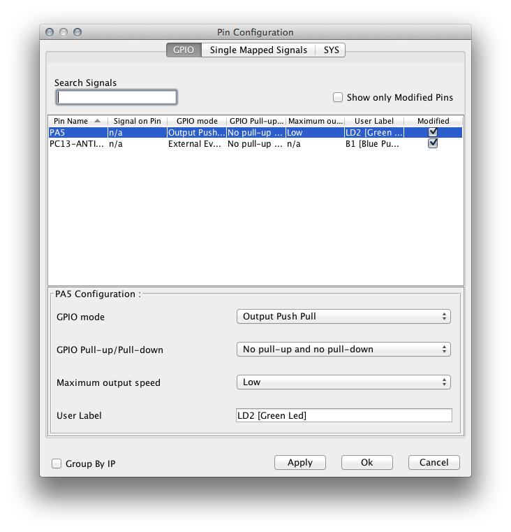
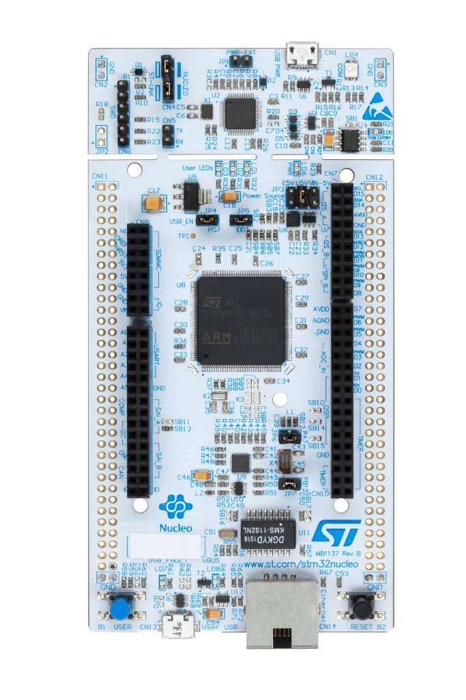

+++
title = "STM32CubeMX 4.12 reveals new Nucleo boards with 144-pin MCU"
slug = "stm32cubemx-4-12-reveals-nucleo-boards-144-pin-mcu"
url = "/2015/12/10/stm32cubemx-4-12-reveals-nucleo-boards-144-pin-mcu/"
date = "2015-12-10T17:32:06Z"
lastmod = "2015-12-10T17:35:01Z"
draft = false
description = "ST has recently released the new STM32CubeMX 4.12.0. It faces some minor changes to the user interfaces but, more important, it now seems to work perfectly also on MacOS X…"
categories = ["STM32"]
tags = []
showHero = true
showTableOfContents = true

[cover]
image = "images/legacy/stm32cubemx-4-12-reveals-nucleo-boards-144-pin-mcu/cover-nucleo-144-large-2.jpg"
alt = "nucleo_144_large"
hiddenInSingle = false
+++

ST has recently released the new STM32CubeMX 4.12.0. It faces some minor changes to the user interfaces but, more important, it now seems to work perfectly also on MacOS X and Linux. In fact, it's now possible to change the I/O settings like it happens on the Windows platform:Another interesting thing is that it indirectly announces that ST is going to release a new family of Nucleo boards: Nucleo-144.

These boards are based on the LQFP-144 version of STM MCUs, and it seems that they may also provide an Ethernet port!! This sounds really exiting!!

The list of Nucleo-144 boards is provided by CubeMX itself:

- **Nucleo-F746ZG** (can't wait for this!!!)
- **Nucleo-F446ZE**
- **Nucleo-F429ZI**
- **Nucleo-F303ZE**
- **Nucleo-F207ZG**

I hope that ST will place them on the market soon! Stay tuned 😉
