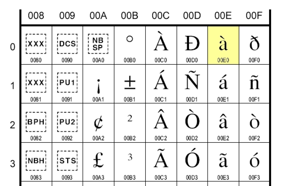
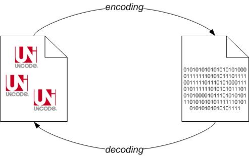

+++
title = "Unicode in 5 minuti"
slug = "unicode-in-5-minuti"
url = "/2008/05/20/unicode-in-5-minuti/"
date = "2008-05-20T15:18:12Z"
lastmod = "2013-07-30T14:16:28Z"
draft = false
description = "Oggi giorno nessun programmatore può ignorare Unicode: con la diffusione di Internet e la pubblicazione dei contenuti via web è diventato impossibile non conoscere questo sistema di caratteri e, grazie al fatto che sono sempre di più i linguaggi di programmazione che lo trattano "
categories = ["Others"]
tags = ["ascii","byte-string","iso8859-1","java","latin1","python","tutorial","unicode","utf-8"]
showHero = true
showTableOfContents = true

[cover]
image = "images/legacy/unicode-in-5-minuti/cover-unicode.jpg"
alt = "unicode"
hiddenInSingle = false
+++

\[dropcap\]O\[/dropcap\]ggi giorno nessun programmatore può ignorare Unicode: con la diffusione di Internet e la pubblicazione dei contenuti via web è diventato impossibile non conoscere questo sistema di caratteri e, grazie al fatto che sono sempre di più i linguaggi di programmazione che lo trattano in maniera nativa, è diventato molto semplice poterlo adoperare nelle proprie applicazioni. Sicuro??!?!

A leggere in giro nella rete sembrerebbe esattamente il contrario. Praticamente tutti i giorni si legge di programmatori disperati che non sanno come trattare stringhe di testo contenenti caratteri Unicode, e spesso le soluzioni trovate sono alquanto *naïf* e sbagliate. Insomma, lo Unicode è per mia esperienza la bestia nera degli informatici del nuovo millennio, nonostante il web sia pieno di ottimi tutorial molto completi per approfondire la materia.\
E forse è proprio questo il nocciolo della questione: le guide, i tutorial, gli *howto* elaborati per i vari linguaggi di programmazione spesso sono troppo completi ed esaustivi. Per carità, lungi da voler criticare il lavoro svolto da altre persone, ma per mia esperienza personale in questo tema più si tiene basso il livello e meglio si comprende qual è esattamente il problema. Per poi successivamente magari approfondire tutti i dettagli per gli amanti della storia dell'informatica.

In questo mini tutorial mi propongo di trascodificare su carta l'esperimento effettuato alla [PyCon Due](http://www.pycon.it), e cioè presentare Unicode in soli 5 minuti. Si, avete capito bene. Vi chiedo di impiegare soltanto 5 minuti del vostro tempo, in cui vi impongo di rilassarvi e di dimenticare tutto quello che avete letto in giro fino ad ora.\
Per illustrarvi gli esempi adopererò i linguaggi di programmazione Python e Java, ma sappiate che tutto quello che dirò potrà essere direttamente riportato in qualunque altro linguaggio di programmazione come C#, Visual Basic.NET, ecc - se vi aspettavate di leggere anche 'PHP' sappiate che ancora oggi, con PHP5, [non c'è un supporto nativo alle stringhe Unicode](http://www.ibm.com/developerworks/library/os-php-unicode/index.html).

 

Relax. Respiro profondo. Via.

### **Minuto 1** **- Lo standard ASCII 7-bit non è in grado di rappresentare tutti i caratteri di tutti gli alfabeti esistenti\**

L' [ASCII](http://it.wikipedia.org/wiki/ASCII) è uno standard di codifica dei caratteri che associa i numeri da 0 a 127 ad un carattere ben preciso (non bisogna dimenticare che i computer sanno trattare esclusivamente numeri). Nello specifico, soltanto i numeri da 32 a 126 corrispondono a caratteri stampabili, tutti gli altri sono i cosiddetti caratteri di controllo. I caratteri contemplati dallo standard ASCII sono soltanto i caratteri dell'alfabeto latino (dalla A alla Z, maiuscoli e minuscoli). So già a cosa state pensando: "*ma sulla mia tastiera ci sono anche le vocali accentate*". Ebbene questo è un punto di confusione: lo standard ASCII originario a 7 bit fu successivamente esteso a 8 bit per contemplare caratteri di alfabeti specifici (si parla per l'appunto di *ASCII esteso*). Questi 128 caratteri in più furono adoperati per codificare lettere specifiche dei singoli alfabeti, come le vocali accentate. Il compito di rimappare i codici numerici a lettere di un alfabeto era demandato ai cosiddetti *codepage*, che nel caso dell'alfabeto italiano (e non solo) per i PC equipaggiati con MS-DOS era il [codepage 850](http://msdn.microsoft.com/en-us/library/cc195064.aspx). Tuttavia, se 128 caratteri aggiuntivi sono sufficienti a rappresentare tutti i caratteri degli alfabeti dei paesi 'occidentali' (comprese le vocali accentate, lettere con dieresi, ecc), non lo sono affatto per quei paesi i cui alfabeti superano abbondantemente tale numero di caratteri (si pensi agli ideogrammi cinesi). Insomma,

***l'ASCII non è lo standard idoneo per trattare tutti gli alfabeti esistenti***.

### 

### **Minuto 2 - UNICODE è uno standard che associa ad un carattere un solo codice numerico**

Per aggirare questa intrinseca limitazione dell'ASCII, le principali aziende del settore informatico unirono i loro sforzi per formare un consorzio con l'obiettivo di standardizzare tutti i caratteri esistenti in tutti gli alfabeti possibili: lo [*Unicode Consortium*](http://www.unicode.org/consortium/consort.html).\
Lo Unicode è uno standard che assegna univocamente un numero ad ogni carattere di scrittura testi, indipendentemente dalla lingua, dalla particolare piattaforma software, dalla sua specifica rappresentazione in bit. Con Unicode ogni carattere ha il suo numero e non esistono caratteri con lo stesso numero. Ad esempio, il numero in base dieci 224 corrisponde alla lettera 'à'; mentre il numero in base dieci 1590 alla lettera araba 'sad' (ض). In realtà i codici Unicode sono rappresentati in esadecimale, con 4 o 6 cifre, e nello specifico nella forma 'U+XXXX'. Ad esempio, la lettera accentata 'à' ha rappresentazione 'U+00E0', mentre la lettera araba 'sad' (ض) ha rappresentazione 'U+0636'.

Usare Unicode è semplicissimo e bastano pochissimi passi.

1.  Dirigetevi sul sito web di Unicode e nello specifico nella sezione '[*code charts*](http://www.unicode.org/charts/)';
2.  Scegliere una tavola di una famiglia di caratteri, ad esempio la tavola [latin1](http://www.unicode.org/charts/PDF/U0080.pdf) della famiglia degli alfabeti europei;
3.  Vi apparirà un documento PDF contenente la tavola dei caratteri latin1, (di cui sotto è riportato un estratto), ed incrociando i valori delle colonne con quelli delle righe è possibile ottenere il codice Unicode del carattere desiderato.

Come possiamo sfruttare le tavole Unicode nei nostri programmi? Beh, nulla di più semplice: si riporta banalmente il codice Unicode del carattere desiderato nelle stringhe di testo in formato Unicode, usando la sequenza di escape '\uXXXX', dove XXXX è il codice esadecimale Unicode.\
Ad esempio, in Python basta scrivere:

`>>> data = u'\u00E0'`\
`>>> print data`\
`à`

In Java, è praticamente la stessa cosa:

**`public`**` class Prova {`\
**`public static void`**` main(String[] args) {`\
`String data = "\u00e0";`\
`System.out.println(data);`\
`}`\
`}`

Fine. Non c'è nessun altra informazione da aggiungere. Unicode è semplicemente questo, ed è importante sottolineare che lo Unicode non dice NULLA su come questi caratteri debbano essere rappresentati in macchina (infatti, spesso si parla di caratteri 'idealizzati'). Questo significa che da solo Unicode non basta a poter trattare i testi con questa codifica. Insomma,

***Unicode è uno standard che assegna univocamente un numero ad ogni carattere di scrittura testi, indipendentemente dalla lingua, dalla particolare piattaforma software, dalla sua specifica rappresentazione in bit***

 

### **Minuto 3** **- Un *codec* è una funzione che data una sequenza di caratteri Unicode restituisce una stringa di byte**

Come già detto nel minuto precedente, una stringa di caratteri Unicode è una sorta di stringa 'idealizzata', che necessita di un ulteriore trasformazione per poter essere salvata, scambiata tra sistemi, interpretata da un browser. Tale processo di trasformazione in stringa di byte (o anche stringa binaria) è demandato ad un *codec*. Questo è il passaggio più delicato ed è anche quello dove si hanno tutte le difficoltà con Unicode. ASCII era una codifica che si occupava di standardizzare sia i caratteri sia la loro rappresentazione in bit. Unicode al contrario, si limita a standardizzare i caratteri lasciando ai codec la seconda funzione.

Un codec non è altro che  una funzione di trasformazione: dato un carattere Unicode restituisce la corrispondente sequenza di byte. Esistono diversi codec compatibili con Unicode e la maggior parte di loro non è in grado di codificare tutti i caratteri standardizzati dallo Unicode. Ad esempio, [ISO-8859-1](http://en.wikipedia.org/wiki/ISO_8859-1) è il codec di trasformazione dei caratteri dell'alfabeto latino che, ad esempio, associa alla lettera 'à' (U+00E0) la stringa di byte "\xe0" (questa procedura di trasformazione è anche detta *encoding*). ISO-8859-1 è un codec a lunghezza fissa, ossia associa sempre e solo un byte per i caratteri che può codificare (ad un codec specifico per l'alfabeto latino non potrete mai far codificare un ideogramma cinese).\
UTF-8 (acronimo di [*Unicode Trasformation Format*](http://en.wikipedia.org/wiki/UTF-8)) è un altro codec, a lunghezza variabile, dove un carattere può essere rappresentato con un minimo di un byte fino ad un massimo di quattro byte. UTF-8 è in grado di rappresentare qualunque carattere dello standard Unicode e, ad esempio, associa la stringa di byte (due in questo caso) '\xc3\xa0' alla lettera 'à' (U+00E0).

Come fare per ottenere una stringa di byte a partire da una stringa idealizzata Unicode? Nulla di più facile. In Python possiamo fare questo per mezzo del metodo 'encode()' di un oggetto unicode:

`>>> a = u'\u00e0'`\
`>>> a.encode('iso8859-1')`\
`\xe0`\
`>>> a.encode('utf8')`\
`\xc3\xa0 `

In Java:

**`public class `**`Prova {`\
**`public static void`**` main(String[] args) `**`throws`**` java.io.UnsupportedEncodingException {`\
`String data = "\u00e0";`\
`byte[] byte_string = data.getBytes("UTF8");`\
`System.out.println(byte_string);`\
`}`\
`}`\

 

L'operazione inversa a quella di *encoding* è il *decoding* di una stringa di byte per ottenere una stringa Unicode. Supponiamo di avere un file di testo, codificato con un dato encoding, ad esempio UTF-8. Per ottenere una stringa Unicode in Python avremo:

`>>> ustr = open("filename").read().decode('UTF8')`\
`>>> type(ustr)`\
`<type 'unicode'>`

In Java avremo:

``` c
import java.io.*;

public class Prova {
    public static void main(String[] args) throws java.io.UnsupportedEncodingException {
         try {
             BufferedReader rdr = new BufferedReader(
                  new InputStreamReader(new FileInputStream("filename"),
                  "UTF-8"));
             String line = rdr.readLine();
             System.out.println(line);
         } catch (IOException exc) {
         System.err.println("I/O error");
     }
    }
}
```

 

La figura sotto schematizza il processo di *encoding/decoding*.

Riassumendo,

***Un codec è una funzione di trasformazione di un carattere Unicode in una stringa di byte serializzabile in macchina***

 

### **Minuto 4** **- Per interagire con una stringa di byte è necessario conoscere l'*encoding* con cui è stata codificata**

L'ultimo concetto importante da tenere bene a mente è che in generale è indecidibile dire una stringa di byte con quale encoding è stata generata. Ad esempio, consideriamo la sequenza di due byte '\xc3\xa0'. Da umani non ci risulta difficile riconoscere che siamo alla presenza della lettera 'à' codificata in UTF-8. Tuttavia, nulla vieta di essere in presenza di due caratteri codificati con un codec a 1 byte. Ad esempio, in Python in maniera perfettamente lecita possiamo scrivere:

`>>> print u'\u00E0'.encode('utf'8').decode('ISO-8859-1'), "-"`\
`Ã -`\

Con questo frammento di codice stiamo dicendo: prendi il carattere Unicode U+00E0 (à), codificalo con l'encoding UTF-8 e la stringa di byte ottenuta decodificala con ISO-8859-1. Quello che otteniamo non è più il carattere originario di partenza, perché il primo byte '\\xc3' viene interpretato come il carattere 'Ã' mentre il secondo '\xa0' come spazio, perché così contemplati dallo standard.\
Questo esempio ci fa capire che quando si manipolano dati, qualunque sia la provenienza, è importante sapere con che codec sono stati codificati. Il caso più tipico si verifica quando si cerca di manipolare stringhe di byte con gli encoding di default, che nel caso di Python è 'ascii' su tutte le piattaforme (come configurato nel file site.py), mentre in Java è un parametro dipendente dal particolare sistema: su Windows è 'cp1252', come indicato dalla funzione System.getProperty("file.encoding"), ed è possibile alterarlo alla riga di comando della JVM con il parametro -Dfile.encoding=\<codec\>.\
Ad esempio, sempre dall'esempio di prima, adoperando l'encoding di default di Python abbiamo:

`>>> data=open("curr.txt").read().decode()`\
`Traceback (most recent call last):`\
`File "C:\Documents and Settings\cnoviello\Desktop\pro.py", line 1, in <module>`\
`data=open("curr.txt").read().decode('ascii')`\
`UnicodeDecodeError: 'ascii' codec can't decode byte 0xef in position 0: ordinal not in range(128)`\

ottenendo un messaggio di errore molto noto a tutte le persone che hanno avuto a che fare con problemi di gestione dello Unicode. Altra alternativa è rappresentata dalla funzionalità di 'replace' della funzione 'decode()': è possibile specificare al decodificatore di sostituire tutte le sequenze di byte che non hanno corrispondenza nel codec con il carattere di sostituzione Unicode U+FFFD (il famigerato � che tipicamente visualizzano i browser quando non sanno decodificare correttamente una sequenza di byte).

`>>> print u'\u00e0'.encode('utf8').decode('ascii', 'replace')`\
`��`\

E' importante, quindi, che l'applicazione abbia una gestione consistente dell'encoding della fonte dati: si fissa un codec e si continuerà ad adoperarlo sempre. A meno di non sapere con esattezza che cosa si sta facendo. Ad esempio, è molto semplice convertire stringhe di byte codificate in un dato encoding sorgente in uno nuovo. Il seguente codice Java fa proprio questo:

``` c
public static byte[] convert(byte[] data, String startEncoding, String targetEncoding) {
      //Si decodifica la stringa di byte grazie al costruttore della             
      //classe String, ottenendo una stringa Unicode
      String str = new String(data, srcEncoding);

      //Si ricodifica la stringa dato un encoding prefissato
      byte[] result = str.getBytes(targetEncoding);

      return result;
}
```

Un discorso analogo può essere fatto nel caso dei documenti HTML. Ricordarsi sempre di specificare l'encoding dei propri documenti tramite la direttiva:

``` c
<meta http-equiv=content-type content="text/html; charset=UTF-8">
```

 

Riassumendo,

***Ha senso parlare di stringhe di byte soltanto se si conosce l'encoding con cui è stata codificata\***

### 

### **Minuto 5** **- Utilizzare sempre il codec UTF-8**

Dagli esempi visti in precedenza emerge che la scelta del codec da utilizzare per i propri dati non è banale, ed è intrinsecamente connessa con la tipologia di caratteri che si andrà a gestire. Se ci si limita ai soli caratteri dell'alfabeto latino, la classica codifica ISO-8859-1, nota anche come latin1, o la cp1252 di Windows (quella di default per le localizzazioni di Windows per i paesi 'occidentali') è più che sufficiente. Tuttavia, questi encoding non sono in grado di codificare caratteri non latini (si provi per esercizio a codificare in ISO8859-1 il carattere Unicode U+03A9 che corrisponde alla lettera greca 'Ω'), e soprattutto nel caso di applicazioni web potrebbero essere la scelta meno adatta. Per questo motivo, oggi UTF-8 è l'encoding diventato standard nel mondo Web, ed è consigliabile sviluppare le proprie applicazioni per gestire stringhe di byte codificate con questo *codec*.

Riassumendo,

***Utilizzare UTF-8 come encoding standard per la codifica di stringhe Unicode\***

 

 

Come visto, occorrono pochi minuti per apprendere le basi di Unicode. I concetti di base sono quelli. Bisognerebbe poi accennare al fatto che Unicode nasce per essere retrocompatibile con ASCII 7bit (i primi caratteri sono proprio quelli dell'ASCII), così come molti codec hanno come sottoinsieme i codepage più diffusi dell'ASCII esteso. Ma questi sono dettagli che oggi si possono ignorare senza problemi.

Successivamente alla pubblicazione di questo articolo, è nata una discussione sul forum [programmazione di Ubuntu-it](http://forum.ubuntu-it.org/index.php/topic,194890.0.html) in cui mi hanno fatto notare che la rappresentazione interna di stringe in Java è UTF-16, come [riportato qui](http://java.sun.com/j2se/1.5.0/docs/api/java/lang/String.html). Tuttavia, ciò non toglie che è importante sapere sempre qual è la codifica dei propri dati in ingresso, e non affidarsi ai default encoding della particolare piattaforma.

Per concludere, qualche riferimento per approfondire. Il riferimento più citato della rete è senza ombra di dubbio:\
<http://www.joelonsoftware.com/articles/Unicode.html>\
Ai pythonisti consiglio vivamente la lettura di questo tutorial che io reputo il migliore:\
<http://boodebr.org/main/python/all-about-python-and-unicode>\
Se avete ereditato dei dati di cui non sapete nulla circa l'encoding adoperato, vi consiglio di dare uno sguardo al modulo chardet:\
<http://chardet.feedparser.org/>\
Infine, Wikipedia è un ottimo punto di partenza per le varie specifiche:\
<http://en.wikipedia.org/wiki/Unicode>\
<http://en.wikipedia.org/wiki/UTF-8>\
<http://en.wikipedia.org/wiki/ISO_8859-1>\
<http://unicode.org/>

 

*Vi sarò grato se lascerete eventuali commenti e considerazioni. O magari mi direte se questo breve tutorial è stato utile o no.*

Come dite?!?!? Non ho detto tutto??!? Ah già Non ho detto cosa significa l'ideogramma 简, che si legge 'jiǎn'. Ebbene significa 'semplice' (come Unicode, no?!?!), ma anche 'semplificare'; il suo codice Unicode è U+7B80 e la rappresentazione in UTF-8 è '\xe7\xae\x80', quindi 3 byte.
