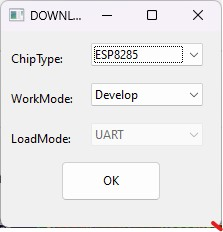
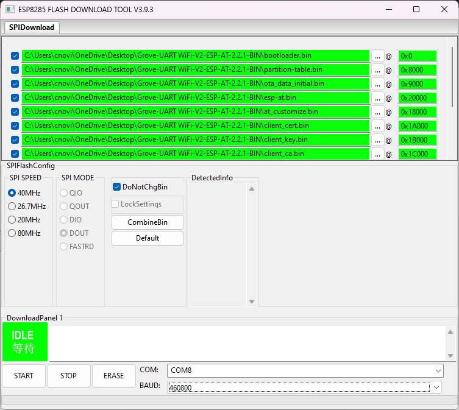

+++
title = 'Upgrading Grove-UART WiFi V2 to latest ESP-AT firmware'
slug = 'upgrading-grove-uart-wifi-v2-to-latest-esp-at-firmware'
date = 2022-12-17T00:00:00+01:00
lastmod = 2023-04-25T00:00:00+02:00
draft = false
description = 'How to update the Grove-UART WiFi V2 module to ESP-AT 2.2.1 firmware.'
categories = ['Electronics']
tags = ['ESP-AT', 'ESP8266', 'ESP8285']
featureimage = 'featured-grove-uart-wifi-v2.jpg'
featureimagealt = 'Grove-UART WiFi V2 module'
showHero = true
showTableOfContents = true

[cover]
image = 'images/grove-uart-wifi-v2.jpg'
alt = 'Grove-UART WiFi V2 module'
hiddenInSingle = false
+++

The [Grove - UART WiFi](https://wiki.seeedstudio.com/Grove-UART_Wifi_V2/) is a UART transceiver module from Seeed Studio featuring the ubiquitous ESP8266 IoT SoC. With integrated TCP/IP protocol stack, this module lets your micro-controller interact with WiFi networks with a dedicated set of [AT commands](https://espressif-docs.readthedocs-hosted.com/projects/esp-at/en/release-v2.2.0.0_esp8266/AT_Command_Set/index.html).

Unfortunately, these modules come from Seeed Studio with a quite outdated version of the ESP-AT command set. The module I bought through DigiKey was delivered with the ESP-AT 1.6 release, that lacks several interesting features available in the more recent versions.

Moreover, the instructions and binary files available in the [Seeed Studio documentation](https://wiki.seeedstudio.com/Grove-UART_Wifi_V2/#firmware-update) are completely broken, for two reasons:

- First the instructions refer to the first version of the Grove - UART WiFi, which was based on the ESP8266 SoC, and not the ESP8285. While the two SoC can be considered almost the same in terms of features, MCU core, peripherals, etc., they differ for one relevant thing: the ESP8285 integrates a 1 MB SPI flash memory (instead of being "stateless" like the original ESP8266), with a different SPI mode (DOUT instead of QIO).
- Second, the binary images provided refer to an early "stage" of the ESP-AT framework (release 0.24), and it's not the version shipped with the module.

The latest release of the ESP-AT command set for the ESP8266 is [2.2.1.0](https://docs.espressif.com/projects/esp-at/en/release-v2.2.0.0_esp8266/Get_Started/What_is_ESP-AT.html). This is not the latest release ever, but it's the latest release that supports the ESP8266 SoC. I could not find any binary file already ready for the Grove - UART WiFi module, and so I decided to setup the whole toolchain to compile the ESP-AT. But - trust me - this was not a trivial task, and this took me two days to get rid of the whole process. And this for a very simple reason: the ESP8266 is no longer the most relevant SoC in the Espressif product lineup, and the whole [ESP8266-RTOS-SDK](https://espressif-docs.readthedocs-hosted.com/projects/esp8266-rtos-sdk/en/v3.4/) is quite outdated and it lacks of some relevant tools (cmake, for example) that are no longer available in the MSYS2 repositories. For this reason, I won't detail here the whole procedure to setup the toolchain.

## What you need

To update the Grove - UART WiFi V2 module to the ESP-AT 2.2.1 release you need to download:

- The [pre-built binary images](/downloads/grove-uart-wifi-v2-esp-at-v2-2-1-bin.zip).
- A recent release of the [Flash Download Tools](https://www.espressif.com/sites/default/files/tools/flash_download_tool_3.9.3.zip) (here I assume the v3.9.3).

You also need a USB-to-serial adapter, as described in the [original Seeed Studio documentation](https://wiki.seeedstudio.com/Grove-UART_Wifi_V2/#hardware_1):

Once you are ready with the hardware setup, unzip the Flash Download Tool and launch the `flash_download_tool_3.9.3.exe` file. In the **DOWNLOAD TOOL MODE** dialog select the **ESP8285** chip, as shown below.

In the next window, ensure to load all the binary images in the exact order as shown below.

## Flash layout

The complete list of binary files to load and the corresponding flash address is reported in the table below:

| Binary image | Flash address |
| --- | ---: |
| `bootloader.bin` | `0x0000` |
| `partition-table.bin` | `0x8000` |
| `ota_data_initial.bin` | `0x9000` |
| `esp-at.bin` | `0x20000` |
| `at_customize.bin` | `0x18000` |
| `client_ca.bin` | `0x1c000` |
| `mqtt_key.bin` | `0x1e000` |
| `mqtt_cert.bin` | `0x1d000` |
| `mqtt_ca.bin` | `0x1f000` |
| `factory_param.bin` | `0x19000` |
| `client_cert.bin` | `0x1a000` |
| `client_key.bin` | `0x1b000` |

Once all files are configured, select the COM port corresponding to the USB-Serial converter and select the baudrate (higher baudrates require a well done connection). Click on the **START** button and wait for the process completion.

Enjoy your updated Grove-UART WiFi.
